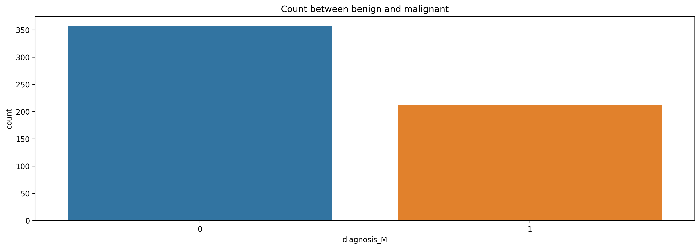
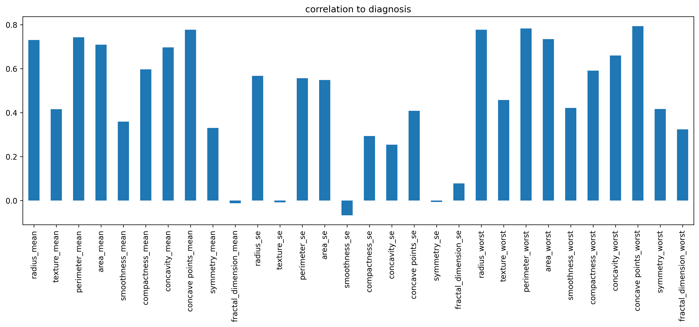
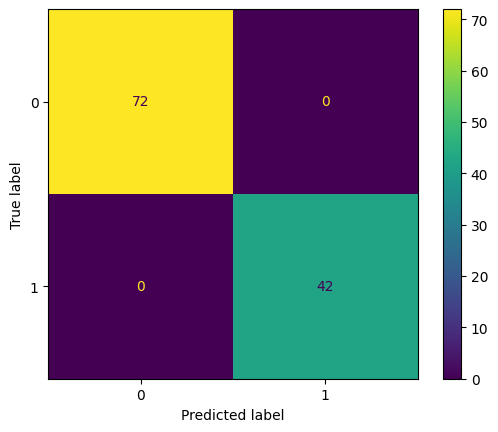

# import necessary library


```python
import numpy as np
import pandas as pd
import matplotlib.pyplot as plt
import seaborn as sns
```


```python
pd.set_option('display.max_column', None)

def display():
    plt.figure(figsize=(16,5), dpi=300)
```

# import dataset


```python
df = pd.read_csv('data.csv')
df = df.drop(['id', 'Unnamed: 32'], axis=1)
```

# data exploration


```python
df.info()
```

    <class 'pandas.core.frame.DataFrame'>
    RangeIndex: 569 entries, 0 to 568
    Data columns (total 31 columns):
     #   Column                   Non-Null Count  Dtype  
    ---  ------                   --------------  -----  
     0   diagnosis                569 non-null    object 
     1   radius_mean              569 non-null    float64
     2   texture_mean             569 non-null    float64
     3   perimeter_mean           569 non-null    float64
     4   area_mean                569 non-null    float64
     5   smoothness_mean          569 non-null    float64
     6   compactness_mean         569 non-null    float64
     7   concavity_mean           569 non-null    float64
     8   concave points_mean      569 non-null    float64
     9   symmetry_mean            569 non-null    float64
     10  fractal_dimension_mean   569 non-null    float64
     11  radius_se                569 non-null    float64
     12  texture_se               569 non-null    float64
     13  perimeter_se             569 non-null    float64
     14  area_se                  569 non-null    float64
     15  smoothness_se            569 non-null    float64
     16  compactness_se           569 non-null    float64
     17  concavity_se             569 non-null    float64
     18  concave points_se        569 non-null    float64
     19  symmetry_se              569 non-null    float64
     20  fractal_dimension_se     569 non-null    float64
     21  radius_worst             569 non-null    float64
     22  texture_worst            569 non-null    float64
     23  perimeter_worst          569 non-null    float64
     24  area_worst               569 non-null    float64
     25  smoothness_worst         569 non-null    float64
     26  compactness_worst        569 non-null    float64
     27  concavity_worst          569 non-null    float64
     28  concave points_worst     569 non-null    float64
     29  symmetry_worst           569 non-null    float64
     30  fractal_dimension_worst  569 non-null    float64
    dtypes: float64(30), object(1)
    memory usage: 137.9+ KB
    


```python
df.isnull().sum()
```


    diagnosis                  0
    radius_mean                0
    texture_mean               0
    perimeter_mean             0
    area_mean                  0
    smoothness_mean            0
    compactness_mean           0
    concavity_mean             0
    concave points_mean        0
    symmetry_mean              0
    fractal_dimension_mean     0
    radius_se                  0
    texture_se                 0
    perimeter_se               0
    area_se                    0
    smoothness_se              0
    compactness_se             0
    concavity_se               0
    concave points_se          0
    symmetry_se                0
    fractal_dimension_se       0
    radius_worst               0
    texture_worst              0
    perimeter_worst            0
    area_worst                 0
    smoothness_worst           0
    compactness_worst          0
    concavity_worst            0
    concave points_worst       0
    symmetry_worst             0
    fractal_dimension_worst    0
    dtype: int64


```python
df.drop(['diagnosis'], axis=1).describe().round(3).T
```


<div>
<style scoped>
    .dataframe tbody tr th:only-of-type {
        vertical-align: middle;
    }

    .dataframe tbody tr th {
        vertical-align: top;
    }

    .dataframe thead th {
        text-align: right;
    }
</style>
<table border="1" class="dataframe">
  <thead>
    <tr style="text-align: right;">
      <th></th>
      <th>count</th>
      <th>mean</th>
      <th>std</th>
      <th>min</th>
      <th>25%</th>
      <th>50%</th>
      <th>75%</th>
      <th>max</th>
    </tr>
  </thead>
  <tbody>
    <tr>
      <th>radius_mean</th>
      <td>569.0</td>
      <td>14.127</td>
      <td>3.524</td>
      <td>6.981</td>
      <td>11.700</td>
      <td>13.370</td>
      <td>15.780</td>
      <td>28.110</td>
    </tr>
    <tr>
      <th>texture_mean</th>
      <td>569.0</td>
      <td>19.290</td>
      <td>4.301</td>
      <td>9.710</td>
      <td>16.170</td>
      <td>18.840</td>
      <td>21.800</td>
      <td>39.280</td>
    </tr>
    <tr>
      <th>perimeter_mean</th>
      <td>569.0</td>
      <td>91.969</td>
      <td>24.299</td>
      <td>43.790</td>
      <td>75.170</td>
      <td>86.240</td>
      <td>104.100</td>
      <td>188.500</td>
    </tr>
    <tr>
      <th>area_mean</th>
      <td>569.0</td>
      <td>654.889</td>
      <td>351.914</td>
      <td>143.500</td>
      <td>420.300</td>
      <td>551.100</td>
      <td>782.700</td>
      <td>2501.000</td>
    </tr>
    <tr>
      <th>smoothness_mean</th>
      <td>569.0</td>
      <td>0.096</td>
      <td>0.014</td>
      <td>0.053</td>
      <td>0.086</td>
      <td>0.096</td>
      <td>0.105</td>
      <td>0.163</td>
    </tr>
    <tr>
      <th>compactness_mean</th>
      <td>569.0</td>
      <td>0.104</td>
      <td>0.053</td>
      <td>0.019</td>
      <td>0.065</td>
      <td>0.093</td>
      <td>0.130</td>
      <td>0.345</td>
    </tr>
    <tr>
      <th>concavity_mean</th>
      <td>569.0</td>
      <td>0.089</td>
      <td>0.080</td>
      <td>0.000</td>
      <td>0.030</td>
      <td>0.062</td>
      <td>0.131</td>
      <td>0.427</td>
    </tr>
    <tr>
      <th>concave points_mean</th>
      <td>569.0</td>
      <td>0.049</td>
      <td>0.039</td>
      <td>0.000</td>
      <td>0.020</td>
      <td>0.034</td>
      <td>0.074</td>
      <td>0.201</td>
    </tr>
    <tr>
      <th>symmetry_mean</th>
      <td>569.0</td>
      <td>0.181</td>
      <td>0.027</td>
      <td>0.106</td>
      <td>0.162</td>
      <td>0.179</td>
      <td>0.196</td>
      <td>0.304</td>
    </tr>
    <tr>
      <th>fractal_dimension_mean</th>
      <td>569.0</td>
      <td>0.063</td>
      <td>0.007</td>
      <td>0.050</td>
      <td>0.058</td>
      <td>0.062</td>
      <td>0.066</td>
      <td>0.097</td>
    </tr>
    <tr>
      <th>radius_se</th>
      <td>569.0</td>
      <td>0.405</td>
      <td>0.277</td>
      <td>0.112</td>
      <td>0.232</td>
      <td>0.324</td>
      <td>0.479</td>
      <td>2.873</td>
    </tr>
    <tr>
      <th>texture_se</th>
      <td>569.0</td>
      <td>1.217</td>
      <td>0.552</td>
      <td>0.360</td>
      <td>0.834</td>
      <td>1.108</td>
      <td>1.474</td>
      <td>4.885</td>
    </tr>
    <tr>
      <th>perimeter_se</th>
      <td>569.0</td>
      <td>2.866</td>
      <td>2.022</td>
      <td>0.757</td>
      <td>1.606</td>
      <td>2.287</td>
      <td>3.357</td>
      <td>21.980</td>
    </tr>
    <tr>
      <th>area_se</th>
      <td>569.0</td>
      <td>40.337</td>
      <td>45.491</td>
      <td>6.802</td>
      <td>17.850</td>
      <td>24.530</td>
      <td>45.190</td>
      <td>542.200</td>
    </tr>
    <tr>
      <th>smoothness_se</th>
      <td>569.0</td>
      <td>0.007</td>
      <td>0.003</td>
      <td>0.002</td>
      <td>0.005</td>
      <td>0.006</td>
      <td>0.008</td>
      <td>0.031</td>
    </tr>
    <tr>
      <th>compactness_se</th>
      <td>569.0</td>
      <td>0.025</td>
      <td>0.018</td>
      <td>0.002</td>
      <td>0.013</td>
      <td>0.020</td>
      <td>0.032</td>
      <td>0.135</td>
    </tr>
    <tr>
      <th>concavity_se</th>
      <td>569.0</td>
      <td>0.032</td>
      <td>0.030</td>
      <td>0.000</td>
      <td>0.015</td>
      <td>0.026</td>
      <td>0.042</td>
      <td>0.396</td>
    </tr>
    <tr>
      <th>concave points_se</th>
      <td>569.0</td>
      <td>0.012</td>
      <td>0.006</td>
      <td>0.000</td>
      <td>0.008</td>
      <td>0.011</td>
      <td>0.015</td>
      <td>0.053</td>
    </tr>
    <tr>
      <th>symmetry_se</th>
      <td>569.0</td>
      <td>0.021</td>
      <td>0.008</td>
      <td>0.008</td>
      <td>0.015</td>
      <td>0.019</td>
      <td>0.023</td>
      <td>0.079</td>
    </tr>
    <tr>
      <th>fractal_dimension_se</th>
      <td>569.0</td>
      <td>0.004</td>
      <td>0.003</td>
      <td>0.001</td>
      <td>0.002</td>
      <td>0.003</td>
      <td>0.005</td>
      <td>0.030</td>
    </tr>
    <tr>
      <th>radius_worst</th>
      <td>569.0</td>
      <td>16.269</td>
      <td>4.833</td>
      <td>7.930</td>
      <td>13.010</td>
      <td>14.970</td>
      <td>18.790</td>
      <td>36.040</td>
    </tr>
    <tr>
      <th>texture_worst</th>
      <td>569.0</td>
      <td>25.677</td>
      <td>6.146</td>
      <td>12.020</td>
      <td>21.080</td>
      <td>25.410</td>
      <td>29.720</td>
      <td>49.540</td>
    </tr>
    <tr>
      <th>perimeter_worst</th>
      <td>569.0</td>
      <td>107.261</td>
      <td>33.603</td>
      <td>50.410</td>
      <td>84.110</td>
      <td>97.660</td>
      <td>125.400</td>
      <td>251.200</td>
    </tr>
    <tr>
      <th>area_worst</th>
      <td>569.0</td>
      <td>880.583</td>
      <td>569.357</td>
      <td>185.200</td>
      <td>515.300</td>
      <td>686.500</td>
      <td>1084.000</td>
      <td>4254.000</td>
    </tr>
    <tr>
      <th>smoothness_worst</th>
      <td>569.0</td>
      <td>0.132</td>
      <td>0.023</td>
      <td>0.071</td>
      <td>0.117</td>
      <td>0.131</td>
      <td>0.146</td>
      <td>0.223</td>
    </tr>
    <tr>
      <th>compactness_worst</th>
      <td>569.0</td>
      <td>0.254</td>
      <td>0.157</td>
      <td>0.027</td>
      <td>0.147</td>
      <td>0.212</td>
      <td>0.339</td>
      <td>1.058</td>
    </tr>
    <tr>
      <th>concavity_worst</th>
      <td>569.0</td>
      <td>0.272</td>
      <td>0.209</td>
      <td>0.000</td>
      <td>0.114</td>
      <td>0.227</td>
      <td>0.383</td>
      <td>1.252</td>
    </tr>
    <tr>
      <th>concave points_worst</th>
      <td>569.0</td>
      <td>0.115</td>
      <td>0.066</td>
      <td>0.000</td>
      <td>0.065</td>
      <td>0.100</td>
      <td>0.161</td>
      <td>0.291</td>
    </tr>
    <tr>
      <th>symmetry_worst</th>
      <td>569.0</td>
      <td>0.290</td>
      <td>0.062</td>
      <td>0.156</td>
      <td>0.250</td>
      <td>0.282</td>
      <td>0.318</td>
      <td>0.664</td>
    </tr>
    <tr>
      <th>fractal_dimension_worst</th>
      <td>569.0</td>
      <td>0.084</td>
      <td>0.018</td>
      <td>0.055</td>
      <td>0.071</td>
      <td>0.080</td>
      <td>0.092</td>
      <td>0.208</td>
    </tr>
  </tbody>
</table>
</div>


```python
print(df.diagnosis.unique())
print(df.diagnosis.nunique())
```

    ['M' 'B']
    2
    


```python
df = pd.get_dummies(data=df, columns=['diagnosis'], drop_first=True)
df.head()
```


<div>
<style scoped>
    .dataframe tbody tr th:only-of-type {
        vertical-align: middle;
    }

    .dataframe tbody tr th {
        vertical-align: top;
    }

    .dataframe thead th {
        text-align: right;
    }
</style>
<table border="1" class="dataframe">
  <thead>
    <tr style="text-align: right;">
      <th></th>
      <th>radius_mean</th>
      <th>texture_mean</th>
      <th>perimeter_mean</th>
      <th>area_mean</th>
      <th>smoothness_mean</th>
      <th>compactness_mean</th>
      <th>concavity_mean</th>
      <th>concave points_mean</th>
      <th>symmetry_mean</th>
      <th>fractal_dimension_mean</th>
      <th>radius_se</th>
      <th>texture_se</th>
      <th>perimeter_se</th>
      <th>area_se</th>
      <th>smoothness_se</th>
      <th>compactness_se</th>
      <th>concavity_se</th>
      <th>concave points_se</th>
      <th>symmetry_se</th>
      <th>fractal_dimension_se</th>
      <th>radius_worst</th>
      <th>texture_worst</th>
      <th>perimeter_worst</th>
      <th>area_worst</th>
      <th>smoothness_worst</th>
      <th>compactness_worst</th>
      <th>concavity_worst</th>
      <th>concave points_worst</th>
      <th>symmetry_worst</th>
      <th>fractal_dimension_worst</th>
      <th>diagnosis_M</th>
    </tr>
  </thead>
  <tbody>
    <tr>
      <th>0</th>
      <td>17.99</td>
      <td>10.38</td>
      <td>122.80</td>
      <td>1001.0</td>
      <td>0.11840</td>
      <td>0.27760</td>
      <td>0.3001</td>
      <td>0.14710</td>
      <td>0.2419</td>
      <td>0.07871</td>
      <td>1.0950</td>
      <td>0.9053</td>
      <td>8.589</td>
      <td>153.40</td>
      <td>0.006399</td>
      <td>0.04904</td>
      <td>0.05373</td>
      <td>0.01587</td>
      <td>0.03003</td>
      <td>0.006193</td>
      <td>25.38</td>
      <td>17.33</td>
      <td>184.60</td>
      <td>2019.0</td>
      <td>0.1622</td>
      <td>0.6656</td>
      <td>0.7119</td>
      <td>0.2654</td>
      <td>0.4601</td>
      <td>0.11890</td>
      <td>1</td>
    </tr>
    <tr>
      <th>1</th>
      <td>20.57</td>
      <td>17.77</td>
      <td>132.90</td>
      <td>1326.0</td>
      <td>0.08474</td>
      <td>0.07864</td>
      <td>0.0869</td>
      <td>0.07017</td>
      <td>0.1812</td>
      <td>0.05667</td>
      <td>0.5435</td>
      <td>0.7339</td>
      <td>3.398</td>
      <td>74.08</td>
      <td>0.005225</td>
      <td>0.01308</td>
      <td>0.01860</td>
      <td>0.01340</td>
      <td>0.01389</td>
      <td>0.003532</td>
      <td>24.99</td>
      <td>23.41</td>
      <td>158.80</td>
      <td>1956.0</td>
      <td>0.1238</td>
      <td>0.1866</td>
      <td>0.2416</td>
      <td>0.1860</td>
      <td>0.2750</td>
      <td>0.08902</td>
      <td>1</td>
    </tr>
    <tr>
      <th>2</th>
      <td>19.69</td>
      <td>21.25</td>
      <td>130.00</td>
      <td>1203.0</td>
      <td>0.10960</td>
      <td>0.15990</td>
      <td>0.1974</td>
      <td>0.12790</td>
      <td>0.2069</td>
      <td>0.05999</td>
      <td>0.7456</td>
      <td>0.7869</td>
      <td>4.585</td>
      <td>94.03</td>
      <td>0.006150</td>
      <td>0.04006</td>
      <td>0.03832</td>
      <td>0.02058</td>
      <td>0.02250</td>
      <td>0.004571</td>
      <td>23.57</td>
      <td>25.53</td>
      <td>152.50</td>
      <td>1709.0</td>
      <td>0.1444</td>
      <td>0.4245</td>
      <td>0.4504</td>
      <td>0.2430</td>
      <td>0.3613</td>
      <td>0.08758</td>
      <td>1</td>
    </tr>
    <tr>
      <th>3</th>
      <td>11.42</td>
      <td>20.38</td>
      <td>77.58</td>
      <td>386.1</td>
      <td>0.14250</td>
      <td>0.28390</td>
      <td>0.2414</td>
      <td>0.10520</td>
      <td>0.2597</td>
      <td>0.09744</td>
      <td>0.4956</td>
      <td>1.1560</td>
      <td>3.445</td>
      <td>27.23</td>
      <td>0.009110</td>
      <td>0.07458</td>
      <td>0.05661</td>
      <td>0.01867</td>
      <td>0.05963</td>
      <td>0.009208</td>
      <td>14.91</td>
      <td>26.50</td>
      <td>98.87</td>
      <td>567.7</td>
      <td>0.2098</td>
      <td>0.8663</td>
      <td>0.6869</td>
      <td>0.2575</td>
      <td>0.6638</td>
      <td>0.17300</td>
      <td>1</td>
    </tr>
    <tr>
      <th>4</th>
      <td>20.29</td>
      <td>14.34</td>
      <td>135.10</td>
      <td>1297.0</td>
      <td>0.10030</td>
      <td>0.13280</td>
      <td>0.1980</td>
      <td>0.10430</td>
      <td>0.1809</td>
      <td>0.05883</td>
      <td>0.7572</td>
      <td>0.7813</td>
      <td>5.438</td>
      <td>94.44</td>
      <td>0.011490</td>
      <td>0.02461</td>
      <td>0.05688</td>
      <td>0.01885</td>
      <td>0.01756</td>
      <td>0.005115</td>
      <td>22.54</td>
      <td>16.67</td>
      <td>152.20</td>
      <td>1575.0</td>
      <td>0.1374</td>
      <td>0.2050</td>
      <td>0.4000</td>
      <td>0.1625</td>
      <td>0.2364</td>
      <td>0.07678</td>
      <td>1</td>
    </tr>
  </tbody>
</table>
</div>


```python
display()
sns.countplot(data=df, x='diagnosis_M')
plt.title('Count between benign and malignant')
plt.show()
```


    

    


```python
display()
df.drop(['diagnosis_M'], axis=1).corrwith(df['diagnosis_M']).plot(kind='bar')
plt.title('correlation to diagnosis')
plt.show()
```


    

    


# building machine learning model


```python
x = df.drop(['diagnosis_M'], axis=1).values
y = df['diagnosis_M'].values
```


```python
print(x.shape)
print(y.shape)
```

    (569, 30)
    (569,)
    


```python
from sklearn.model_selection import train_test_split, cross_val_score
from sklearn.preprocessing import MinMaxScaler
from sklearn.metrics import accuracy_score, f1_score, recall_score, precision_score, classification_report, ConfusionMatrixDisplay
from sklearn.ensemble import RandomForestClassifier, GradientBoostingClassifier
from sklearn.linear_model import LogisticRegression
from sklearn.neighbors import KNeighborsClassifier
from sklearn.svm import SVC
from sklearn.tree import DecisionTreeClassifier
from sklearn.model_selection import GridSearchCV
```

### split data for train and test


```python
xTrain, xTest, yTrain, yTest = train_test_split(x, y, random_state=42, train_size=0.8, stratify=y)
```


```python
scaler = MinMaxScaler()
scaler.fit(xTrain)
```


<style>#sk-container-id-1 {color: black;background-color: white;}#sk-container-id-1 pre{padding: 0;}#sk-container-id-1 div.sk-toggleable {background-color: white;}#sk-container-id-1 label.sk-toggleable__label {cursor: pointer;display: block;width: 100%;margin-bottom: 0;padding: 0.3em;box-sizing: border-box;text-align: center;}#sk-container-id-1 label.sk-toggleable__label-arrow:before {content: "▸";float: left;margin-right: 0.25em;color: #696969;}#sk-container-id-1 label.sk-toggleable__label-arrow:hover:before {color: black;}#sk-container-id-1 div.sk-estimator:hover label.sk-toggleable__label-arrow:before {color: black;}#sk-container-id-1 div.sk-toggleable__content {max-height: 0;max-width: 0;overflow: hidden;text-align: left;background-color: #f0f8ff;}#sk-container-id-1 div.sk-toggleable__content pre {margin: 0.2em;color: black;border-radius: 0.25em;background-color: #f0f8ff;}#sk-container-id-1 input.sk-toggleable__control:checked~div.sk-toggleable__content {max-height: 200px;max-width: 100%;overflow: auto;}#sk-container-id-1 input.sk-toggleable__control:checked~label.sk-toggleable__label-arrow:before {content: "▾";}#sk-container-id-1 div.sk-estimator input.sk-toggleable__control:checked~label.sk-toggleable__label {background-color: #d4ebff;}#sk-container-id-1 div.sk-label input.sk-toggleable__control:checked~label.sk-toggleable__label {background-color: #d4ebff;}#sk-container-id-1 input.sk-hidden--visually {border: 0;clip: rect(1px 1px 1px 1px);clip: rect(1px, 1px, 1px, 1px);height: 1px;margin: -1px;overflow: hidden;padding: 0;position: absolute;width: 1px;}#sk-container-id-1 div.sk-estimator {font-family: monospace;background-color: #f0f8ff;border: 1px dotted black;border-radius: 0.25em;box-sizing: border-box;margin-bottom: 0.5em;}#sk-container-id-1 div.sk-estimator:hover {background-color: #d4ebff;}#sk-container-id-1 div.sk-parallel-item::after {content: "";width: 100%;border-bottom: 1px solid gray;flex-grow: 1;}#sk-container-id-1 div.sk-label:hover label.sk-toggleable__label {background-color: #d4ebff;}#sk-container-id-1 div.sk-serial::before {content: "";position: absolute;border-left: 1px solid gray;box-sizing: border-box;top: 0;bottom: 0;left: 50%;z-index: 0;}#sk-container-id-1 div.sk-serial {display: flex;flex-direction: column;align-items: center;background-color: white;padding-right: 0.2em;padding-left: 0.2em;position: relative;}#sk-container-id-1 div.sk-item {position: relative;z-index: 1;}#sk-container-id-1 div.sk-parallel {display: flex;align-items: stretch;justify-content: center;background-color: white;position: relative;}#sk-container-id-1 div.sk-item::before, #sk-container-id-1 div.sk-parallel-item::before {content: "";position: absolute;border-left: 1px solid gray;box-sizing: border-box;top: 0;bottom: 0;left: 50%;z-index: -1;}#sk-container-id-1 div.sk-parallel-item {display: flex;flex-direction: column;z-index: 1;position: relative;background-color: white;}#sk-container-id-1 div.sk-parallel-item:first-child::after {align-self: flex-end;width: 50%;}#sk-container-id-1 div.sk-parallel-item:last-child::after {align-self: flex-start;width: 50%;}#sk-container-id-1 div.sk-parallel-item:only-child::after {width: 0;}#sk-container-id-1 div.sk-dashed-wrapped {border: 1px dashed gray;margin: 0 0.4em 0.5em 0.4em;box-sizing: border-box;padding-bottom: 0.4em;background-color: white;}#sk-container-id-1 div.sk-label label {font-family: monospace;font-weight: bold;display: inline-block;line-height: 1.2em;}#sk-container-id-1 div.sk-label-container {text-align: center;}#sk-container-id-1 div.sk-container {/* jupyter's `normalize.less` sets `[hidden] { display: none; }` but bootstrap.min.css set `[hidden] { display: none !important; }` so we also need the `!important` here to be able to override the default hidden behavior on the sphinx rendered scikit-learn.org. See: https://github.com/scikit-learn/scikit-learn/issues/21755 */display: inline-block !important;position: relative;}#sk-container-id-1 div.sk-text-repr-fallback {display: none;}</style><div id="sk-container-id-1" class="sk-top-container"><div class="sk-text-repr-fallback"><pre>MinMaxScaler()</pre><b>In a Jupyter environment, please rerun this cell to show the HTML representation or trust the notebook. <br />On GitHub, the HTML representation is unable to render, please try loading this page with nbviewer.org.</b></div><div class="sk-container" hidden><div class="sk-item"><div class="sk-estimator sk-toggleable"><input class="sk-toggleable__control sk-hidden--visually" id="sk-estimator-id-1" type="checkbox" checked><label for="sk-estimator-id-1" class="sk-toggleable__label sk-toggleable__label-arrow">MinMaxScaler</label><div class="sk-toggleable__content"><pre>MinMaxScaler()</pre></div></div></div></div></div>


```python
xTrain = scaler.transform(xTrain)
xTest = scaler.transform(xTest)
```

### search for best model


```python
names = ['RandomForestClassifier', 
         'GradientBoostingClassifier', 
         'LogisticRegression', 
         'KNeighborsClassifier',
         'SVC',
         'DecisionTreeClassifier']

models = [RandomForestClassifier(),
          GradientBoostingClassifier(),
          LogisticRegression(),
          KNeighborsClassifier(),
          SVC(),
          DecisionTreeClassifier()]
```


```python
accuracy = []
f1 = []
recall = []
precision = []
cross_validation = []

for model in models:
    clf = model.fit(xTrain, yTrain)
    pred = model.predict(xTest)
    accuracy_model = accuracy_score(y_true=yTest, y_pred=pred)
    accuracy.append(accuracy_model)

    f1_model = f1_score(y_true=yTest, y_pred=pred)
    f1.append(f1_model)

    recall_model = recall_score(y_true=yTest, y_pred=pred)
    recall.append(recall_model)
    
    precision_model = precision_score(y_true=yTest, y_pred=pred, average='macro')
    precision.append(precision_model)

    cv = cross_val_score(estimator=model, X=xTrain, y=yTrain, cv=5).mean()
    cross_validation.append(cv)

names = pd.Series(data=names)
accuracy = pd.Series(data=accuracy)
f1 = pd.Series(data=f1)
recall = pd.Series(data=recall)
precision = pd.Series(data=precision)
cross_validation = pd.Series(data=cross_validation)

score_model = pd.DataFrame({'Models': names,
                            'Accuracy': accuracy,
                            'F1': f1,
                            'Recall': recall,
                            'Precision': precision,
                            'Cross Validation': cross_validation})
```


```python
score_model.round(3)
```


<div>
<style scoped>
    .dataframe tbody tr th:only-of-type {
        vertical-align: middle;
    }

    .dataframe tbody tr th {
        vertical-align: top;
    }

    .dataframe thead th {
        text-align: right;
    }
</style>
<table border="1" class="dataframe">
  <thead>
    <tr style="text-align: right;">
      <th></th>
      <th>Models</th>
      <th>Accuracy</th>
      <th>F1</th>
      <th>Recall</th>
      <th>Precision</th>
      <th>Cross Validation</th>
    </tr>
  </thead>
  <tbody>
    <tr>
      <th>0</th>
      <td>RandomForestClassifier</td>
      <td>0.974</td>
      <td>0.963</td>
      <td>0.929</td>
      <td>0.980</td>
      <td>0.958</td>
    </tr>
    <tr>
      <th>1</th>
      <td>GradientBoostingClassifier</td>
      <td>0.965</td>
      <td>0.950</td>
      <td>0.905</td>
      <td>0.974</td>
      <td>0.949</td>
    </tr>
    <tr>
      <th>2</th>
      <td>LogisticRegression</td>
      <td>0.974</td>
      <td>0.963</td>
      <td>0.929</td>
      <td>0.980</td>
      <td>0.963</td>
    </tr>
    <tr>
      <th>3</th>
      <td>KNeighborsClassifier</td>
      <td>0.956</td>
      <td>0.938</td>
      <td>0.905</td>
      <td>0.961</td>
      <td>0.967</td>
    </tr>
    <tr>
      <th>4</th>
      <td>SVC</td>
      <td>0.982</td>
      <td>0.976</td>
      <td>0.952</td>
      <td>0.986</td>
      <td>0.974</td>
    </tr>
    <tr>
      <th>5</th>
      <td>DecisionTreeClassifier</td>
      <td>0.921</td>
      <td>0.889</td>
      <td>0.857</td>
      <td>0.922</td>
      <td>0.936</td>
    </tr>
  </tbody>
</table>
</div>


### search for best parameter


```python
params = {'C': [0.1, 1, 10, 100, 1000],
          'kernel': ['linear', 'rbf', 'poly'],
          'gamma':[0.1, 1, 10, 100],
          'degree': [1, 2, 3, 4, 5, 6, 7]}
```


```python
grid = GridSearchCV(estimator=SVC(), param_grid=params, scoring='accuracy', cv=5, verbose=3)
```


```python
grid.fit(X=xTrain, y=yTrain)
```

    Fitting 5 folds for each of 420 candidates, totalling 2100 fits
    [CV 1/5] END C=0.1, degree=1, gamma=0.1, kernel=linear;, score=0.945 total time=   0.0s
    [CV 2/5] END C=0.1, degree=1, gamma=0.1, kernel=linear;, score=0.989 total time=   0.0s
    [CV 3/5] END C=0.1, degree=1, gamma=0.1, kernel=linear;, score=0.934 total time=   0.0s
    [CV 4/5] END C=0.1, degree=1, gamma=0.1, kernel=linear;, score=0.956 total time=   0.0s
    [CV 5/5] END C=0.1, degree=1, gamma=0.1, kernel=linear;, score=0.945 total time=   0.0s
    [CV 1/5] END C=0.1, degree=1, gamma=0.1, kernel=rbf;, score=0.901 total time=   0.0s
    [CV 2/5] END C=0.1, degree=1, gamma=0.1, kernel=rbf;, score=0.945 total time=   0.0s
    [CV 3/5] END C=0.1, degree=1, gamma=0.1, kernel=rbf;, score=0.901 total time=   0.0s
    [CV 4/5] END C=0.1, degree=1, gamma=0.1, kernel=rbf;, score=0.901 total time=   0.0s
    [CV 5/5] END C=0.1, degree=1, gamma=0.1, kernel=rbf;, score=0.923 total time=   0.0s
    [CV 1/5] END C=0.1, degree=1, gamma=0.1, kernel=poly;, score=0.769 total time=   0.0s
    [CV 2/5] END C=0.1, degree=1, gamma=0.1, kernel=poly;, score=0.857 total time=   0.0s
    [CV 3/5] END C=0.1, degree=1, gamma=0.1, kernel=poly;, score=0.769 total time=   0.0s
    [CV 4/5] END C=0.1, degree=1, gamma=0.1, kernel=poly;, score=0.813 total time=   0.0s
    [CV 5/5] END C=0.1, degree=1, gamma=0.1, kernel=poly;, score=0.824 total time=   0.0s
    [CV 1/5] END C=0.1, degree=1, gamma=1, kernel=linear;, score=0.945 total time=   0.0s
    [CV 2/5] END C=0.1, degree=1, gamma=1, kernel=linear;, score=0.989 total time=   0.0s
    [CV 3/5] END C=0.1, degree=1, gamma=1, kernel=linear;, score=0.934 total time=   0.0s
    [CV 4/5] END C=0.1, degree=1, gamma=1, kernel=linear;, score=0.956 total time=   0.0s
    [CV 5/5] END C=0.1, degree=1, gamma=1, kernel=linear;, score=0.945 total time=   0.0s
    [CV 1/5] END C=0.1, degree=1, gamma=1, kernel=rbf;, score=0.956 total time=   0.0s
    [CV 2/5] END C=0.1, degree=1, gamma=1, kernel=rbf;, score=0.989 total time=   0.0s
    [CV 3/5] END C=0.1, degree=1, gamma=1, kernel=rbf;, score=0.945 total time=   0.0s
    [CV 4/5] END C=0.1, degree=1, gamma=1, kernel=rbf;, score=0.945 total time=   0.0s
    [CV 5/5] END C=0.1, degree=1, gamma=1, kernel=rbf;, score=0.923 total time=   0.0s
    [CV 1/5] END C=0.1, degree=1, gamma=1, kernel=poly;, score=0.945 total time=   0.0s
    [CV 2/5] END C=0.1, degree=1, gamma=1, kernel=poly;, score=0.989 total time=   0.0s
    [CV 3/5] END C=0.1, degree=1, gamma=1, kernel=poly;, score=0.934 total time=   0.0s
    [CV 4/5] END C=0.1, degree=1, gamma=1, kernel=poly;, score=0.956 total time=   0.0s
    [CV 5/5] END C=0.1, degree=1, gamma=1, kernel=poly;, score=0.945 total time=   0.0s
    [CV 1/5] END C=0.1, degree=1, gamma=10, kernel=linear;, score=0.945 total time=   0.0s
    [CV 2/5] END C=0.1, degree=1, gamma=10, kernel=linear;, score=0.989 total time=   0.0s
    [CV 3/5] END C=0.1, degree=1, gamma=10, kernel=linear;, score=0.934 total time=   0.0s
    [CV 4/5] END C=0.1, degree=1, gamma=10, kernel=linear;, score=0.956 total time=   0.0s
    [CV 5/5] END C=0.1, degree=1, gamma=10, kernel=linear;, score=0.945 total time=   0.0s
    [CV 1/5] END C=0.1, degree=1, gamma=10, kernel=rbf;, score=0.659 total time=   0.0s
    [CV 2/5] END C=0.1, degree=1, gamma=10, kernel=rbf;, score=0.648 total time=   0.0s
    [CV 3/5] END C=0.1, degree=1, gamma=10, kernel=rbf;, score=0.659 total time=   0.0s
    [CV 4/5] END C=0.1, degree=1, gamma=10, kernel=rbf;, score=0.637 total time=   0.0s
    [CV 5/5] END C=0.1, degree=1, gamma=10, kernel=rbf;, score=0.637 total time=   0.0s
    [CV 1/5] END C=0.1, degree=1, gamma=10, kernel=poly;, score=0.956 total time=   0.0s
    [CV 2/5] END C=0.1, degree=1, gamma=10, kernel=poly;, score=1.000 total time=   0.0s
    [CV 3/5] END C=0.1, degree=1, gamma=10, kernel=poly;, score=0.945 total time=   0.0s
    [CV 4/5] END C=0.1, degree=1, gamma=10, kernel=poly;, score=0.978 total time=   0.0s
    [CV 5/5] END C=0.1, degree=1, gamma=10, kernel=poly;, score=0.978 total time=   0.0s
    [CV 1/5] END C=0.1, degree=1, gamma=100, kernel=linear;, score=0.945 total time=   0.0s
    [CV 2/5] END C=0.1, degree=1, gamma=100, kernel=linear;, score=0.989 total time=   0.0s
    [CV 3/5] END C=0.1, degree=1, gamma=100, kernel=linear;, score=0.934 total time=   0.0s
    [CV 4/5] END C=0.1, degree=1, gamma=100, kernel=linear;, score=0.956 total time=   0.0s
    [CV 5/5] END C=0.1, degree=1, gamma=100, kernel=linear;, score=0.945 total time=   0.0s
    [CV 1/5] END C=0.1, degree=1, gamma=100, kernel=rbf;, score=0.626 total time=   0.0s
    [CV 2/5] END C=0.1, degree=1, gamma=100, kernel=rbf;, score=0.626 total time=   0.0s
    [CV 3/5] END C=0.1, degree=1, gamma=100, kernel=rbf;, score=0.626 total time=   0.0s
    [CV 4/5] END C=0.1, degree=1, gamma=100, kernel=rbf;, score=0.626 total time=   0.0s
    [CV 5/5] END C=0.1, degree=1, gamma=100, kernel=rbf;, score=0.626 total time=   0.0s
    [CV 1/5] END C=0.1, degree=1, gamma=100, kernel=poly;, score=0.967 total time=   0.0s
    [CV 2/5] END C=0.1, degree=1, gamma=100, kernel=poly;, score=0.989 total time=   0.0s
    [CV 3/5] END C=0.1, degree=1, gamma=100, kernel=poly;, score=0.956 total time=   0.0s
    [CV 4/5] END C=0.1, degree=1, gamma=100, kernel=poly;, score=0.967 total time=   0.0s
    [CV 5/5] END C=0.1, degree=1, gamma=100, kernel=poly;, score=0.956 total time=   0.0s
    [CV 1/5] END C=0.1, degree=2, gamma=0.1, kernel=linear;, score=0.945 total time=   0.0s
    [CV 2/5] END C=0.1, degree=2, gamma=0.1, kernel=linear;, score=0.989 total time=   0.0s
    [CV 3/5] END C=0.1, degree=2, gamma=0.1, kernel=linear;, score=0.934 total time=   0.0s
    [CV 4/5] END C=0.1, degree=2, gamma=0.1, kernel=linear;, score=0.956 total time=   0.0s
    [CV 5/5] END C=0.1, degree=2, gamma=0.1, kernel=linear;, score=0.945 total time=   0.0s
    [CV 1/5] END C=0.1, degree=2, gamma=0.1, kernel=rbf;, score=0.901 total time=   0.0s
    [CV 2/5] END C=0.1, degree=2, gamma=0.1, kernel=rbf;, score=0.945 total time=   0.0s
    [CV 3/5] END C=0.1, degree=2, gamma=0.1, kernel=rbf;, score=0.901 total time=   0.0s
    [CV 4/5] END C=0.1, degree=2, gamma=0.1, kernel=rbf;, score=0.901 total time=   0.0s
    [CV 5/5] END C=0.1, degree=2, gamma=0.1, kernel=rbf;, score=0.923 total time=   0.0s
    [CV 1/5] END C=0.1, degree=2, gamma=0.1, kernel=poly;, score=0.736 total time=   0.0s
    [CV 2/5] END C=0.1, degree=2, gamma=0.1, kernel=poly;, score=0.780 total time=   0.0s
    [CV 3/5] END C=0.1, degree=2, gamma=0.1, kernel=poly;, score=0.736 total time=   0.0s
    [CV 4/5] END C=0.1, degree=2, gamma=0.1, kernel=poly;, score=0.780 total time=   0.0s
    [CV 5/5] END C=0.1, degree=2, gamma=0.1, kernel=poly;, score=0.758 total time=   0.0s
    [CV 1/5] END C=0.1, degree=2, gamma=1, kernel=linear;, score=0.945 total time=   0.0s
    [CV 2/5] END C=0.1, degree=2, gamma=1, kernel=linear;, score=0.989 total time=   0.0s
    [CV 3/5] END C=0.1, degree=2, gamma=1, kernel=linear;, score=0.934 total time=   0.0s
    [CV 4/5] END C=0.1, degree=2, gamma=1, kernel=linear;, score=0.956 total time=   0.0s
    [CV 5/5] END C=0.1, degree=2, gamma=1, kernel=linear;, score=0.945 total time=   0.0s
    [CV 1/5] END C=0.1, degree=2, gamma=1, kernel=rbf;, score=0.956 total time=   0.0s
    [CV 2/5] END C=0.1, degree=2, gamma=1, kernel=rbf;, score=0.989 total time=   0.0s
    [CV 3/5] END C=0.1, degree=2, gamma=1, kernel=rbf;, score=0.945 total time=   0.0s
    [CV 4/5] END C=0.1, degree=2, gamma=1, kernel=rbf;, score=0.945 total time=   0.0s
    [CV 5/5] END C=0.1, degree=2, gamma=1, kernel=rbf;, score=0.923 total time=   0.0s
    [CV 1/5] END C=0.1, degree=2, gamma=1, kernel=poly;, score=0.956 total time=   0.0s
    [CV 2/5] END C=0.1, degree=2, gamma=1, kernel=poly;, score=0.989 total time=   0.0s
    [CV 3/5] END C=0.1, degree=2, gamma=1, kernel=poly;, score=0.934 total time=   0.0s
    [CV 4/5] END C=0.1, degree=2, gamma=1, kernel=poly;, score=0.978 total time=   0.0s
    [CV 5/5] END C=0.1, degree=2, gamma=1, kernel=poly;, score=0.956 total time=   0.0s
    [CV 1/5] END C=0.1, degree=2, gamma=10, kernel=linear;, score=0.945 total time=   0.0s
    [CV 2/5] END C=0.1, degree=2, gamma=10, kernel=linear;, score=0.989 total time=   0.0s
    [CV 3/5] END C=0.1, degree=2, gamma=10, kernel=linear;, score=0.934 total time=   0.0s
    [CV 4/5] END C=0.1, degree=2, gamma=10, kernel=linear;, score=0.956 total time=   0.0s
    [CV 5/5] END C=0.1, degree=2, gamma=10, kernel=linear;, score=0.945 total time=   0.0s
    [CV 1/5] END C=0.1, degree=2, gamma=10, kernel=rbf;, score=0.659 total time=   0.0s
    [CV 2/5] END C=0.1, degree=2, gamma=10, kernel=rbf;, score=0.648 total time=   0.0s
    [CV 3/5] END C=0.1, degree=2, gamma=10, kernel=rbf;, score=0.659 total time=   0.0s
    [CV 4/5] END C=0.1, degree=2, gamma=10, kernel=rbf;, score=0.637 total time=   0.0s
    [CV 5/5] END C=0.1, degree=2, gamma=10, kernel=rbf;, score=0.637 total time=   0.0s
    [CV 1/5] END C=0.1, degree=2, gamma=10, kernel=poly;, score=0.967 total time=   0.0s
    [CV 2/5] END C=0.1, degree=2, gamma=10, kernel=poly;, score=0.989 total time=   0.0s
    [CV 3/5] END C=0.1, degree=2, gamma=10, kernel=poly;, score=0.956 total time=   0.0s
    [CV 4/5] END C=0.1, degree=2, gamma=10, kernel=poly;, score=0.989 total time=   0.0s
    [CV 5/5] END C=0.1, degree=2, gamma=10, kernel=poly;, score=0.934 total time=   0.0s
    [CV 1/5] END C=0.1, degree=2, gamma=100, kernel=linear;, score=0.945 total time=   0.0s
    [CV 2/5] END C=0.1, degree=2, gamma=100, kernel=linear;, score=0.989 total time=   0.0s
    [CV 3/5] END C=0.1, degree=2, gamma=100, kernel=linear;, score=0.934 total time=   0.0s
    [CV 4/5] END C=0.1, degree=2, gamma=100, kernel=linear;, score=0.956 total time=   0.0s
    [CV 5/5] END C=0.1, degree=2, gamma=100, kernel=linear;, score=0.945 total time=   0.0s
    [CV 1/5] END C=0.1, degree=2, gamma=100, kernel=rbf;, score=0.626 total time=   0.0s
    [CV 2/5] END C=0.1, degree=2, gamma=100, kernel=rbf;, score=0.626 total time=   0.0s
    [CV 3/5] END C=0.1, degree=2, gamma=100, kernel=rbf;, score=0.626 total time=   0.0s
    [CV 4/5] END C=0.1, degree=2, gamma=100, kernel=rbf;, score=0.626 total time=   0.0s
    [CV 5/5] END C=0.1, degree=2, gamma=100, kernel=rbf;, score=0.626 total time=   0.0s
    [CV 1/5] END C=0.1, degree=2, gamma=100, kernel=poly;, score=0.967 total time=   0.0s
    [CV 2/5] END C=0.1, degree=2, gamma=100, kernel=poly;, score=0.967 total time=   0.0s
    [CV 3/5] END C=0.1, degree=2, gamma=100, kernel=poly;, score=0.956 total time=   0.0s
    [CV 4/5] END C=0.1, degree=2, gamma=100, kernel=poly;, score=0.967 total time=   0.0s
    [CV 5/5] END C=0.1, degree=2, gamma=100, kernel=poly;, score=0.934 total time=   0.0s
    [CV 1/5] END C=0.1, degree=3, gamma=0.1, kernel=linear;, score=0.945 total time=   0.0s
    [CV 2/5] END C=0.1, degree=3, gamma=0.1, kernel=linear;, score=0.989 total time=   0.0s
    [CV 3/5] END C=0.1, degree=3, gamma=0.1, kernel=linear;, score=0.934 total time=   0.0s
    [CV 4/5] END C=0.1, degree=3, gamma=0.1, kernel=linear;, score=0.956 total time=   0.0s
    [CV 5/5] END C=0.1, degree=3, gamma=0.1, kernel=linear;, score=0.945 total time=   0.0s
    [CV 1/5] END C=0.1, degree=3, gamma=0.1, kernel=rbf;, score=0.901 total time=   0.0s
    [CV 2/5] END C=0.1, degree=3, gamma=0.1, kernel=rbf;, score=0.945 total time=   0.0s
    [CV 3/5] END C=0.1, degree=3, gamma=0.1, kernel=rbf;, score=0.901 total time=   0.0s
    [CV 4/5] END C=0.1, degree=3, gamma=0.1, kernel=rbf;, score=0.901 total time=   0.0s
    [CV 5/5] END C=0.1, degree=3, gamma=0.1, kernel=rbf;, score=0.923 total time=   0.0s
    [CV 1/5] END C=0.1, degree=3, gamma=0.1, kernel=poly;, score=0.681 total time=   0.0s
    [CV 2/5] END C=0.1, degree=3, gamma=0.1, kernel=poly;, score=0.692 total time=   0.0s
    [CV 3/5] END C=0.1, degree=3, gamma=0.1, kernel=poly;, score=0.670 total time=   0.0s
    [CV 4/5] END C=0.1, degree=3, gamma=0.1, kernel=poly;, score=0.703 total time=   0.0s
    [CV 5/5] END C=0.1, degree=3, gamma=0.1, kernel=poly;, score=0.659 total time=   0.0s
    [CV 1/5] END C=0.1, degree=3, gamma=1, kernel=linear;, score=0.945 total time=   0.0s
    [CV 2/5] END C=0.1, degree=3, gamma=1, kernel=linear;, score=0.989 total time=   0.0s
    [CV 3/5] END C=0.1, degree=3, gamma=1, kernel=linear;, score=0.934 total time=   0.0s
    [CV 4/5] END C=0.1, degree=3, gamma=1, kernel=linear;, score=0.956 total time=   0.0s
    [CV 5/5] END C=0.1, degree=3, gamma=1, kernel=linear;, score=0.945 total time=   0.0s
    [CV 1/5] END C=0.1, degree=3, gamma=1, kernel=rbf;, score=0.956 total time=   0.0s
    [CV 2/5] END C=0.1, degree=3, gamma=1, kernel=rbf;, score=0.989 total time=   0.0s
    [CV 3/5] END C=0.1, degree=3, gamma=1, kernel=rbf;, score=0.945 total time=   0.0s
    [CV 4/5] END C=0.1, degree=3, gamma=1, kernel=rbf;, score=0.945 total time=   0.0s
    [CV 5/5] END C=0.1, degree=3, gamma=1, kernel=rbf;, score=0.923 total time=   0.0s
    [CV 1/5] END C=0.1, degree=3, gamma=1, kernel=poly;, score=0.945 total time=   0.0s
    [CV 2/5] END C=0.1, degree=3, gamma=1, kernel=poly;, score=1.000 total time=   0.0s
    [CV 3/5] END C=0.1, degree=3, gamma=1, kernel=poly;, score=0.967 total time=   0.0s
    [CV 4/5] END C=0.1, degree=3, gamma=1, kernel=poly;, score=0.978 total time=   0.0s
    [CV 5/5] END C=0.1, degree=3, gamma=1, kernel=poly;, score=0.978 total time=   0.0s
    [CV 1/5] END C=0.1, degree=3, gamma=10, kernel=linear;, score=0.945 total time=   0.0s
    [CV 2/5] END C=0.1, degree=3, gamma=10, kernel=linear;, score=0.989 total time=   0.0s
    [CV 3/5] END C=0.1, degree=3, gamma=10, kernel=linear;, score=0.934 total time=   0.0s
    [CV 4/5] END C=0.1, degree=3, gamma=10, kernel=linear;, score=0.956 total time=   0.0s
    [CV 5/5] END C=0.1, degree=3, gamma=10, kernel=linear;, score=0.945 total time=   0.0s
    [CV 1/5] END C=0.1, degree=3, gamma=10, kernel=rbf;, score=0.659 total time=   0.0s
    [CV 2/5] END C=0.1, degree=3, gamma=10, kernel=rbf;, score=0.648 total time=   0.0s
    [CV 3/5] END C=0.1, degree=3, gamma=10, kernel=rbf;, score=0.659 total time=   0.0s
    [CV 4/5] END C=0.1, degree=3, gamma=10, kernel=rbf;, score=0.637 total time=   0.0s
    [CV 5/5] END C=0.1, degree=3, gamma=10, kernel=rbf;, score=0.637 total time=   0.0s
    [CV 1/5] END C=0.1, degree=3, gamma=10, kernel=poly;, score=0.945 total time=   0.0s
    [CV 2/5] END C=0.1, degree=3, gamma=10, kernel=poly;, score=0.978 total time=   0.0s
    [CV 3/5] END C=0.1, degree=3, gamma=10, kernel=poly;, score=0.956 total time=   0.0s
    [CV 4/5] END C=0.1, degree=3, gamma=10, kernel=poly;, score=0.967 total time=   0.0s
    [CV 5/5] END C=0.1, degree=3, gamma=10, kernel=poly;, score=0.934 total time=   0.0s
    [CV 1/5] END C=0.1, degree=3, gamma=100, kernel=linear;, score=0.945 total time=   0.0s
    [CV 2/5] END C=0.1, degree=3, gamma=100, kernel=linear;, score=0.989 total time=   0.0s
    [CV 3/5] END C=0.1, degree=3, gamma=100, kernel=linear;, score=0.934 total time=   0.0s
    [CV 4/5] END C=0.1, degree=3, gamma=100, kernel=linear;, score=0.956 total time=   0.0s
    [CV 5/5] END C=0.1, degree=3, gamma=100, kernel=linear;, score=0.945 total time=   0.0s
    [CV 1/5] END C=0.1, degree=3, gamma=100, kernel=rbf;, score=0.626 total time=   0.0s
    [CV 2/5] END C=0.1, degree=3, gamma=100, kernel=rbf;, score=0.626 total time=   0.0s
    [CV 3/5] END C=0.1, degree=3, gamma=100, kernel=rbf;, score=0.626 total time=   0.0s
    [CV 4/5] END C=0.1, degree=3, gamma=100, kernel=rbf;, score=0.626 total time=   0.0s
    [CV 5/5] END C=0.1, degree=3, gamma=100, kernel=rbf;, score=0.626 total time=   0.0s
    [CV 1/5] END C=0.1, degree=3, gamma=100, kernel=poly;, score=0.945 total time=   0.0s
    [CV 2/5] END C=0.1, degree=3, gamma=100, kernel=poly;, score=0.978 total time=   0.0s
    [CV 3/5] END C=0.1, degree=3, gamma=100, kernel=poly;, score=0.956 total time=   0.0s
    [CV 4/5] END C=0.1, degree=3, gamma=100, kernel=poly;, score=0.967 total time=   0.0s
    [CV 5/5] END C=0.1, degree=3, gamma=100, kernel=poly;, score=0.934 total time=   0.0s
    [CV 1/5] END C=0.1, degree=4, gamma=0.1, kernel=linear;, score=0.945 total time=   0.0s
    [CV 2/5] END C=0.1, degree=4, gamma=0.1, kernel=linear;, score=0.989 total time=   0.0s
    [CV 3/5] END C=0.1, degree=4, gamma=0.1, kernel=linear;, score=0.934 total time=   0.0s
    [CV 4/5] END C=0.1, degree=4, gamma=0.1, kernel=linear;, score=0.956 total time=   0.0s
    [CV 5/5] END C=0.1, degree=4, gamma=0.1, kernel=linear;, score=0.945 total time=   0.0s
    [CV 1/5] END C=0.1, degree=4, gamma=0.1, kernel=rbf;, score=0.901 total time=   0.0s
    [CV 2/5] END C=0.1, degree=4, gamma=0.1, kernel=rbf;, score=0.945 total time=   0.0s
    [CV 3/5] END C=0.1, degree=4, gamma=0.1, kernel=rbf;, score=0.901 total time=   0.0s
    [CV 4/5] END C=0.1, degree=4, gamma=0.1, kernel=rbf;, score=0.901 total time=   0.0s
    [CV 5/5] END C=0.1, degree=4, gamma=0.1, kernel=rbf;, score=0.923 total time=   0.0s
    [CV 1/5] END C=0.1, degree=4, gamma=0.1, kernel=poly;, score=0.670 total time=   0.0s
    [CV 2/5] END C=0.1, degree=4, gamma=0.1, kernel=poly;, score=0.637 total time=   0.0s
    [CV 3/5] END C=0.1, degree=4, gamma=0.1, kernel=poly;, score=0.648 total time=   0.0s
    [CV 4/5] END C=0.1, degree=4, gamma=0.1, kernel=poly;, score=0.659 total time=   0.0s
    [CV 5/5] END C=0.1, degree=4, gamma=0.1, kernel=poly;, score=0.648 total time=   0.0s
    [CV 1/5] END C=0.1, degree=4, gamma=1, kernel=linear;, score=0.945 total time=   0.0s
    [CV 2/5] END C=0.1, degree=4, gamma=1, kernel=linear;, score=0.989 total time=   0.0s
    [CV 3/5] END C=0.1, degree=4, gamma=1, kernel=linear;, score=0.934 total time=   0.0s
    [CV 4/5] END C=0.1, degree=4, gamma=1, kernel=linear;, score=0.956 total time=   0.0s
    [CV 5/5] END C=0.1, degree=4, gamma=1, kernel=linear;, score=0.945 total time=   0.0s
    [CV 1/5] END C=0.1, degree=4, gamma=1, kernel=rbf;, score=0.956 total time=   0.0s
    [CV 2/5] END C=0.1, degree=4, gamma=1, kernel=rbf;, score=0.989 total time=   0.0s
    [CV 3/5] END C=0.1, degree=4, gamma=1, kernel=rbf;, score=0.945 total time=   0.0s
    [CV 4/5] END C=0.1, degree=4, gamma=1, kernel=rbf;, score=0.945 total time=   0.0s
    [CV 5/5] END C=0.1, degree=4, gamma=1, kernel=rbf;, score=0.923 total time=   0.0s
    [CV 1/5] END C=0.1, degree=4, gamma=1, kernel=poly;, score=0.945 total time=   0.0s
    [CV 2/5] END C=0.1, degree=4, gamma=1, kernel=poly;, score=1.000 total time=   0.0s
    [CV 3/5] END C=0.1, degree=4, gamma=1, kernel=poly;, score=0.967 total time=   0.0s
    [CV 4/5] END C=0.1, degree=4, gamma=1, kernel=poly;, score=0.989 total time=   0.0s
    [CV 5/5] END C=0.1, degree=4, gamma=1, kernel=poly;, score=0.967 total time=   0.0s
    [CV 1/5] END C=0.1, degree=4, gamma=10, kernel=linear;, score=0.945 total time=   0.0s
    [CV 2/5] END C=0.1, degree=4, gamma=10, kernel=linear;, score=0.989 total time=   0.0s
    [CV 3/5] END C=0.1, degree=4, gamma=10, kernel=linear;, score=0.934 total time=   0.0s
    [CV 4/5] END C=0.1, degree=4, gamma=10, kernel=linear;, score=0.956 total time=   0.0s
    [CV 5/5] END C=0.1, degree=4, gamma=10, kernel=linear;, score=0.945 total time=   0.0s
    [CV 1/5] END C=0.1, degree=4, gamma=10, kernel=rbf;, score=0.659 total time=   0.0s
    [CV 2/5] END C=0.1, degree=4, gamma=10, kernel=rbf;, score=0.648 total time=   0.0s
    [CV 3/5] END C=0.1, degree=4, gamma=10, kernel=rbf;, score=0.659 total time=   0.0s
    [CV 4/5] END C=0.1, degree=4, gamma=10, kernel=rbf;, score=0.637 total time=   0.0s
    [CV 5/5] END C=0.1, degree=4, gamma=10, kernel=rbf;, score=0.637 total time=   0.0s
    [CV 1/5] END C=0.1, degree=4, gamma=10, kernel=poly;, score=0.956 total time=   0.0s
    [CV 2/5] END C=0.1, degree=4, gamma=10, kernel=poly;, score=0.967 total time=   0.0s
    [CV 3/5] END C=0.1, degree=4, gamma=10, kernel=poly;, score=0.956 total time=   0.0s
    [CV 4/5] END C=0.1, degree=4, gamma=10, kernel=poly;, score=0.956 total time=   0.0s
    [CV 5/5] END C=0.1, degree=4, gamma=10, kernel=poly;, score=0.945 total time=   0.0s
    [CV 1/5] END C=0.1, degree=4, gamma=100, kernel=linear;, score=0.945 total time=   0.0s
    [CV 2/5] END C=0.1, degree=4, gamma=100, kernel=linear;, score=0.989 total time=   0.0s
    [CV 3/5] END C=0.1, degree=4, gamma=100, kernel=linear;, score=0.934 total time=   0.0s
    [CV 4/5] END C=0.1, degree=4, gamma=100, kernel=linear;, score=0.956 total time=   0.0s
    [CV 5/5] END C=0.1, degree=4, gamma=100, kernel=linear;, score=0.945 total time=   0.0s
    [CV 1/5] END C=0.1, degree=4, gamma=100, kernel=rbf;, score=0.626 total time=   0.0s
    [CV 2/5] END C=0.1, degree=4, gamma=100, kernel=rbf;, score=0.626 total time=   0.0s
    [CV 3/5] END C=0.1, degree=4, gamma=100, kernel=rbf;, score=0.626 total time=   0.0s
    [CV 4/5] END C=0.1, degree=4, gamma=100, kernel=rbf;, score=0.626 total time=   0.0s
    [CV 5/5] END C=0.1, degree=4, gamma=100, kernel=rbf;, score=0.626 total time=   0.0s
    [CV 1/5] END C=0.1, degree=4, gamma=100, kernel=poly;, score=0.956 total time=   0.0s
    [CV 2/5] END C=0.1, degree=4, gamma=100, kernel=poly;, score=0.967 total time=   0.0s
    [CV 3/5] END C=0.1, degree=4, gamma=100, kernel=poly;, score=0.956 total time=   0.0s
    [CV 4/5] END C=0.1, degree=4, gamma=100, kernel=poly;, score=0.956 total time=   0.0s
    [CV 5/5] END C=0.1, degree=4, gamma=100, kernel=poly;, score=0.945 total time=   0.0s
    [CV 1/5] END C=0.1, degree=5, gamma=0.1, kernel=linear;, score=0.945 total time=   0.0s
    [CV 2/5] END C=0.1, degree=5, gamma=0.1, kernel=linear;, score=0.989 total time=   0.0s
    [CV 3/5] END C=0.1, degree=5, gamma=0.1, kernel=linear;, score=0.934 total time=   0.0s
    [CV 4/5] END C=0.1, degree=5, gamma=0.1, kernel=linear;, score=0.956 total time=   0.0s
    [CV 5/5] END C=0.1, degree=5, gamma=0.1, kernel=linear;, score=0.945 total time=   0.0s
    [CV 1/5] END C=0.1, degree=5, gamma=0.1, kernel=rbf;, score=0.901 total time=   0.0s
    [CV 2/5] END C=0.1, degree=5, gamma=0.1, kernel=rbf;, score=0.945 total time=   0.0s
    [CV 3/5] END C=0.1, degree=5, gamma=0.1, kernel=rbf;, score=0.901 total time=   0.0s
    [CV 4/5] END C=0.1, degree=5, gamma=0.1, kernel=rbf;, score=0.901 total time=   0.0s
    [CV 5/5] END C=0.1, degree=5, gamma=0.1, kernel=rbf;, score=0.923 total time=   0.0s
    [CV 1/5] END C=0.1, degree=5, gamma=0.1, kernel=poly;, score=0.648 total time=   0.0s
    [CV 2/5] END C=0.1, degree=5, gamma=0.1, kernel=poly;, score=0.637 total time=   0.0s
    [CV 3/5] END C=0.1, degree=5, gamma=0.1, kernel=poly;, score=0.648 total time=   0.0s
    [CV 4/5] END C=0.1, degree=5, gamma=0.1, kernel=poly;, score=0.648 total time=   0.0s
    [CV 5/5] END C=0.1, degree=5, gamma=0.1, kernel=poly;, score=0.648 total time=   0.0s
    [CV 1/5] END C=0.1, degree=5, gamma=1, kernel=linear;, score=0.945 total time=   0.0s
    [CV 2/5] END C=0.1, degree=5, gamma=1, kernel=linear;, score=0.989 total time=   0.0s
    [CV 3/5] END C=0.1, degree=5, gamma=1, kernel=linear;, score=0.934 total time=   0.0s
    [CV 4/5] END C=0.1, degree=5, gamma=1, kernel=linear;, score=0.956 total time=   0.0s
    [CV 5/5] END C=0.1, degree=5, gamma=1, kernel=linear;, score=0.945 total time=   0.0s
    [CV 1/5] END C=0.1, degree=5, gamma=1, kernel=rbf;, score=0.956 total time=   0.0s
    [CV 2/5] END C=0.1, degree=5, gamma=1, kernel=rbf;, score=0.989 total time=   0.0s
    [CV 3/5] END C=0.1, degree=5, gamma=1, kernel=rbf;, score=0.945 total time=   0.0s
    [CV 4/5] END C=0.1, degree=5, gamma=1, kernel=rbf;, score=0.945 total time=   0.0s
    [CV 5/5] END C=0.1, degree=5, gamma=1, kernel=rbf;, score=0.923 total time=   0.0s
    [CV 1/5] END C=0.1, degree=5, gamma=1, kernel=poly;, score=0.945 total time=   0.0s
    [CV 2/5] END C=0.1, degree=5, gamma=1, kernel=poly;, score=0.989 total time=   0.0s
    [CV 3/5] END C=0.1, degree=5, gamma=1, kernel=poly;, score=0.967 total time=   0.0s
    [CV 4/5] END C=0.1, degree=5, gamma=1, kernel=poly;, score=0.978 total time=   0.0s
    [CV 5/5] END C=0.1, degree=5, gamma=1, kernel=poly;, score=0.945 total time=   0.0s
    [CV 1/5] END C=0.1, degree=5, gamma=10, kernel=linear;, score=0.945 total time=   0.0s
    [CV 2/5] END C=0.1, degree=5, gamma=10, kernel=linear;, score=0.989 total time=   0.0s
    [CV 3/5] END C=0.1, degree=5, gamma=10, kernel=linear;, score=0.934 total time=   0.0s
    [CV 4/5] END C=0.1, degree=5, gamma=10, kernel=linear;, score=0.956 total time=   0.0s
    [CV 5/5] END C=0.1, degree=5, gamma=10, kernel=linear;, score=0.945 total time=   0.0s
    [CV 1/5] END C=0.1, degree=5, gamma=10, kernel=rbf;, score=0.659 total time=   0.0s
    [CV 2/5] END C=0.1, degree=5, gamma=10, kernel=rbf;, score=0.648 total time=   0.0s
    [CV 3/5] END C=0.1, degree=5, gamma=10, kernel=rbf;, score=0.659 total time=   0.0s
    [CV 4/5] END C=0.1, degree=5, gamma=10, kernel=rbf;, score=0.637 total time=   0.0s
    [CV 5/5] END C=0.1, degree=5, gamma=10, kernel=rbf;, score=0.637 total time=   0.0s
    [CV 1/5] END C=0.1, degree=5, gamma=10, kernel=poly;, score=0.945 total time=   0.0s
    [CV 2/5] END C=0.1, degree=5, gamma=10, kernel=poly;, score=0.967 total time=   0.0s
    [CV 3/5] END C=0.1, degree=5, gamma=10, kernel=poly;, score=0.956 total time=   0.0s
    [CV 4/5] END C=0.1, degree=5, gamma=10, kernel=poly;, score=0.934 total time=   0.0s
    [CV 5/5] END C=0.1, degree=5, gamma=10, kernel=poly;, score=0.923 total time=   0.0s
    [CV 1/5] END C=0.1, degree=5, gamma=100, kernel=linear;, score=0.945 total time=   0.0s
    [CV 2/5] END C=0.1, degree=5, gamma=100, kernel=linear;, score=0.989 total time=   0.0s
    [CV 3/5] END C=0.1, degree=5, gamma=100, kernel=linear;, score=0.934 total time=   0.0s
    [CV 4/5] END C=0.1, degree=5, gamma=100, kernel=linear;, score=0.956 total time=   0.0s
    [CV 5/5] END C=0.1, degree=5, gamma=100, kernel=linear;, score=0.945 total time=   0.0s
    [CV 1/5] END C=0.1, degree=5, gamma=100, kernel=rbf;, score=0.626 total time=   0.0s
    [CV 2/5] END C=0.1, degree=5, gamma=100, kernel=rbf;, score=0.626 total time=   0.0s
    [CV 3/5] END C=0.1, degree=5, gamma=100, kernel=rbf;, score=0.626 total time=   0.0s
    [CV 4/5] END C=0.1, degree=5, gamma=100, kernel=rbf;, score=0.626 total time=   0.0s
    [CV 5/5] END C=0.1, degree=5, gamma=100, kernel=rbf;, score=0.626 total time=   0.0s
    [CV 1/5] END C=0.1, degree=5, gamma=100, kernel=poly;, score=0.945 total time=   0.0s
    [CV 2/5] END C=0.1, degree=5, gamma=100, kernel=poly;, score=0.967 total time=   0.0s
    [CV 3/5] END C=0.1, degree=5, gamma=100, kernel=poly;, score=0.956 total time=   0.0s
    [CV 4/5] END C=0.1, degree=5, gamma=100, kernel=poly;, score=0.934 total time=   0.0s
    [CV 5/5] END C=0.1, degree=5, gamma=100, kernel=poly;, score=0.923 total time=   0.0s
    [CV 1/5] END C=0.1, degree=6, gamma=0.1, kernel=linear;, score=0.945 total time=   0.0s
    [CV 2/5] END C=0.1, degree=6, gamma=0.1, kernel=linear;, score=0.989 total time=   0.0s
    [CV 3/5] END C=0.1, degree=6, gamma=0.1, kernel=linear;, score=0.934 total time=   0.0s
    [CV 4/5] END C=0.1, degree=6, gamma=0.1, kernel=linear;, score=0.956 total time=   0.0s
    [CV 5/5] END C=0.1, degree=6, gamma=0.1, kernel=linear;, score=0.945 total time=   0.0s
    [CV 1/5] END C=0.1, degree=6, gamma=0.1, kernel=rbf;, score=0.901 total time=   0.0s
    [CV 2/5] END C=0.1, degree=6, gamma=0.1, kernel=rbf;, score=0.945 total time=   0.0s
    [CV 3/5] END C=0.1, degree=6, gamma=0.1, kernel=rbf;, score=0.901 total time=   0.0s
    [CV 4/5] END C=0.1, degree=6, gamma=0.1, kernel=rbf;, score=0.901 total time=   0.0s
    [CV 5/5] END C=0.1, degree=6, gamma=0.1, kernel=rbf;, score=0.923 total time=   0.0s
    [CV 1/5] END C=0.1, degree=6, gamma=0.1, kernel=poly;, score=0.637 total time=   0.0s
    [CV 2/5] END C=0.1, degree=6, gamma=0.1, kernel=poly;, score=0.637 total time=   0.0s
    [CV 3/5] END C=0.1, degree=6, gamma=0.1, kernel=poly;, score=0.637 total time=   0.0s
    [CV 4/5] END C=0.1, degree=6, gamma=0.1, kernel=poly;, score=0.648 total time=   0.0s
    [CV 5/5] END C=0.1, degree=6, gamma=0.1, kernel=poly;, score=0.648 total time=   0.0s
    [CV 1/5] END C=0.1, degree=6, gamma=1, kernel=linear;, score=0.945 total time=   0.0s
    [CV 2/5] END C=0.1, degree=6, gamma=1, kernel=linear;, score=0.989 total time=   0.0s
    [CV 3/5] END C=0.1, degree=6, gamma=1, kernel=linear;, score=0.934 total time=   0.0s
    [CV 4/5] END C=0.1, degree=6, gamma=1, kernel=linear;, score=0.956 total time=   0.0s
    [CV 5/5] END C=0.1, degree=6, gamma=1, kernel=linear;, score=0.945 total time=   0.0s
    [CV 1/5] END C=0.1, degree=6, gamma=1, kernel=rbf;, score=0.956 total time=   0.0s
    [CV 2/5] END C=0.1, degree=6, gamma=1, kernel=rbf;, score=0.989 total time=   0.0s
    [CV 3/5] END C=0.1, degree=6, gamma=1, kernel=rbf;, score=0.945 total time=   0.0s
    [CV 4/5] END C=0.1, degree=6, gamma=1, kernel=rbf;, score=0.945 total time=   0.0s
    [CV 5/5] END C=0.1, degree=6, gamma=1, kernel=rbf;, score=0.923 total time=   0.0s
    [CV 1/5] END C=0.1, degree=6, gamma=1, kernel=poly;, score=0.945 total time=   0.0s
    [CV 2/5] END C=0.1, degree=6, gamma=1, kernel=poly;, score=1.000 total time=   0.0s
    [CV 3/5] END C=0.1, degree=6, gamma=1, kernel=poly;, score=0.967 total time=   0.0s
    [CV 4/5] END C=0.1, degree=6, gamma=1, kernel=poly;, score=0.989 total time=   0.0s
    [CV 5/5] END C=0.1, degree=6, gamma=1, kernel=poly;, score=0.934 total time=   0.0s
    [CV 1/5] END C=0.1, degree=6, gamma=10, kernel=linear;, score=0.945 total time=   0.0s
    [CV 2/5] END C=0.1, degree=6, gamma=10, kernel=linear;, score=0.989 total time=   0.0s
    [CV 3/5] END C=0.1, degree=6, gamma=10, kernel=linear;, score=0.934 total time=   0.0s
    [CV 4/5] END C=0.1, degree=6, gamma=10, kernel=linear;, score=0.956 total time=   0.0s
    [CV 5/5] END C=0.1, degree=6, gamma=10, kernel=linear;, score=0.945 total time=   0.0s
    [CV 1/5] END C=0.1, degree=6, gamma=10, kernel=rbf;, score=0.659 total time=   0.0s
    [CV 2/5] END C=0.1, degree=6, gamma=10, kernel=rbf;, score=0.648 total time=   0.0s
    [CV 3/5] END C=0.1, degree=6, gamma=10, kernel=rbf;, score=0.659 total time=   0.0s
    [CV 4/5] END C=0.1, degree=6, gamma=10, kernel=rbf;, score=0.637 total time=   0.0s
    [CV 5/5] END C=0.1, degree=6, gamma=10, kernel=rbf;, score=0.637 total time=   0.0s
    [CV 1/5] END C=0.1, degree=6, gamma=10, kernel=poly;, score=0.945 total time=   0.0s
    [CV 2/5] END C=0.1, degree=6, gamma=10, kernel=poly;, score=0.945 total time=   0.0s
    [CV 3/5] END C=0.1, degree=6, gamma=10, kernel=poly;, score=0.956 total time=   0.0s
    [CV 4/5] END C=0.1, degree=6, gamma=10, kernel=poly;, score=0.934 total time=   0.0s
    [CV 5/5] END C=0.1, degree=6, gamma=10, kernel=poly;, score=0.901 total time=   0.0s
    [CV 1/5] END C=0.1, degree=6, gamma=100, kernel=linear;, score=0.945 total time=   0.0s
    [CV 2/5] END C=0.1, degree=6, gamma=100, kernel=linear;, score=0.989 total time=   0.0s
    [CV 3/5] END C=0.1, degree=6, gamma=100, kernel=linear;, score=0.934 total time=   0.0s
    [CV 4/5] END C=0.1, degree=6, gamma=100, kernel=linear;, score=0.956 total time=   0.0s
    [CV 5/5] END C=0.1, degree=6, gamma=100, kernel=linear;, score=0.945 total time=   0.0s
    [CV 1/5] END C=0.1, degree=6, gamma=100, kernel=rbf;, score=0.626 total time=   0.0s
    [CV 2/5] END C=0.1, degree=6, gamma=100, kernel=rbf;, score=0.626 total time=   0.0s
    [CV 3/5] END C=0.1, degree=6, gamma=100, kernel=rbf;, score=0.626 total time=   0.0s
    [CV 4/5] END C=0.1, degree=6, gamma=100, kernel=rbf;, score=0.626 total time=   0.0s
    [CV 5/5] END C=0.1, degree=6, gamma=100, kernel=rbf;, score=0.626 total time=   0.0s
    [CV 1/5] END C=0.1, degree=6, gamma=100, kernel=poly;, score=0.945 total time=   0.0s
    [CV 2/5] END C=0.1, degree=6, gamma=100, kernel=poly;, score=0.945 total time=   0.0s
    [CV 3/5] END C=0.1, degree=6, gamma=100, kernel=poly;, score=0.956 total time=   0.0s
    [CV 4/5] END C=0.1, degree=6, gamma=100, kernel=poly;, score=0.934 total time=   0.0s
    [CV 5/5] END C=0.1, degree=6, gamma=100, kernel=poly;, score=0.901 total time=   0.0s
    [CV 1/5] END C=0.1, degree=7, gamma=0.1, kernel=linear;, score=0.945 total time=   0.0s
    [CV 2/5] END C=0.1, degree=7, gamma=0.1, kernel=linear;, score=0.989 total time=   0.0s
    [CV 3/5] END C=0.1, degree=7, gamma=0.1, kernel=linear;, score=0.934 total time=   0.0s
    [CV 4/5] END C=0.1, degree=7, gamma=0.1, kernel=linear;, score=0.956 total time=   0.0s
    [CV 5/5] END C=0.1, degree=7, gamma=0.1, kernel=linear;, score=0.945 total time=   0.0s
    [CV 1/5] END C=0.1, degree=7, gamma=0.1, kernel=rbf;, score=0.901 total time=   0.0s
    [CV 2/5] END C=0.1, degree=7, gamma=0.1, kernel=rbf;, score=0.945 total time=   0.0s
    [CV 3/5] END C=0.1, degree=7, gamma=0.1, kernel=rbf;, score=0.901 total time=   0.0s
    [CV 4/5] END C=0.1, degree=7, gamma=0.1, kernel=rbf;, score=0.901 total time=   0.0s
    [CV 5/5] END C=0.1, degree=7, gamma=0.1, kernel=rbf;, score=0.923 total time=   0.0s
    [CV 1/5] END C=0.1, degree=7, gamma=0.1, kernel=poly;, score=0.637 total time=   0.0s
    [CV 2/5] END C=0.1, degree=7, gamma=0.1, kernel=poly;, score=0.637 total time=   0.0s
    [CV 3/5] END C=0.1, degree=7, gamma=0.1, kernel=poly;, score=0.626 total time=   0.0s
    [CV 4/5] END C=0.1, degree=7, gamma=0.1, kernel=poly;, score=0.637 total time=   0.0s
    [CV 5/5] END C=0.1, degree=7, gamma=0.1, kernel=poly;, score=0.637 total time=   0.0s
    [CV 1/5] END C=0.1, degree=7, gamma=1, kernel=linear;, score=0.945 total time=   0.0s
    [CV 2/5] END C=0.1, degree=7, gamma=1, kernel=linear;, score=0.989 total time=   0.0s
    [CV 3/5] END C=0.1, degree=7, gamma=1, kernel=linear;, score=0.934 total time=   0.0s
    [CV 4/5] END C=0.1, degree=7, gamma=1, kernel=linear;, score=0.956 total time=   0.0s
    [CV 5/5] END C=0.1, degree=7, gamma=1, kernel=linear;, score=0.945 total time=   0.0s
    [CV 1/5] END C=0.1, degree=7, gamma=1, kernel=rbf;, score=0.956 total time=   0.0s
    [CV 2/5] END C=0.1, degree=7, gamma=1, kernel=rbf;, score=0.989 total time=   0.0s
    [CV 3/5] END C=0.1, degree=7, gamma=1, kernel=rbf;, score=0.945 total time=   0.0s
    [CV 4/5] END C=0.1, degree=7, gamma=1, kernel=rbf;, score=0.945 total time=   0.0s
    [CV 5/5] END C=0.1, degree=7, gamma=1, kernel=rbf;, score=0.923 total time=   0.0s
    [CV 1/5] END C=0.1, degree=7, gamma=1, kernel=poly;, score=0.956 total time=   0.0s
    [CV 2/5] END C=0.1, degree=7, gamma=1, kernel=poly;, score=1.000 total time=   0.0s
    [CV 3/5] END C=0.1, degree=7, gamma=1, kernel=poly;, score=0.956 total time=   0.0s
    [CV 4/5] END C=0.1, degree=7, gamma=1, kernel=poly;, score=0.978 total time=   0.0s
    [CV 5/5] END C=0.1, degree=7, gamma=1, kernel=poly;, score=0.934 total time=   0.0s
    [CV 1/5] END C=0.1, degree=7, gamma=10, kernel=linear;, score=0.945 total time=   0.0s
    [CV 2/5] END C=0.1, degree=7, gamma=10, kernel=linear;, score=0.989 total time=   0.0s
    [CV 3/5] END C=0.1, degree=7, gamma=10, kernel=linear;, score=0.934 total time=   0.0s
    [CV 4/5] END C=0.1, degree=7, gamma=10, kernel=linear;, score=0.956 total time=   0.0s
    [CV 5/5] END C=0.1, degree=7, gamma=10, kernel=linear;, score=0.945 total time=   0.0s
    [CV 1/5] END C=0.1, degree=7, gamma=10, kernel=rbf;, score=0.659 total time=   0.0s
    [CV 2/5] END C=0.1, degree=7, gamma=10, kernel=rbf;, score=0.648 total time=   0.0s
    [CV 3/5] END C=0.1, degree=7, gamma=10, kernel=rbf;, score=0.659 total time=   0.0s
    [CV 4/5] END C=0.1, degree=7, gamma=10, kernel=rbf;, score=0.637 total time=   0.0s
    [CV 5/5] END C=0.1, degree=7, gamma=10, kernel=rbf;, score=0.637 total time=   0.0s
    [CV 1/5] END C=0.1, degree=7, gamma=10, kernel=poly;, score=0.956 total time=   0.0s
    [CV 2/5] END C=0.1, degree=7, gamma=10, kernel=poly;, score=0.923 total time=   0.0s
    [CV 3/5] END C=0.1, degree=7, gamma=10, kernel=poly;, score=0.956 total time=   0.0s
    [CV 4/5] END C=0.1, degree=7, gamma=10, kernel=poly;, score=0.912 total time=   0.0s
    [CV 5/5] END C=0.1, degree=7, gamma=10, kernel=poly;, score=0.890 total time=   0.0s
    [CV 1/5] END C=0.1, degree=7, gamma=100, kernel=linear;, score=0.945 total time=   0.0s
    [CV 2/5] END C=0.1, degree=7, gamma=100, kernel=linear;, score=0.989 total time=   0.0s
    [CV 3/5] END C=0.1, degree=7, gamma=100, kernel=linear;, score=0.934 total time=   0.0s
    [CV 4/5] END C=0.1, degree=7, gamma=100, kernel=linear;, score=0.956 total time=   0.0s
    [CV 5/5] END C=0.1, degree=7, gamma=100, kernel=linear;, score=0.945 total time=   0.0s
    [CV 1/5] END C=0.1, degree=7, gamma=100, kernel=rbf;, score=0.626 total time=   0.0s
    [CV 2/5] END C=0.1, degree=7, gamma=100, kernel=rbf;, score=0.626 total time=   0.0s
    [CV 3/5] END C=0.1, degree=7, gamma=100, kernel=rbf;, score=0.626 total time=   0.0s
    [CV 4/5] END C=0.1, degree=7, gamma=100, kernel=rbf;, score=0.626 total time=   0.0s
    [CV 5/5] END C=0.1, degree=7, gamma=100, kernel=rbf;, score=0.626 total time=   0.0s
    [CV 1/5] END C=0.1, degree=7, gamma=100, kernel=poly;, score=0.956 total time=   0.0s
    [CV 2/5] END C=0.1, degree=7, gamma=100, kernel=poly;, score=0.923 total time=   0.0s
    [CV 3/5] END C=0.1, degree=7, gamma=100, kernel=poly;, score=0.956 total time=   0.0s
    [CV 4/5] END C=0.1, degree=7, gamma=100, kernel=poly;, score=0.912 total time=   0.0s
    [CV 5/5] END C=0.1, degree=7, gamma=100, kernel=poly;, score=0.890 total time=   0.0s
    [CV 1/5] END C=1, degree=1, gamma=0.1, kernel=linear;, score=0.956 total time=   0.0s
    [CV 2/5] END C=1, degree=1, gamma=0.1, kernel=linear;, score=1.000 total time=   0.0s
    [CV 3/5] END C=1, degree=1, gamma=0.1, kernel=linear;, score=0.945 total time=   0.0s
    [CV 4/5] END C=1, degree=1, gamma=0.1, kernel=linear;, score=0.978 total time=   0.0s
    [CV 5/5] END C=1, degree=1, gamma=0.1, kernel=linear;, score=0.978 total time=   0.0s
    [CV 1/5] END C=1, degree=1, gamma=0.1, kernel=rbf;, score=0.956 total time=   0.0s
    [CV 2/5] END C=1, degree=1, gamma=0.1, kernel=rbf;, score=0.989 total time=   0.0s
    [CV 3/5] END C=1, degree=1, gamma=0.1, kernel=rbf;, score=0.934 total time=   0.0s
    [CV 4/5] END C=1, degree=1, gamma=0.1, kernel=rbf;, score=0.967 total time=   0.0s
    [CV 5/5] END C=1, degree=1, gamma=0.1, kernel=rbf;, score=0.945 total time=   0.0s
    [CV 1/5] END C=1, degree=1, gamma=0.1, kernel=poly;, score=0.945 total time=   0.0s
    [CV 2/5] END C=1, degree=1, gamma=0.1, kernel=poly;, score=0.989 total time=   0.0s
    [CV 3/5] END C=1, degree=1, gamma=0.1, kernel=poly;, score=0.934 total time=   0.0s
    [CV 4/5] END C=1, degree=1, gamma=0.1, kernel=poly;, score=0.956 total time=   0.0s
    [CV 5/5] END C=1, degree=1, gamma=0.1, kernel=poly;, score=0.945 total time=   0.0s
    [CV 1/5] END C=1, degree=1, gamma=1, kernel=linear;, score=0.956 total time=   0.0s
    [CV 2/5] END C=1, degree=1, gamma=1, kernel=linear;, score=1.000 total time=   0.0s
    [CV 3/5] END C=1, degree=1, gamma=1, kernel=linear;, score=0.945 total time=   0.0s
    [CV 4/5] END C=1, degree=1, gamma=1, kernel=linear;, score=0.978 total time=   0.0s
    [CV 5/5] END C=1, degree=1, gamma=1, kernel=linear;, score=0.978 total time=   0.0s
    [CV 1/5] END C=1, degree=1, gamma=1, kernel=rbf;, score=0.967 total time=   0.0s
    [CV 2/5] END C=1, degree=1, gamma=1, kernel=rbf;, score=1.000 total time=   0.0s
    [CV 3/5] END C=1, degree=1, gamma=1, kernel=rbf;, score=0.967 total time=   0.0s
    [CV 4/5] END C=1, degree=1, gamma=1, kernel=rbf;, score=0.967 total time=   0.0s
    [CV 5/5] END C=1, degree=1, gamma=1, kernel=rbf;, score=0.967 total time=   0.0s
    [CV 1/5] END C=1, degree=1, gamma=1, kernel=poly;, score=0.956 total time=   0.0s
    [CV 2/5] END C=1, degree=1, gamma=1, kernel=poly;, score=1.000 total time=   0.0s
    [CV 3/5] END C=1, degree=1, gamma=1, kernel=poly;, score=0.945 total time=   0.0s
    [CV 4/5] END C=1, degree=1, gamma=1, kernel=poly;, score=0.978 total time=   0.0s
    [CV 5/5] END C=1, degree=1, gamma=1, kernel=poly;, score=0.978 total time=   0.0s
    [CV 1/5] END C=1, degree=1, gamma=10, kernel=linear;, score=0.956 total time=   0.0s
    [CV 2/5] END C=1, degree=1, gamma=10, kernel=linear;, score=1.000 total time=   0.0s
    [CV 3/5] END C=1, degree=1, gamma=10, kernel=linear;, score=0.945 total time=   0.0s
    [CV 4/5] END C=1, degree=1, gamma=10, kernel=linear;, score=0.978 total time=   0.0s
    [CV 5/5] END C=1, degree=1, gamma=10, kernel=linear;, score=0.978 total time=   0.0s
    [CV 1/5] END C=1, degree=1, gamma=10, kernel=rbf;, score=0.923 total time=   0.0s
    [CV 2/5] END C=1, degree=1, gamma=10, kernel=rbf;, score=0.978 total time=   0.0s
    [CV 3/5] END C=1, degree=1, gamma=10, kernel=rbf;, score=0.934 total time=   0.0s
    [CV 4/5] END C=1, degree=1, gamma=10, kernel=rbf;, score=0.967 total time=   0.0s
    [CV 5/5] END C=1, degree=1, gamma=10, kernel=rbf;, score=0.901 total time=   0.0s
    [CV 1/5] END C=1, degree=1, gamma=10, kernel=poly;, score=0.967 total time=   0.0s
    [CV 2/5] END C=1, degree=1, gamma=10, kernel=poly;, score=0.989 total time=   0.0s
    [CV 3/5] END C=1, degree=1, gamma=10, kernel=poly;, score=0.956 total time=   0.0s
    [CV 4/5] END C=1, degree=1, gamma=10, kernel=poly;, score=0.967 total time=   0.0s
    [CV 5/5] END C=1, degree=1, gamma=10, kernel=poly;, score=0.956 total time=   0.0s
    [CV 1/5] END C=1, degree=1, gamma=100, kernel=linear;, score=0.956 total time=   0.0s
    [CV 2/5] END C=1, degree=1, gamma=100, kernel=linear;, score=1.000 total time=   0.0s
    [CV 3/5] END C=1, degree=1, gamma=100, kernel=linear;, score=0.945 total time=   0.0s
    [CV 4/5] END C=1, degree=1, gamma=100, kernel=linear;, score=0.978 total time=   0.0s
    [CV 5/5] END C=1, degree=1, gamma=100, kernel=linear;, score=0.978 total time=   0.0s
    [CV 1/5] END C=1, degree=1, gamma=100, kernel=rbf;, score=0.626 total time=   0.0s
    [CV 2/5] END C=1, degree=1, gamma=100, kernel=rbf;, score=0.626 total time=   0.0s
    [CV 3/5] END C=1, degree=1, gamma=100, kernel=rbf;, score=0.626 total time=   0.0s
    [CV 4/5] END C=1, degree=1, gamma=100, kernel=rbf;, score=0.626 total time=   0.0s
    [CV 5/5] END C=1, degree=1, gamma=100, kernel=rbf;, score=0.626 total time=   0.0s
    [CV 1/5] END C=1, degree=1, gamma=100, kernel=poly;, score=0.978 total time=   0.0s
    [CV 2/5] END C=1, degree=1, gamma=100, kernel=poly;, score=0.989 total time=   0.0s
    [CV 3/5] END C=1, degree=1, gamma=100, kernel=poly;, score=0.945 total time=   0.0s
    [CV 4/5] END C=1, degree=1, gamma=100, kernel=poly;, score=0.967 total time=   0.0s
    [CV 5/5] END C=1, degree=1, gamma=100, kernel=poly;, score=0.945 total time=   0.0s
    [CV 1/5] END C=1, degree=2, gamma=0.1, kernel=linear;, score=0.956 total time=   0.0s
    [CV 2/5] END C=1, degree=2, gamma=0.1, kernel=linear;, score=1.000 total time=   0.0s
    [CV 3/5] END C=1, degree=2, gamma=0.1, kernel=linear;, score=0.945 total time=   0.0s
    [CV 4/5] END C=1, degree=2, gamma=0.1, kernel=linear;, score=0.978 total time=   0.0s
    [CV 5/5] END C=1, degree=2, gamma=0.1, kernel=linear;, score=0.978 total time=   0.0s
    [CV 1/5] END C=1, degree=2, gamma=0.1, kernel=rbf;, score=0.956 total time=   0.0s
    [CV 2/5] END C=1, degree=2, gamma=0.1, kernel=rbf;, score=0.989 total time=   0.0s
    [CV 3/5] END C=1, degree=2, gamma=0.1, kernel=rbf;, score=0.934 total time=   0.0s
    [CV 4/5] END C=1, degree=2, gamma=0.1, kernel=rbf;, score=0.967 total time=   0.0s
    [CV 5/5] END C=1, degree=2, gamma=0.1, kernel=rbf;, score=0.945 total time=   0.0s
    [CV 1/5] END C=1, degree=2, gamma=0.1, kernel=poly;, score=0.901 total time=   0.0s
    [CV 2/5] END C=1, degree=2, gamma=0.1, kernel=poly;, score=0.978 total time=   0.0s
    [CV 3/5] END C=1, degree=2, gamma=0.1, kernel=poly;, score=0.923 total time=   0.0s
    [CV 4/5] END C=1, degree=2, gamma=0.1, kernel=poly;, score=0.934 total time=   0.0s
    [CV 5/5] END C=1, degree=2, gamma=0.1, kernel=poly;, score=0.945 total time=   0.0s
    [CV 1/5] END C=1, degree=2, gamma=1, kernel=linear;, score=0.956 total time=   0.0s
    [CV 2/5] END C=1, degree=2, gamma=1, kernel=linear;, score=1.000 total time=   0.0s
    [CV 3/5] END C=1, degree=2, gamma=1, kernel=linear;, score=0.945 total time=   0.0s
    [CV 4/5] END C=1, degree=2, gamma=1, kernel=linear;, score=0.978 total time=   0.0s
    [CV 5/5] END C=1, degree=2, gamma=1, kernel=linear;, score=0.978 total time=   0.0s
    [CV 1/5] END C=1, degree=2, gamma=1, kernel=rbf;, score=0.967 total time=   0.0s
    [CV 2/5] END C=1, degree=2, gamma=1, kernel=rbf;, score=1.000 total time=   0.0s
    [CV 3/5] END C=1, degree=2, gamma=1, kernel=rbf;, score=0.967 total time=   0.0s
    [CV 4/5] END C=1, degree=2, gamma=1, kernel=rbf;, score=0.967 total time=   0.0s
    [CV 5/5] END C=1, degree=2, gamma=1, kernel=rbf;, score=0.967 total time=   0.0s
    [CV 1/5] END C=1, degree=2, gamma=1, kernel=poly;, score=0.967 total time=   0.0s
    [CV 2/5] END C=1, degree=2, gamma=1, kernel=poly;, score=1.000 total time=   0.0s
    [CV 3/5] END C=1, degree=2, gamma=1, kernel=poly;, score=0.967 total time=   0.0s
    [CV 4/5] END C=1, degree=2, gamma=1, kernel=poly;, score=0.978 total time=   0.0s
    [CV 5/5] END C=1, degree=2, gamma=1, kernel=poly;, score=0.956 total time=   0.0s
    [CV 1/5] END C=1, degree=2, gamma=10, kernel=linear;, score=0.956 total time=   0.0s
    [CV 2/5] END C=1, degree=2, gamma=10, kernel=linear;, score=1.000 total time=   0.0s
    [CV 3/5] END C=1, degree=2, gamma=10, kernel=linear;, score=0.945 total time=   0.0s
    [CV 4/5] END C=1, degree=2, gamma=10, kernel=linear;, score=0.978 total time=   0.0s
    [CV 5/5] END C=1, degree=2, gamma=10, kernel=linear;, score=0.978 total time=   0.0s
    [CV 1/5] END C=1, degree=2, gamma=10, kernel=rbf;, score=0.923 total time=   0.0s
    [CV 2/5] END C=1, degree=2, gamma=10, kernel=rbf;, score=0.978 total time=   0.0s
    [CV 3/5] END C=1, degree=2, gamma=10, kernel=rbf;, score=0.934 total time=   0.0s
    [CV 4/5] END C=1, degree=2, gamma=10, kernel=rbf;, score=0.967 total time=   0.0s
    [CV 5/5] END C=1, degree=2, gamma=10, kernel=rbf;, score=0.901 total time=   0.0s
    [CV 1/5] END C=1, degree=2, gamma=10, kernel=poly;, score=0.967 total time=   0.0s
    [CV 2/5] END C=1, degree=2, gamma=10, kernel=poly;, score=0.967 total time=   0.0s
    [CV 3/5] END C=1, degree=2, gamma=10, kernel=poly;, score=0.956 total time=   0.0s
    [CV 4/5] END C=1, degree=2, gamma=10, kernel=poly;, score=0.978 total time=   0.0s
    [CV 5/5] END C=1, degree=2, gamma=10, kernel=poly;, score=0.923 total time=   0.0s
    [CV 1/5] END C=1, degree=2, gamma=100, kernel=linear;, score=0.956 total time=   0.0s
    [CV 2/5] END C=1, degree=2, gamma=100, kernel=linear;, score=1.000 total time=   0.0s
    [CV 3/5] END C=1, degree=2, gamma=100, kernel=linear;, score=0.945 total time=   0.0s
    [CV 4/5] END C=1, degree=2, gamma=100, kernel=linear;, score=0.978 total time=   0.0s
    [CV 5/5] END C=1, degree=2, gamma=100, kernel=linear;, score=0.978 total time=   0.0s
    [CV 1/5] END C=1, degree=2, gamma=100, kernel=rbf;, score=0.626 total time=   0.0s
    [CV 2/5] END C=1, degree=2, gamma=100, kernel=rbf;, score=0.626 total time=   0.0s
    [CV 3/5] END C=1, degree=2, gamma=100, kernel=rbf;, score=0.626 total time=   0.0s
    [CV 4/5] END C=1, degree=2, gamma=100, kernel=rbf;, score=0.626 total time=   0.0s
    [CV 5/5] END C=1, degree=2, gamma=100, kernel=rbf;, score=0.626 total time=   0.0s
    [CV 1/5] END C=1, degree=2, gamma=100, kernel=poly;, score=0.967 total time=   0.0s
    [CV 2/5] END C=1, degree=2, gamma=100, kernel=poly;, score=0.967 total time=   0.0s
    [CV 3/5] END C=1, degree=2, gamma=100, kernel=poly;, score=0.956 total time=   0.0s
    [CV 4/5] END C=1, degree=2, gamma=100, kernel=poly;, score=0.967 total time=   0.0s
    [CV 5/5] END C=1, degree=2, gamma=100, kernel=poly;, score=0.934 total time=   0.0s
    [CV 1/5] END C=1, degree=3, gamma=0.1, kernel=linear;, score=0.956 total time=   0.0s
    [CV 2/5] END C=1, degree=3, gamma=0.1, kernel=linear;, score=1.000 total time=   0.0s
    [CV 3/5] END C=1, degree=3, gamma=0.1, kernel=linear;, score=0.945 total time=   0.0s
    [CV 4/5] END C=1, degree=3, gamma=0.1, kernel=linear;, score=0.978 total time=   0.0s
    [CV 5/5] END C=1, degree=3, gamma=0.1, kernel=linear;, score=0.978 total time=   0.0s
    [CV 1/5] END C=1, degree=3, gamma=0.1, kernel=rbf;, score=0.956 total time=   0.0s
    [CV 2/5] END C=1, degree=3, gamma=0.1, kernel=rbf;, score=0.989 total time=   0.0s
    [CV 3/5] END C=1, degree=3, gamma=0.1, kernel=rbf;, score=0.934 total time=   0.0s
    [CV 4/5] END C=1, degree=3, gamma=0.1, kernel=rbf;, score=0.967 total time=   0.0s
    [CV 5/5] END C=1, degree=3, gamma=0.1, kernel=rbf;, score=0.945 total time=   0.0s
    [CV 1/5] END C=1, degree=3, gamma=0.1, kernel=poly;, score=0.857 total time=   0.0s
    [CV 2/5] END C=1, degree=3, gamma=0.1, kernel=poly;, score=0.934 total time=   0.0s
    [CV 3/5] END C=1, degree=3, gamma=0.1, kernel=poly;, score=0.901 total time=   0.0s
    [CV 4/5] END C=1, degree=3, gamma=0.1, kernel=poly;, score=0.912 total time=   0.0s
    [CV 5/5] END C=1, degree=3, gamma=0.1, kernel=poly;, score=0.901 total time=   0.0s
    [CV 1/5] END C=1, degree=3, gamma=1, kernel=linear;, score=0.956 total time=   0.0s
    [CV 2/5] END C=1, degree=3, gamma=1, kernel=linear;, score=1.000 total time=   0.0s
    [CV 3/5] END C=1, degree=3, gamma=1, kernel=linear;, score=0.945 total time=   0.0s
    [CV 4/5] END C=1, degree=3, gamma=1, kernel=linear;, score=0.978 total time=   0.0s
    [CV 5/5] END C=1, degree=3, gamma=1, kernel=linear;, score=0.978 total time=   0.0s
    [CV 1/5] END C=1, degree=3, gamma=1, kernel=rbf;, score=0.967 total time=   0.0s
    [CV 2/5] END C=1, degree=3, gamma=1, kernel=rbf;, score=1.000 total time=   0.0s
    [CV 3/5] END C=1, degree=3, gamma=1, kernel=rbf;, score=0.967 total time=   0.0s
    [CV 4/5] END C=1, degree=3, gamma=1, kernel=rbf;, score=0.967 total time=   0.0s
    [CV 5/5] END C=1, degree=3, gamma=1, kernel=rbf;, score=0.967 total time=   0.0s
    [CV 1/5] END C=1, degree=3, gamma=1, kernel=poly;, score=0.967 total time=   0.0s
    [CV 2/5] END C=1, degree=3, gamma=1, kernel=poly;, score=1.000 total time=   0.0s
    [CV 3/5] END C=1, degree=3, gamma=1, kernel=poly;, score=0.967 total time=   0.0s
    [CV 4/5] END C=1, degree=3, gamma=1, kernel=poly;, score=0.978 total time=   0.0s
    [CV 5/5] END C=1, degree=3, gamma=1, kernel=poly;, score=0.956 total time=   0.0s
    [CV 1/5] END C=1, degree=3, gamma=10, kernel=linear;, score=0.956 total time=   0.0s
    [CV 2/5] END C=1, degree=3, gamma=10, kernel=linear;, score=1.000 total time=   0.0s
    [CV 3/5] END C=1, degree=3, gamma=10, kernel=linear;, score=0.945 total time=   0.0s
    [CV 4/5] END C=1, degree=3, gamma=10, kernel=linear;, score=0.978 total time=   0.0s
    [CV 5/5] END C=1, degree=3, gamma=10, kernel=linear;, score=0.978 total time=   0.0s
    [CV 1/5] END C=1, degree=3, gamma=10, kernel=rbf;, score=0.923 total time=   0.0s
    [CV 2/5] END C=1, degree=3, gamma=10, kernel=rbf;, score=0.978 total time=   0.0s
    [CV 3/5] END C=1, degree=3, gamma=10, kernel=rbf;, score=0.934 total time=   0.0s
    [CV 4/5] END C=1, degree=3, gamma=10, kernel=rbf;, score=0.967 total time=   0.0s
    [CV 5/5] END C=1, degree=3, gamma=10, kernel=rbf;, score=0.901 total time=   0.0s
    [CV 1/5] END C=1, degree=3, gamma=10, kernel=poly;, score=0.945 total time=   0.0s
    [CV 2/5] END C=1, degree=3, gamma=10, kernel=poly;, score=0.978 total time=   0.0s
    [CV 3/5] END C=1, degree=3, gamma=10, kernel=poly;, score=0.956 total time=   0.0s
    [CV 4/5] END C=1, degree=3, gamma=10, kernel=poly;, score=0.967 total time=   0.0s
    [CV 5/5] END C=1, degree=3, gamma=10, kernel=poly;, score=0.934 total time=   0.0s
    [CV 1/5] END C=1, degree=3, gamma=100, kernel=linear;, score=0.956 total time=   0.0s
    [CV 2/5] END C=1, degree=3, gamma=100, kernel=linear;, score=1.000 total time=   0.0s
    [CV 3/5] END C=1, degree=3, gamma=100, kernel=linear;, score=0.945 total time=   0.0s
    [CV 4/5] END C=1, degree=3, gamma=100, kernel=linear;, score=0.978 total time=   0.0s
    [CV 5/5] END C=1, degree=3, gamma=100, kernel=linear;, score=0.978 total time=   0.0s
    [CV 1/5] END C=1, degree=3, gamma=100, kernel=rbf;, score=0.626 total time=   0.0s
    [CV 2/5] END C=1, degree=3, gamma=100, kernel=rbf;, score=0.626 total time=   0.0s
    [CV 3/5] END C=1, degree=3, gamma=100, kernel=rbf;, score=0.626 total time=   0.0s
    [CV 4/5] END C=1, degree=3, gamma=100, kernel=rbf;, score=0.626 total time=   0.0s
    [CV 5/5] END C=1, degree=3, gamma=100, kernel=rbf;, score=0.626 total time=   0.0s
    [CV 1/5] END C=1, degree=3, gamma=100, kernel=poly;, score=0.945 total time=   0.0s
    [CV 2/5] END C=1, degree=3, gamma=100, kernel=poly;, score=0.978 total time=   0.0s
    [CV 3/5] END C=1, degree=3, gamma=100, kernel=poly;, score=0.956 total time=   0.0s
    [CV 4/5] END C=1, degree=3, gamma=100, kernel=poly;, score=0.967 total time=   0.0s
    [CV 5/5] END C=1, degree=3, gamma=100, kernel=poly;, score=0.934 total time=   0.0s
    [CV 1/5] END C=1, degree=4, gamma=0.1, kernel=linear;, score=0.956 total time=   0.0s
    [CV 2/5] END C=1, degree=4, gamma=0.1, kernel=linear;, score=1.000 total time=   0.0s
    [CV 3/5] END C=1, degree=4, gamma=0.1, kernel=linear;, score=0.945 total time=   0.0s
    [CV 4/5] END C=1, degree=4, gamma=0.1, kernel=linear;, score=0.978 total time=   0.0s
    [CV 5/5] END C=1, degree=4, gamma=0.1, kernel=linear;, score=0.978 total time=   0.0s
    [CV 1/5] END C=1, degree=4, gamma=0.1, kernel=rbf;, score=0.956 total time=   0.0s
    [CV 2/5] END C=1, degree=4, gamma=0.1, kernel=rbf;, score=0.989 total time=   0.0s
    [CV 3/5] END C=1, degree=4, gamma=0.1, kernel=rbf;, score=0.934 total time=   0.0s
    [CV 4/5] END C=1, degree=4, gamma=0.1, kernel=rbf;, score=0.967 total time=   0.0s
    [CV 5/5] END C=1, degree=4, gamma=0.1, kernel=rbf;, score=0.945 total time=   0.0s
    [CV 1/5] END C=1, degree=4, gamma=0.1, kernel=poly;, score=0.780 total time=   0.0s
    [CV 2/5] END C=1, degree=4, gamma=0.1, kernel=poly;, score=0.879 total time=   0.0s
    [CV 3/5] END C=1, degree=4, gamma=0.1, kernel=poly;, score=0.780 total time=   0.0s
    [CV 4/5] END C=1, degree=4, gamma=0.1, kernel=poly;, score=0.813 total time=   0.0s
    [CV 5/5] END C=1, degree=4, gamma=0.1, kernel=poly;, score=0.879 total time=   0.0s
    [CV 1/5] END C=1, degree=4, gamma=1, kernel=linear;, score=0.956 total time=   0.0s
    [CV 2/5] END C=1, degree=4, gamma=1, kernel=linear;, score=1.000 total time=   0.0s
    [CV 3/5] END C=1, degree=4, gamma=1, kernel=linear;, score=0.945 total time=   0.0s
    [CV 4/5] END C=1, degree=4, gamma=1, kernel=linear;, score=0.978 total time=   0.0s
    [CV 5/5] END C=1, degree=4, gamma=1, kernel=linear;, score=0.978 total time=   0.0s
    [CV 1/5] END C=1, degree=4, gamma=1, kernel=rbf;, score=0.967 total time=   0.0s
    [CV 2/5] END C=1, degree=4, gamma=1, kernel=rbf;, score=1.000 total time=   0.0s
    [CV 3/5] END C=1, degree=4, gamma=1, kernel=rbf;, score=0.967 total time=   0.0s
    [CV 4/5] END C=1, degree=4, gamma=1, kernel=rbf;, score=0.967 total time=   0.0s
    [CV 5/5] END C=1, degree=4, gamma=1, kernel=rbf;, score=0.967 total time=   0.0s
    [CV 1/5] END C=1, degree=4, gamma=1, kernel=poly;, score=0.956 total time=   0.0s
    [CV 2/5] END C=1, degree=4, gamma=1, kernel=poly;, score=1.000 total time=   0.0s
    [CV 3/5] END C=1, degree=4, gamma=1, kernel=poly;, score=0.967 total time=   0.0s
    [CV 4/5] END C=1, degree=4, gamma=1, kernel=poly;, score=0.989 total time=   0.0s
    [CV 5/5] END C=1, degree=4, gamma=1, kernel=poly;, score=0.923 total time=   0.0s
    [CV 1/5] END C=1, degree=4, gamma=10, kernel=linear;, score=0.956 total time=   0.0s
    [CV 2/5] END C=1, degree=4, gamma=10, kernel=linear;, score=1.000 total time=   0.0s
    [CV 3/5] END C=1, degree=4, gamma=10, kernel=linear;, score=0.945 total time=   0.0s
    [CV 4/5] END C=1, degree=4, gamma=10, kernel=linear;, score=0.978 total time=   0.0s
    [CV 5/5] END C=1, degree=4, gamma=10, kernel=linear;, score=0.978 total time=   0.0s
    [CV 1/5] END C=1, degree=4, gamma=10, kernel=rbf;, score=0.923 total time=   0.0s
    [CV 2/5] END C=1, degree=4, gamma=10, kernel=rbf;, score=0.978 total time=   0.0s
    [CV 3/5] END C=1, degree=4, gamma=10, kernel=rbf;, score=0.934 total time=   0.0s
    [CV 4/5] END C=1, degree=4, gamma=10, kernel=rbf;, score=0.967 total time=   0.0s
    [CV 5/5] END C=1, degree=4, gamma=10, kernel=rbf;, score=0.901 total time=   0.0s
    [CV 1/5] END C=1, degree=4, gamma=10, kernel=poly;, score=0.956 total time=   0.0s
    [CV 2/5] END C=1, degree=4, gamma=10, kernel=poly;, score=0.967 total time=   0.0s
    [CV 3/5] END C=1, degree=4, gamma=10, kernel=poly;, score=0.956 total time=   0.0s
    [CV 4/5] END C=1, degree=4, gamma=10, kernel=poly;, score=0.956 total time=   0.0s
    [CV 5/5] END C=1, degree=4, gamma=10, kernel=poly;, score=0.945 total time=   0.0s
    [CV 1/5] END C=1, degree=4, gamma=100, kernel=linear;, score=0.956 total time=   0.0s
    [CV 2/5] END C=1, degree=4, gamma=100, kernel=linear;, score=1.000 total time=   0.0s
    [CV 3/5] END C=1, degree=4, gamma=100, kernel=linear;, score=0.945 total time=   0.0s
    [CV 4/5] END C=1, degree=4, gamma=100, kernel=linear;, score=0.978 total time=   0.0s
    [CV 5/5] END C=1, degree=4, gamma=100, kernel=linear;, score=0.978 total time=   0.0s
    [CV 1/5] END C=1, degree=4, gamma=100, kernel=rbf;, score=0.626 total time=   0.0s
    [CV 2/5] END C=1, degree=4, gamma=100, kernel=rbf;, score=0.626 total time=   0.0s
    [CV 3/5] END C=1, degree=4, gamma=100, kernel=rbf;, score=0.626 total time=   0.0s
    [CV 4/5] END C=1, degree=4, gamma=100, kernel=rbf;, score=0.626 total time=   0.0s
    [CV 5/5] END C=1, degree=4, gamma=100, kernel=rbf;, score=0.626 total time=   0.0s
    [CV 1/5] END C=1, degree=4, gamma=100, kernel=poly;, score=0.956 total time=   0.0s
    [CV 2/5] END C=1, degree=4, gamma=100, kernel=poly;, score=0.967 total time=   0.0s
    [CV 3/5] END C=1, degree=4, gamma=100, kernel=poly;, score=0.956 total time=   0.0s
    [CV 4/5] END C=1, degree=4, gamma=100, kernel=poly;, score=0.956 total time=   0.0s
    [CV 5/5] END C=1, degree=4, gamma=100, kernel=poly;, score=0.945 total time=   0.0s
    [CV 1/5] END C=1, degree=5, gamma=0.1, kernel=linear;, score=0.956 total time=   0.0s
    [CV 2/5] END C=1, degree=5, gamma=0.1, kernel=linear;, score=1.000 total time=   0.0s
    [CV 3/5] END C=1, degree=5, gamma=0.1, kernel=linear;, score=0.945 total time=   0.0s
    [CV 4/5] END C=1, degree=5, gamma=0.1, kernel=linear;, score=0.978 total time=   0.0s
    [CV 5/5] END C=1, degree=5, gamma=0.1, kernel=linear;, score=0.978 total time=   0.0s
    [CV 1/5] END C=1, degree=5, gamma=0.1, kernel=rbf;, score=0.956 total time=   0.0s
    [CV 2/5] END C=1, degree=5, gamma=0.1, kernel=rbf;, score=0.989 total time=   0.0s
    [CV 3/5] END C=1, degree=5, gamma=0.1, kernel=rbf;, score=0.934 total time=   0.0s
    [CV 4/5] END C=1, degree=5, gamma=0.1, kernel=rbf;, score=0.967 total time=   0.0s
    [CV 5/5] END C=1, degree=5, gamma=0.1, kernel=rbf;, score=0.945 total time=   0.0s
    [CV 1/5] END C=1, degree=5, gamma=0.1, kernel=poly;, score=0.736 total time=   0.0s
    [CV 2/5] END C=1, degree=5, gamma=0.1, kernel=poly;, score=0.802 total time=   0.0s
    [CV 3/5] END C=1, degree=5, gamma=0.1, kernel=poly;, score=0.736 total time=   0.0s
    [CV 4/5] END C=1, degree=5, gamma=0.1, kernel=poly;, score=0.769 total time=   0.0s
    [CV 5/5] END C=1, degree=5, gamma=0.1, kernel=poly;, score=0.780 total time=   0.0s
    [CV 1/5] END C=1, degree=5, gamma=1, kernel=linear;, score=0.956 total time=   0.0s
    [CV 2/5] END C=1, degree=5, gamma=1, kernel=linear;, score=1.000 total time=   0.0s
    [CV 3/5] END C=1, degree=5, gamma=1, kernel=linear;, score=0.945 total time=   0.0s
    [CV 4/5] END C=1, degree=5, gamma=1, kernel=linear;, score=0.978 total time=   0.0s
    [CV 5/5] END C=1, degree=5, gamma=1, kernel=linear;, score=0.978 total time=   0.0s
    [CV 1/5] END C=1, degree=5, gamma=1, kernel=rbf;, score=0.967 total time=   0.0s
    [CV 2/5] END C=1, degree=5, gamma=1, kernel=rbf;, score=1.000 total time=   0.0s
    [CV 3/5] END C=1, degree=5, gamma=1, kernel=rbf;, score=0.967 total time=   0.0s
    [CV 4/5] END C=1, degree=5, gamma=1, kernel=rbf;, score=0.967 total time=   0.0s
    [CV 5/5] END C=1, degree=5, gamma=1, kernel=rbf;, score=0.967 total time=   0.0s
    [CV 1/5] END C=1, degree=5, gamma=1, kernel=poly;, score=0.956 total time=   0.0s
    [CV 2/5] END C=1, degree=5, gamma=1, kernel=poly;, score=1.000 total time=   0.0s
    [CV 3/5] END C=1, degree=5, gamma=1, kernel=poly;, score=0.956 total time=   0.0s
    [CV 4/5] END C=1, degree=5, gamma=1, kernel=poly;, score=0.978 total time=   0.0s
    [CV 5/5] END C=1, degree=5, gamma=1, kernel=poly;, score=0.923 total time=   0.0s
    [CV 1/5] END C=1, degree=5, gamma=10, kernel=linear;, score=0.956 total time=   0.0s
    [CV 2/5] END C=1, degree=5, gamma=10, kernel=linear;, score=1.000 total time=   0.0s
    [CV 3/5] END C=1, degree=5, gamma=10, kernel=linear;, score=0.945 total time=   0.0s
    [CV 4/5] END C=1, degree=5, gamma=10, kernel=linear;, score=0.978 total time=   0.0s
    [CV 5/5] END C=1, degree=5, gamma=10, kernel=linear;, score=0.978 total time=   0.0s
    [CV 1/5] END C=1, degree=5, gamma=10, kernel=rbf;, score=0.923 total time=   0.0s
    [CV 2/5] END C=1, degree=5, gamma=10, kernel=rbf;, score=0.978 total time=   0.0s
    [CV 3/5] END C=1, degree=5, gamma=10, kernel=rbf;, score=0.934 total time=   0.0s
    [CV 4/5] END C=1, degree=5, gamma=10, kernel=rbf;, score=0.967 total time=   0.0s
    [CV 5/5] END C=1, degree=5, gamma=10, kernel=rbf;, score=0.901 total time=   0.0s
    [CV 1/5] END C=1, degree=5, gamma=10, kernel=poly;, score=0.945 total time=   0.0s
    [CV 2/5] END C=1, degree=5, gamma=10, kernel=poly;, score=0.967 total time=   0.0s
    [CV 3/5] END C=1, degree=5, gamma=10, kernel=poly;, score=0.956 total time=   0.0s
    [CV 4/5] END C=1, degree=5, gamma=10, kernel=poly;, score=0.934 total time=   0.0s
    [CV 5/5] END C=1, degree=5, gamma=10, kernel=poly;, score=0.923 total time=   0.0s
    [CV 1/5] END C=1, degree=5, gamma=100, kernel=linear;, score=0.956 total time=   0.0s
    [CV 2/5] END C=1, degree=5, gamma=100, kernel=linear;, score=1.000 total time=   0.0s
    [CV 3/5] END C=1, degree=5, gamma=100, kernel=linear;, score=0.945 total time=   0.0s
    [CV 4/5] END C=1, degree=5, gamma=100, kernel=linear;, score=0.978 total time=   0.0s
    [CV 5/5] END C=1, degree=5, gamma=100, kernel=linear;, score=0.978 total time=   0.0s
    [CV 1/5] END C=1, degree=5, gamma=100, kernel=rbf;, score=0.626 total time=   0.0s
    [CV 2/5] END C=1, degree=5, gamma=100, kernel=rbf;, score=0.626 total time=   0.0s
    [CV 3/5] END C=1, degree=5, gamma=100, kernel=rbf;, score=0.626 total time=   0.0s
    [CV 4/5] END C=1, degree=5, gamma=100, kernel=rbf;, score=0.626 total time=   0.0s
    [CV 5/5] END C=1, degree=5, gamma=100, kernel=rbf;, score=0.626 total time=   0.0s
    [CV 1/5] END C=1, degree=5, gamma=100, kernel=poly;, score=0.945 total time=   0.0s
    [CV 2/5] END C=1, degree=5, gamma=100, kernel=poly;, score=0.967 total time=   0.0s
    [CV 3/5] END C=1, degree=5, gamma=100, kernel=poly;, score=0.956 total time=   0.0s
    [CV 4/5] END C=1, degree=5, gamma=100, kernel=poly;, score=0.934 total time=   0.0s
    [CV 5/5] END C=1, degree=5, gamma=100, kernel=poly;, score=0.923 total time=   0.0s
    [CV 1/5] END C=1, degree=6, gamma=0.1, kernel=linear;, score=0.956 total time=   0.0s
    [CV 2/5] END C=1, degree=6, gamma=0.1, kernel=linear;, score=1.000 total time=   0.0s
    [CV 3/5] END C=1, degree=6, gamma=0.1, kernel=linear;, score=0.945 total time=   0.0s
    [CV 4/5] END C=1, degree=6, gamma=0.1, kernel=linear;, score=0.978 total time=   0.0s
    [CV 5/5] END C=1, degree=6, gamma=0.1, kernel=linear;, score=0.978 total time=   0.0s
    [CV 1/5] END C=1, degree=6, gamma=0.1, kernel=rbf;, score=0.956 total time=   0.0s
    [CV 2/5] END C=1, degree=6, gamma=0.1, kernel=rbf;, score=0.989 total time=   0.0s
    [CV 3/5] END C=1, degree=6, gamma=0.1, kernel=rbf;, score=0.934 total time=   0.0s
    [CV 4/5] END C=1, degree=6, gamma=0.1, kernel=rbf;, score=0.967 total time=   0.0s
    [CV 5/5] END C=1, degree=6, gamma=0.1, kernel=rbf;, score=0.945 total time=   0.0s
    [CV 1/5] END C=1, degree=6, gamma=0.1, kernel=poly;, score=0.681 total time=   0.0s
    [CV 2/5] END C=1, degree=6, gamma=0.1, kernel=poly;, score=0.714 total time=   0.0s
    [CV 3/5] END C=1, degree=6, gamma=0.1, kernel=poly;, score=0.670 total time=   0.0s
    [CV 4/5] END C=1, degree=6, gamma=0.1, kernel=poly;, score=0.703 total time=   0.0s
    [CV 5/5] END C=1, degree=6, gamma=0.1, kernel=poly;, score=0.703 total time=   0.0s
    [CV 1/5] END C=1, degree=6, gamma=1, kernel=linear;, score=0.956 total time=   0.0s
    [CV 2/5] END C=1, degree=6, gamma=1, kernel=linear;, score=1.000 total time=   0.0s
    [CV 3/5] END C=1, degree=6, gamma=1, kernel=linear;, score=0.945 total time=   0.0s
    [CV 4/5] END C=1, degree=6, gamma=1, kernel=linear;, score=0.978 total time=   0.0s
    [CV 5/5] END C=1, degree=6, gamma=1, kernel=linear;, score=0.978 total time=   0.0s
    [CV 1/5] END C=1, degree=6, gamma=1, kernel=rbf;, score=0.967 total time=   0.0s
    [CV 2/5] END C=1, degree=6, gamma=1, kernel=rbf;, score=1.000 total time=   0.0s
    [CV 3/5] END C=1, degree=6, gamma=1, kernel=rbf;, score=0.967 total time=   0.0s
    [CV 4/5] END C=1, degree=6, gamma=1, kernel=rbf;, score=0.967 total time=   0.0s
    [CV 5/5] END C=1, degree=6, gamma=1, kernel=rbf;, score=0.967 total time=   0.0s
    [CV 1/5] END C=1, degree=6, gamma=1, kernel=poly;, score=0.967 total time=   0.0s
    [CV 2/5] END C=1, degree=6, gamma=1, kernel=poly;, score=0.989 total time=   0.0s
    [CV 3/5] END C=1, degree=6, gamma=1, kernel=poly;, score=0.956 total time=   0.0s
    [CV 4/5] END C=1, degree=6, gamma=1, kernel=poly;, score=0.989 total time=   0.0s
    [CV 5/5] END C=1, degree=6, gamma=1, kernel=poly;, score=0.945 total time=   0.0s
    [CV 1/5] END C=1, degree=6, gamma=10, kernel=linear;, score=0.956 total time=   0.0s
    [CV 2/5] END C=1, degree=6, gamma=10, kernel=linear;, score=1.000 total time=   0.0s
    [CV 3/5] END C=1, degree=6, gamma=10, kernel=linear;, score=0.945 total time=   0.0s
    [CV 4/5] END C=1, degree=6, gamma=10, kernel=linear;, score=0.978 total time=   0.0s
    [CV 5/5] END C=1, degree=6, gamma=10, kernel=linear;, score=0.978 total time=   0.0s
    [CV 1/5] END C=1, degree=6, gamma=10, kernel=rbf;, score=0.923 total time=   0.0s
    [CV 2/5] END C=1, degree=6, gamma=10, kernel=rbf;, score=0.978 total time=   0.0s
    [CV 3/5] END C=1, degree=6, gamma=10, kernel=rbf;, score=0.934 total time=   0.0s
    [CV 4/5] END C=1, degree=6, gamma=10, kernel=rbf;, score=0.967 total time=   0.0s
    [CV 5/5] END C=1, degree=6, gamma=10, kernel=rbf;, score=0.901 total time=   0.0s
    [CV 1/5] END C=1, degree=6, gamma=10, kernel=poly;, score=0.945 total time=   0.0s
    [CV 2/5] END C=1, degree=6, gamma=10, kernel=poly;, score=0.945 total time=   0.0s
    [CV 3/5] END C=1, degree=6, gamma=10, kernel=poly;, score=0.956 total time=   0.0s
    [CV 4/5] END C=1, degree=6, gamma=10, kernel=poly;, score=0.934 total time=   0.0s
    [CV 5/5] END C=1, degree=6, gamma=10, kernel=poly;, score=0.901 total time=   0.0s
    [CV 1/5] END C=1, degree=6, gamma=100, kernel=linear;, score=0.956 total time=   0.0s
    [CV 2/5] END C=1, degree=6, gamma=100, kernel=linear;, score=1.000 total time=   0.0s
    [CV 3/5] END C=1, degree=6, gamma=100, kernel=linear;, score=0.945 total time=   0.0s
    [CV 4/5] END C=1, degree=6, gamma=100, kernel=linear;, score=0.978 total time=   0.0s
    [CV 5/5] END C=1, degree=6, gamma=100, kernel=linear;, score=0.978 total time=   0.0s
    [CV 1/5] END C=1, degree=6, gamma=100, kernel=rbf;, score=0.626 total time=   0.0s
    [CV 2/5] END C=1, degree=6, gamma=100, kernel=rbf;, score=0.626 total time=   0.0s
    [CV 3/5] END C=1, degree=6, gamma=100, kernel=rbf;, score=0.626 total time=   0.0s
    [CV 4/5] END C=1, degree=6, gamma=100, kernel=rbf;, score=0.626 total time=   0.0s
    [CV 5/5] END C=1, degree=6, gamma=100, kernel=rbf;, score=0.626 total time=   0.0s
    [CV 1/5] END C=1, degree=6, gamma=100, kernel=poly;, score=0.945 total time=   0.0s
    [CV 2/5] END C=1, degree=6, gamma=100, kernel=poly;, score=0.945 total time=   0.0s
    [CV 3/5] END C=1, degree=6, gamma=100, kernel=poly;, score=0.956 total time=   0.0s
    [CV 4/5] END C=1, degree=6, gamma=100, kernel=poly;, score=0.934 total time=   0.0s
    [CV 5/5] END C=1, degree=6, gamma=100, kernel=poly;, score=0.901 total time=   0.0s
    [CV 1/5] END C=1, degree=7, gamma=0.1, kernel=linear;, score=0.956 total time=   0.0s
    [CV 2/5] END C=1, degree=7, gamma=0.1, kernel=linear;, score=1.000 total time=   0.0s
    [CV 3/5] END C=1, degree=7, gamma=0.1, kernel=linear;, score=0.945 total time=   0.0s
    [CV 4/5] END C=1, degree=7, gamma=0.1, kernel=linear;, score=0.978 total time=   0.0s
    [CV 5/5] END C=1, degree=7, gamma=0.1, kernel=linear;, score=0.978 total time=   0.0s
    [CV 1/5] END C=1, degree=7, gamma=0.1, kernel=rbf;, score=0.956 total time=   0.0s
    [CV 2/5] END C=1, degree=7, gamma=0.1, kernel=rbf;, score=0.989 total time=   0.0s
    [CV 3/5] END C=1, degree=7, gamma=0.1, kernel=rbf;, score=0.934 total time=   0.0s
    [CV 4/5] END C=1, degree=7, gamma=0.1, kernel=rbf;, score=0.967 total time=   0.0s
    [CV 5/5] END C=1, degree=7, gamma=0.1, kernel=rbf;, score=0.945 total time=   0.0s
    [CV 1/5] END C=1, degree=7, gamma=0.1, kernel=poly;, score=0.681 total time=   0.0s
    [CV 2/5] END C=1, degree=7, gamma=0.1, kernel=poly;, score=0.670 total time=   0.0s
    [CV 3/5] END C=1, degree=7, gamma=0.1, kernel=poly;, score=0.648 total time=   0.0s
    [CV 4/5] END C=1, degree=7, gamma=0.1, kernel=poly;, score=0.681 total time=   0.0s
    [CV 5/5] END C=1, degree=7, gamma=0.1, kernel=poly;, score=0.659 total time=   0.0s
    [CV 1/5] END C=1, degree=7, gamma=1, kernel=linear;, score=0.956 total time=   0.0s
    [CV 2/5] END C=1, degree=7, gamma=1, kernel=linear;, score=1.000 total time=   0.0s
    [CV 3/5] END C=1, degree=7, gamma=1, kernel=linear;, score=0.945 total time=   0.0s
    [CV 4/5] END C=1, degree=7, gamma=1, kernel=linear;, score=0.978 total time=   0.0s
    [CV 5/5] END C=1, degree=7, gamma=1, kernel=linear;, score=0.978 total time=   0.0s
    [CV 1/5] END C=1, degree=7, gamma=1, kernel=rbf;, score=0.967 total time=   0.0s
    [CV 2/5] END C=1, degree=7, gamma=1, kernel=rbf;, score=1.000 total time=   0.0s
    [CV 3/5] END C=1, degree=7, gamma=1, kernel=rbf;, score=0.967 total time=   0.0s
    [CV 4/5] END C=1, degree=7, gamma=1, kernel=rbf;, score=0.967 total time=   0.0s
    [CV 5/5] END C=1, degree=7, gamma=1, kernel=rbf;, score=0.967 total time=   0.0s
    [CV 1/5] END C=1, degree=7, gamma=1, kernel=poly;, score=0.956 total time=   0.0s
    [CV 2/5] END C=1, degree=7, gamma=1, kernel=poly;, score=0.989 total time=   0.0s
    [CV 3/5] END C=1, degree=7, gamma=1, kernel=poly;, score=0.956 total time=   0.0s
    [CV 4/5] END C=1, degree=7, gamma=1, kernel=poly;, score=0.978 total time=   0.0s
    [CV 5/5] END C=1, degree=7, gamma=1, kernel=poly;, score=0.956 total time=   0.0s
    [CV 1/5] END C=1, degree=7, gamma=10, kernel=linear;, score=0.956 total time=   0.0s
    [CV 2/5] END C=1, degree=7, gamma=10, kernel=linear;, score=1.000 total time=   0.0s
    [CV 3/5] END C=1, degree=7, gamma=10, kernel=linear;, score=0.945 total time=   0.0s
    [CV 4/5] END C=1, degree=7, gamma=10, kernel=linear;, score=0.978 total time=   0.0s
    [CV 5/5] END C=1, degree=7, gamma=10, kernel=linear;, score=0.978 total time=   0.0s
    [CV 1/5] END C=1, degree=7, gamma=10, kernel=rbf;, score=0.923 total time=   0.0s
    [CV 2/5] END C=1, degree=7, gamma=10, kernel=rbf;, score=0.978 total time=   0.0s
    [CV 3/5] END C=1, degree=7, gamma=10, kernel=rbf;, score=0.934 total time=   0.0s
    [CV 4/5] END C=1, degree=7, gamma=10, kernel=rbf;, score=0.967 total time=   0.0s
    [CV 5/5] END C=1, degree=7, gamma=10, kernel=rbf;, score=0.901 total time=   0.0s
    [CV 1/5] END C=1, degree=7, gamma=10, kernel=poly;, score=0.956 total time=   0.0s
    [CV 2/5] END C=1, degree=7, gamma=10, kernel=poly;, score=0.923 total time=   0.0s
    [CV 3/5] END C=1, degree=7, gamma=10, kernel=poly;, score=0.956 total time=   0.0s
    [CV 4/5] END C=1, degree=7, gamma=10, kernel=poly;, score=0.912 total time=   0.0s
    [CV 5/5] END C=1, degree=7, gamma=10, kernel=poly;, score=0.890 total time=   0.0s
    [CV 1/5] END C=1, degree=7, gamma=100, kernel=linear;, score=0.956 total time=   0.0s
    [CV 2/5] END C=1, degree=7, gamma=100, kernel=linear;, score=1.000 total time=   0.0s
    [CV 3/5] END C=1, degree=7, gamma=100, kernel=linear;, score=0.945 total time=   0.0s
    [CV 4/5] END C=1, degree=7, gamma=100, kernel=linear;, score=0.978 total time=   0.0s
    [CV 5/5] END C=1, degree=7, gamma=100, kernel=linear;, score=0.978 total time=   0.0s
    [CV 1/5] END C=1, degree=7, gamma=100, kernel=rbf;, score=0.626 total time=   0.0s
    [CV 2/5] END C=1, degree=7, gamma=100, kernel=rbf;, score=0.626 total time=   0.0s
    [CV 3/5] END C=1, degree=7, gamma=100, kernel=rbf;, score=0.626 total time=   0.0s
    [CV 4/5] END C=1, degree=7, gamma=100, kernel=rbf;, score=0.626 total time=   0.0s
    [CV 5/5] END C=1, degree=7, gamma=100, kernel=rbf;, score=0.626 total time=   0.0s
    [CV 1/5] END C=1, degree=7, gamma=100, kernel=poly;, score=0.956 total time=   0.0s
    [CV 2/5] END C=1, degree=7, gamma=100, kernel=poly;, score=0.923 total time=   0.0s
    [CV 3/5] END C=1, degree=7, gamma=100, kernel=poly;, score=0.956 total time=   0.0s
    [CV 4/5] END C=1, degree=7, gamma=100, kernel=poly;, score=0.912 total time=   0.0s
    [CV 5/5] END C=1, degree=7, gamma=100, kernel=poly;, score=0.890 total time=   0.0s
    [CV 1/5] END C=10, degree=1, gamma=0.1, kernel=linear;, score=0.967 total time=   0.0s
    [CV 2/5] END C=10, degree=1, gamma=0.1, kernel=linear;, score=0.989 total time=   0.0s
    [CV 3/5] END C=10, degree=1, gamma=0.1, kernel=linear;, score=0.956 total time=   0.0s
    [CV 4/5] END C=10, degree=1, gamma=0.1, kernel=linear;, score=0.967 total time=   0.0s
    [CV 5/5] END C=10, degree=1, gamma=0.1, kernel=linear;, score=0.956 total time=   0.0s
    [CV 1/5] END C=10, degree=1, gamma=0.1, kernel=rbf;, score=0.956 total time=   0.0s
    [CV 2/5] END C=10, degree=1, gamma=0.1, kernel=rbf;, score=1.000 total time=   0.0s
    [CV 3/5] END C=10, degree=1, gamma=0.1, kernel=rbf;, score=0.956 total time=   0.0s
    [CV 4/5] END C=10, degree=1, gamma=0.1, kernel=rbf;, score=0.978 total time=   0.0s
    [CV 5/5] END C=10, degree=1, gamma=0.1, kernel=rbf;, score=0.956 total time=   0.0s
    [CV 1/5] END C=10, degree=1, gamma=0.1, kernel=poly;, score=0.956 total time=   0.0s
    [CV 2/5] END C=10, degree=1, gamma=0.1, kernel=poly;, score=1.000 total time=   0.0s
    [CV 3/5] END C=10, degree=1, gamma=0.1, kernel=poly;, score=0.945 total time=   0.0s
    [CV 4/5] END C=10, degree=1, gamma=0.1, kernel=poly;, score=0.978 total time=   0.0s
    [CV 5/5] END C=10, degree=1, gamma=0.1, kernel=poly;, score=0.978 total time=   0.0s
    [CV 1/5] END C=10, degree=1, gamma=1, kernel=linear;, score=0.967 total time=   0.0s
    [CV 2/5] END C=10, degree=1, gamma=1, kernel=linear;, score=0.989 total time=   0.0s
    [CV 3/5] END C=10, degree=1, gamma=1, kernel=linear;, score=0.956 total time=   0.0s
    [CV 4/5] END C=10, degree=1, gamma=1, kernel=linear;, score=0.967 total time=   0.0s
    [CV 5/5] END C=10, degree=1, gamma=1, kernel=linear;, score=0.956 total time=   0.0s
    [CV 1/5] END C=10, degree=1, gamma=1, kernel=rbf;, score=0.967 total time=   0.0s
    [CV 2/5] END C=10, degree=1, gamma=1, kernel=rbf;, score=1.000 total time=   0.0s
    [CV 3/5] END C=10, degree=1, gamma=1, kernel=rbf;, score=0.967 total time=   0.0s
    [CV 4/5] END C=10, degree=1, gamma=1, kernel=rbf;, score=0.989 total time=   0.0s
    [CV 5/5] END C=10, degree=1, gamma=1, kernel=rbf;, score=0.956 total time=   0.0s
    [CV 1/5] END C=10, degree=1, gamma=1, kernel=poly;, score=0.967 total time=   0.0s
    [CV 2/5] END C=10, degree=1, gamma=1, kernel=poly;, score=0.989 total time=   0.0s
    [CV 3/5] END C=10, degree=1, gamma=1, kernel=poly;, score=0.956 total time=   0.0s
    [CV 4/5] END C=10, degree=1, gamma=1, kernel=poly;, score=0.967 total time=   0.0s
    [CV 5/5] END C=10, degree=1, gamma=1, kernel=poly;, score=0.956 total time=   0.0s
    [CV 1/5] END C=10, degree=1, gamma=10, kernel=linear;, score=0.967 total time=   0.0s
    [CV 2/5] END C=10, degree=1, gamma=10, kernel=linear;, score=0.989 total time=   0.0s
    [CV 3/5] END C=10, degree=1, gamma=10, kernel=linear;, score=0.956 total time=   0.0s
    [CV 4/5] END C=10, degree=1, gamma=10, kernel=linear;, score=0.967 total time=   0.0s
    [CV 5/5] END C=10, degree=1, gamma=10, kernel=linear;, score=0.956 total time=   0.0s
    [CV 1/5] END C=10, degree=1, gamma=10, kernel=rbf;, score=0.912 total time=   0.0s
    [CV 2/5] END C=10, degree=1, gamma=10, kernel=rbf;, score=0.978 total time=   0.0s
    [CV 3/5] END C=10, degree=1, gamma=10, kernel=rbf;, score=0.945 total time=   0.0s
    [CV 4/5] END C=10, degree=1, gamma=10, kernel=rbf;, score=0.967 total time=   0.0s
    [CV 5/5] END C=10, degree=1, gamma=10, kernel=rbf;, score=0.901 total time=   0.0s
    [CV 1/5] END C=10, degree=1, gamma=10, kernel=poly;, score=0.978 total time=   0.0s
    [CV 2/5] END C=10, degree=1, gamma=10, kernel=poly;, score=0.989 total time=   0.0s
    [CV 3/5] END C=10, degree=1, gamma=10, kernel=poly;, score=0.945 total time=   0.0s
    [CV 4/5] END C=10, degree=1, gamma=10, kernel=poly;, score=0.967 total time=   0.0s
    [CV 5/5] END C=10, degree=1, gamma=10, kernel=poly;, score=0.945 total time=   0.0s
    [CV 1/5] END C=10, degree=1, gamma=100, kernel=linear;, score=0.967 total time=   0.0s
    [CV 2/5] END C=10, degree=1, gamma=100, kernel=linear;, score=0.989 total time=   0.0s
    [CV 3/5] END C=10, degree=1, gamma=100, kernel=linear;, score=0.956 total time=   0.0s
    [CV 4/5] END C=10, degree=1, gamma=100, kernel=linear;, score=0.967 total time=   0.0s
    [CV 5/5] END C=10, degree=1, gamma=100, kernel=linear;, score=0.956 total time=   0.0s
    [CV 1/5] END C=10, degree=1, gamma=100, kernel=rbf;, score=0.626 total time=   0.0s
    [CV 2/5] END C=10, degree=1, gamma=100, kernel=rbf;, score=0.626 total time=   0.0s
    [CV 3/5] END C=10, degree=1, gamma=100, kernel=rbf;, score=0.626 total time=   0.0s
    [CV 4/5] END C=10, degree=1, gamma=100, kernel=rbf;, score=0.626 total time=   0.0s
    [CV 5/5] END C=10, degree=1, gamma=100, kernel=rbf;, score=0.626 total time=   0.0s
    [CV 1/5] END C=10, degree=1, gamma=100, kernel=poly;, score=0.956 total time=   0.0s
    [CV 2/5] END C=10, degree=1, gamma=100, kernel=poly;, score=0.978 total time=   0.0s
    [CV 3/5] END C=10, degree=1, gamma=100, kernel=poly;, score=0.956 total time=   0.0s
    [CV 4/5] END C=10, degree=1, gamma=100, kernel=poly;, score=0.978 total time=   0.0s
    [CV 5/5] END C=10, degree=1, gamma=100, kernel=poly;, score=0.934 total time=   0.0s
    [CV 1/5] END C=10, degree=2, gamma=0.1, kernel=linear;, score=0.967 total time=   0.0s
    [CV 2/5] END C=10, degree=2, gamma=0.1, kernel=linear;, score=0.989 total time=   0.0s
    [CV 3/5] END C=10, degree=2, gamma=0.1, kernel=linear;, score=0.956 total time=   0.0s
    [CV 4/5] END C=10, degree=2, gamma=0.1, kernel=linear;, score=0.967 total time=   0.0s
    [CV 5/5] END C=10, degree=2, gamma=0.1, kernel=linear;, score=0.956 total time=   0.0s
    [CV 1/5] END C=10, degree=2, gamma=0.1, kernel=rbf;, score=0.956 total time=   0.0s
    [CV 2/5] END C=10, degree=2, gamma=0.1, kernel=rbf;, score=1.000 total time=   0.0s
    [CV 3/5] END C=10, degree=2, gamma=0.1, kernel=rbf;, score=0.956 total time=   0.0s
    [CV 4/5] END C=10, degree=2, gamma=0.1, kernel=rbf;, score=0.978 total time=   0.0s
    [CV 5/5] END C=10, degree=2, gamma=0.1, kernel=rbf;, score=0.956 total time=   0.0s
    [CV 1/5] END C=10, degree=2, gamma=0.1, kernel=poly;, score=0.956 total time=   0.0s
    [CV 2/5] END C=10, degree=2, gamma=0.1, kernel=poly;, score=0.989 total time=   0.0s
    [CV 3/5] END C=10, degree=2, gamma=0.1, kernel=poly;, score=0.934 total time=   0.0s
    [CV 4/5] END C=10, degree=2, gamma=0.1, kernel=poly;, score=0.978 total time=   0.0s
    [CV 5/5] END C=10, degree=2, gamma=0.1, kernel=poly;, score=0.956 total time=   0.0s
    [CV 1/5] END C=10, degree=2, gamma=1, kernel=linear;, score=0.967 total time=   0.0s
    [CV 2/5] END C=10, degree=2, gamma=1, kernel=linear;, score=0.989 total time=   0.0s
    [CV 3/5] END C=10, degree=2, gamma=1, kernel=linear;, score=0.956 total time=   0.0s
    [CV 4/5] END C=10, degree=2, gamma=1, kernel=linear;, score=0.967 total time=   0.0s
    [CV 5/5] END C=10, degree=2, gamma=1, kernel=linear;, score=0.956 total time=   0.0s
    [CV 1/5] END C=10, degree=2, gamma=1, kernel=rbf;, score=0.967 total time=   0.0s
    [CV 2/5] END C=10, degree=2, gamma=1, kernel=rbf;, score=1.000 total time=   0.0s
    [CV 3/5] END C=10, degree=2, gamma=1, kernel=rbf;, score=0.967 total time=   0.0s
    [CV 4/5] END C=10, degree=2, gamma=1, kernel=rbf;, score=0.989 total time=   0.0s
    [CV 5/5] END C=10, degree=2, gamma=1, kernel=rbf;, score=0.956 total time=   0.0s
    [CV 1/5] END C=10, degree=2, gamma=1, kernel=poly;, score=0.967 total time=   0.0s
    [CV 2/5] END C=10, degree=2, gamma=1, kernel=poly;, score=0.989 total time=   0.0s
    [CV 3/5] END C=10, degree=2, gamma=1, kernel=poly;, score=0.956 total time=   0.0s
    [CV 4/5] END C=10, degree=2, gamma=1, kernel=poly;, score=0.989 total time=   0.0s
    [CV 5/5] END C=10, degree=2, gamma=1, kernel=poly;, score=0.934 total time=   0.0s
    [CV 1/5] END C=10, degree=2, gamma=10, kernel=linear;, score=0.967 total time=   0.0s
    [CV 2/5] END C=10, degree=2, gamma=10, kernel=linear;, score=0.989 total time=   0.0s
    [CV 3/5] END C=10, degree=2, gamma=10, kernel=linear;, score=0.956 total time=   0.0s
    [CV 4/5] END C=10, degree=2, gamma=10, kernel=linear;, score=0.967 total time=   0.0s
    [CV 5/5] END C=10, degree=2, gamma=10, kernel=linear;, score=0.956 total time=   0.0s
    [CV 1/5] END C=10, degree=2, gamma=10, kernel=rbf;, score=0.912 total time=   0.0s
    [CV 2/5] END C=10, degree=2, gamma=10, kernel=rbf;, score=0.978 total time=   0.0s
    [CV 3/5] END C=10, degree=2, gamma=10, kernel=rbf;, score=0.945 total time=   0.0s
    [CV 4/5] END C=10, degree=2, gamma=10, kernel=rbf;, score=0.967 total time=   0.0s
    [CV 5/5] END C=10, degree=2, gamma=10, kernel=rbf;, score=0.901 total time=   0.0s
    [CV 1/5] END C=10, degree=2, gamma=10, kernel=poly;, score=0.967 total time=   0.0s
    [CV 2/5] END C=10, degree=2, gamma=10, kernel=poly;, score=0.967 total time=   0.0s
    [CV 3/5] END C=10, degree=2, gamma=10, kernel=poly;, score=0.956 total time=   0.0s
    [CV 4/5] END C=10, degree=2, gamma=10, kernel=poly;, score=0.967 total time=   0.0s
    [CV 5/5] END C=10, degree=2, gamma=10, kernel=poly;, score=0.934 total time=   0.0s
    [CV 1/5] END C=10, degree=2, gamma=100, kernel=linear;, score=0.967 total time=   0.0s
    [CV 2/5] END C=10, degree=2, gamma=100, kernel=linear;, score=0.989 total time=   0.0s
    [CV 3/5] END C=10, degree=2, gamma=100, kernel=linear;, score=0.956 total time=   0.0s
    [CV 4/5] END C=10, degree=2, gamma=100, kernel=linear;, score=0.967 total time=   0.0s
    [CV 5/5] END C=10, degree=2, gamma=100, kernel=linear;, score=0.956 total time=   0.0s
    [CV 1/5] END C=10, degree=2, gamma=100, kernel=rbf;, score=0.626 total time=   0.0s
    [CV 2/5] END C=10, degree=2, gamma=100, kernel=rbf;, score=0.626 total time=   0.0s
    [CV 3/5] END C=10, degree=2, gamma=100, kernel=rbf;, score=0.626 total time=   0.0s
    [CV 4/5] END C=10, degree=2, gamma=100, kernel=rbf;, score=0.626 total time=   0.0s
    [CV 5/5] END C=10, degree=2, gamma=100, kernel=rbf;, score=0.626 total time=   0.0s
    [CV 1/5] END C=10, degree=2, gamma=100, kernel=poly;, score=0.967 total time=   0.0s
    [CV 2/5] END C=10, degree=2, gamma=100, kernel=poly;, score=0.967 total time=   0.0s
    [CV 3/5] END C=10, degree=2, gamma=100, kernel=poly;, score=0.956 total time=   0.0s
    [CV 4/5] END C=10, degree=2, gamma=100, kernel=poly;, score=0.967 total time=   0.0s
    [CV 5/5] END C=10, degree=2, gamma=100, kernel=poly;, score=0.934 total time=   0.0s
    [CV 1/5] END C=10, degree=3, gamma=0.1, kernel=linear;, score=0.967 total time=   0.0s
    [CV 2/5] END C=10, degree=3, gamma=0.1, kernel=linear;, score=0.989 total time=   0.0s
    [CV 3/5] END C=10, degree=3, gamma=0.1, kernel=linear;, score=0.956 total time=   0.0s
    [CV 4/5] END C=10, degree=3, gamma=0.1, kernel=linear;, score=0.967 total time=   0.0s
    [CV 5/5] END C=10, degree=3, gamma=0.1, kernel=linear;, score=0.956 total time=   0.0s
    [CV 1/5] END C=10, degree=3, gamma=0.1, kernel=rbf;, score=0.956 total time=   0.0s
    [CV 2/5] END C=10, degree=3, gamma=0.1, kernel=rbf;, score=1.000 total time=   0.0s
    [CV 3/5] END C=10, degree=3, gamma=0.1, kernel=rbf;, score=0.956 total time=   0.0s
    [CV 4/5] END C=10, degree=3, gamma=0.1, kernel=rbf;, score=0.978 total time=   0.0s
    [CV 5/5] END C=10, degree=3, gamma=0.1, kernel=rbf;, score=0.956 total time=   0.0s
    [CV 1/5] END C=10, degree=3, gamma=0.1, kernel=poly;, score=0.945 total time=   0.0s
    [CV 2/5] END C=10, degree=3, gamma=0.1, kernel=poly;, score=0.978 total time=   0.0s
    [CV 3/5] END C=10, degree=3, gamma=0.1, kernel=poly;, score=0.945 total time=   0.0s
    [CV 4/5] END C=10, degree=3, gamma=0.1, kernel=poly;, score=0.945 total time=   0.0s
    [CV 5/5] END C=10, degree=3, gamma=0.1, kernel=poly;, score=0.945 total time=   0.0s
    [CV 1/5] END C=10, degree=3, gamma=1, kernel=linear;, score=0.967 total time=   0.0s
    [CV 2/5] END C=10, degree=3, gamma=1, kernel=linear;, score=0.989 total time=   0.0s
    [CV 3/5] END C=10, degree=3, gamma=1, kernel=linear;, score=0.956 total time=   0.0s
    [CV 4/5] END C=10, degree=3, gamma=1, kernel=linear;, score=0.967 total time=   0.0s
    [CV 5/5] END C=10, degree=3, gamma=1, kernel=linear;, score=0.956 total time=   0.0s
    [CV 1/5] END C=10, degree=3, gamma=1, kernel=rbf;, score=0.967 total time=   0.0s
    [CV 2/5] END C=10, degree=3, gamma=1, kernel=rbf;, score=1.000 total time=   0.0s
    [CV 3/5] END C=10, degree=3, gamma=1, kernel=rbf;, score=0.967 total time=   0.0s
    [CV 4/5] END C=10, degree=3, gamma=1, kernel=rbf;, score=0.989 total time=   0.0s
    [CV 5/5] END C=10, degree=3, gamma=1, kernel=rbf;, score=0.956 total time=   0.0s
    [CV 1/5] END C=10, degree=3, gamma=1, kernel=poly;, score=0.989 total time=   0.0s
    [CV 2/5] END C=10, degree=3, gamma=1, kernel=poly;, score=1.000 total time=   0.0s
    [CV 3/5] END C=10, degree=3, gamma=1, kernel=poly;, score=0.956 total time=   0.0s
    [CV 4/5] END C=10, degree=3, gamma=1, kernel=poly;, score=0.989 total time=   0.0s
    [CV 5/5] END C=10, degree=3, gamma=1, kernel=poly;, score=0.923 total time=   0.0s
    [CV 1/5] END C=10, degree=3, gamma=10, kernel=linear;, score=0.967 total time=   0.0s
    [CV 2/5] END C=10, degree=3, gamma=10, kernel=linear;, score=0.989 total time=   0.0s
    [CV 3/5] END C=10, degree=3, gamma=10, kernel=linear;, score=0.956 total time=   0.0s
    [CV 4/5] END C=10, degree=3, gamma=10, kernel=linear;, score=0.967 total time=   0.0s
    [CV 5/5] END C=10, degree=3, gamma=10, kernel=linear;, score=0.956 total time=   0.0s
    [CV 1/5] END C=10, degree=3, gamma=10, kernel=rbf;, score=0.912 total time=   0.0s
    [CV 2/5] END C=10, degree=3, gamma=10, kernel=rbf;, score=0.978 total time=   0.0s
    [CV 3/5] END C=10, degree=3, gamma=10, kernel=rbf;, score=0.945 total time=   0.0s
    [CV 4/5] END C=10, degree=3, gamma=10, kernel=rbf;, score=0.967 total time=   0.0s
    [CV 5/5] END C=10, degree=3, gamma=10, kernel=rbf;, score=0.901 total time=   0.0s
    [CV 1/5] END C=10, degree=3, gamma=10, kernel=poly;, score=0.945 total time=   0.0s
    [CV 2/5] END C=10, degree=3, gamma=10, kernel=poly;, score=0.978 total time=   0.0s
    [CV 3/5] END C=10, degree=3, gamma=10, kernel=poly;, score=0.956 total time=   0.0s
    [CV 4/5] END C=10, degree=3, gamma=10, kernel=poly;, score=0.967 total time=   0.0s
    [CV 5/5] END C=10, degree=3, gamma=10, kernel=poly;, score=0.934 total time=   0.0s
    [CV 1/5] END C=10, degree=3, gamma=100, kernel=linear;, score=0.967 total time=   0.0s
    [CV 2/5] END C=10, degree=3, gamma=100, kernel=linear;, score=0.989 total time=   0.0s
    [CV 3/5] END C=10, degree=3, gamma=100, kernel=linear;, score=0.956 total time=   0.0s
    [CV 4/5] END C=10, degree=3, gamma=100, kernel=linear;, score=0.967 total time=   0.0s
    [CV 5/5] END C=10, degree=3, gamma=100, kernel=linear;, score=0.956 total time=   0.0s
    [CV 1/5] END C=10, degree=3, gamma=100, kernel=rbf;, score=0.626 total time=   0.0s
    [CV 2/5] END C=10, degree=3, gamma=100, kernel=rbf;, score=0.626 total time=   0.0s
    [CV 3/5] END C=10, degree=3, gamma=100, kernel=rbf;, score=0.626 total time=   0.0s
    [CV 4/5] END C=10, degree=3, gamma=100, kernel=rbf;, score=0.626 total time=   0.0s
    [CV 5/5] END C=10, degree=3, gamma=100, kernel=rbf;, score=0.626 total time=   0.0s
    [CV 1/5] END C=10, degree=3, gamma=100, kernel=poly;, score=0.945 total time=   0.0s
    [CV 2/5] END C=10, degree=3, gamma=100, kernel=poly;, score=0.978 total time=   0.0s
    [CV 3/5] END C=10, degree=3, gamma=100, kernel=poly;, score=0.956 total time=   0.0s
    [CV 4/5] END C=10, degree=3, gamma=100, kernel=poly;, score=0.967 total time=   0.0s
    [CV 5/5] END C=10, degree=3, gamma=100, kernel=poly;, score=0.934 total time=   0.0s
    [CV 1/5] END C=10, degree=4, gamma=0.1, kernel=linear;, score=0.967 total time=   0.0s
    [CV 2/5] END C=10, degree=4, gamma=0.1, kernel=linear;, score=0.989 total time=   0.0s
    [CV 3/5] END C=10, degree=4, gamma=0.1, kernel=linear;, score=0.956 total time=   0.0s
    [CV 4/5] END C=10, degree=4, gamma=0.1, kernel=linear;, score=0.967 total time=   0.0s
    [CV 5/5] END C=10, degree=4, gamma=0.1, kernel=linear;, score=0.956 total time=   0.0s
    [CV 1/5] END C=10, degree=4, gamma=0.1, kernel=rbf;, score=0.956 total time=   0.0s
    [CV 2/5] END C=10, degree=4, gamma=0.1, kernel=rbf;, score=1.000 total time=   0.0s
    [CV 3/5] END C=10, degree=4, gamma=0.1, kernel=rbf;, score=0.956 total time=   0.0s
    [CV 4/5] END C=10, degree=4, gamma=0.1, kernel=rbf;, score=0.978 total time=   0.0s
    [CV 5/5] END C=10, degree=4, gamma=0.1, kernel=rbf;, score=0.956 total time=   0.0s
    [CV 1/5] END C=10, degree=4, gamma=0.1, kernel=poly;, score=0.901 total time=   0.0s
    [CV 2/5] END C=10, degree=4, gamma=0.1, kernel=poly;, score=0.967 total time=   0.0s
    [CV 3/5] END C=10, degree=4, gamma=0.1, kernel=poly;, score=0.934 total time=   0.0s
    [CV 4/5] END C=10, degree=4, gamma=0.1, kernel=poly;, score=0.923 total time=   0.0s
    [CV 5/5] END C=10, degree=4, gamma=0.1, kernel=poly;, score=0.923 total time=   0.0s
    [CV 1/5] END C=10, degree=4, gamma=1, kernel=linear;, score=0.967 total time=   0.0s
    [CV 2/5] END C=10, degree=4, gamma=1, kernel=linear;, score=0.989 total time=   0.0s
    [CV 3/5] END C=10, degree=4, gamma=1, kernel=linear;, score=0.956 total time=   0.0s
    [CV 4/5] END C=10, degree=4, gamma=1, kernel=linear;, score=0.967 total time=   0.0s
    [CV 5/5] END C=10, degree=4, gamma=1, kernel=linear;, score=0.956 total time=   0.0s
    [CV 1/5] END C=10, degree=4, gamma=1, kernel=rbf;, score=0.967 total time=   0.0s
    [CV 2/5] END C=10, degree=4, gamma=1, kernel=rbf;, score=1.000 total time=   0.0s
    [CV 3/5] END C=10, degree=4, gamma=1, kernel=rbf;, score=0.967 total time=   0.0s
    [CV 4/5] END C=10, degree=4, gamma=1, kernel=rbf;, score=0.989 total time=   0.0s
    [CV 5/5] END C=10, degree=4, gamma=1, kernel=rbf;, score=0.956 total time=   0.0s
    [CV 1/5] END C=10, degree=4, gamma=1, kernel=poly;, score=0.978 total time=   0.0s
    [CV 2/5] END C=10, degree=4, gamma=1, kernel=poly;, score=0.978 total time=   0.0s
    [CV 3/5] END C=10, degree=4, gamma=1, kernel=poly;, score=0.956 total time=   0.0s
    [CV 4/5] END C=10, degree=4, gamma=1, kernel=poly;, score=0.967 total time=   0.0s
    [CV 5/5] END C=10, degree=4, gamma=1, kernel=poly;, score=0.934 total time=   0.0s
    [CV 1/5] END C=10, degree=4, gamma=10, kernel=linear;, score=0.967 total time=   0.0s
    [CV 2/5] END C=10, degree=4, gamma=10, kernel=linear;, score=0.989 total time=   0.0s
    [CV 3/5] END C=10, degree=4, gamma=10, kernel=linear;, score=0.956 total time=   0.0s
    [CV 4/5] END C=10, degree=4, gamma=10, kernel=linear;, score=0.967 total time=   0.0s
    [CV 5/5] END C=10, degree=4, gamma=10, kernel=linear;, score=0.956 total time=   0.0s
    [CV 1/5] END C=10, degree=4, gamma=10, kernel=rbf;, score=0.912 total time=   0.0s
    [CV 2/5] END C=10, degree=4, gamma=10, kernel=rbf;, score=0.978 total time=   0.0s
    [CV 3/5] END C=10, degree=4, gamma=10, kernel=rbf;, score=0.945 total time=   0.0s
    [CV 4/5] END C=10, degree=4, gamma=10, kernel=rbf;, score=0.967 total time=   0.0s
    [CV 5/5] END C=10, degree=4, gamma=10, kernel=rbf;, score=0.901 total time=   0.0s
    [CV 1/5] END C=10, degree=4, gamma=10, kernel=poly;, score=0.956 total time=   0.0s
    [CV 2/5] END C=10, degree=4, gamma=10, kernel=poly;, score=0.967 total time=   0.0s
    [CV 3/5] END C=10, degree=4, gamma=10, kernel=poly;, score=0.956 total time=   0.0s
    [CV 4/5] END C=10, degree=4, gamma=10, kernel=poly;, score=0.956 total time=   0.0s
    [CV 5/5] END C=10, degree=4, gamma=10, kernel=poly;, score=0.945 total time=   0.0s
    [CV 1/5] END C=10, degree=4, gamma=100, kernel=linear;, score=0.967 total time=   0.0s
    [CV 2/5] END C=10, degree=4, gamma=100, kernel=linear;, score=0.989 total time=   0.0s
    [CV 3/5] END C=10, degree=4, gamma=100, kernel=linear;, score=0.956 total time=   0.0s
    [CV 4/5] END C=10, degree=4, gamma=100, kernel=linear;, score=0.967 total time=   0.0s
    [CV 5/5] END C=10, degree=4, gamma=100, kernel=linear;, score=0.956 total time=   0.0s
    [CV 1/5] END C=10, degree=4, gamma=100, kernel=rbf;, score=0.626 total time=   0.0s
    [CV 2/5] END C=10, degree=4, gamma=100, kernel=rbf;, score=0.626 total time=   0.0s
    [CV 3/5] END C=10, degree=4, gamma=100, kernel=rbf;, score=0.626 total time=   0.0s
    [CV 4/5] END C=10, degree=4, gamma=100, kernel=rbf;, score=0.626 total time=   0.0s
    [CV 5/5] END C=10, degree=4, gamma=100, kernel=rbf;, score=0.626 total time=   0.0s
    [CV 1/5] END C=10, degree=4, gamma=100, kernel=poly;, score=0.956 total time=   0.0s
    [CV 2/5] END C=10, degree=4, gamma=100, kernel=poly;, score=0.967 total time=   0.0s
    [CV 3/5] END C=10, degree=4, gamma=100, kernel=poly;, score=0.956 total time=   0.0s
    [CV 4/5] END C=10, degree=4, gamma=100, kernel=poly;, score=0.956 total time=   0.0s
    [CV 5/5] END C=10, degree=4, gamma=100, kernel=poly;, score=0.945 total time=   0.0s
    [CV 1/5] END C=10, degree=5, gamma=0.1, kernel=linear;, score=0.967 total time=   0.0s
    [CV 2/5] END C=10, degree=5, gamma=0.1, kernel=linear;, score=0.989 total time=   0.0s
    [CV 3/5] END C=10, degree=5, gamma=0.1, kernel=linear;, score=0.956 total time=   0.0s
    [CV 4/5] END C=10, degree=5, gamma=0.1, kernel=linear;, score=0.967 total time=   0.0s
    [CV 5/5] END C=10, degree=5, gamma=0.1, kernel=linear;, score=0.956 total time=   0.0s
    [CV 1/5] END C=10, degree=5, gamma=0.1, kernel=rbf;, score=0.956 total time=   0.0s
    [CV 2/5] END C=10, degree=5, gamma=0.1, kernel=rbf;, score=1.000 total time=   0.0s
    [CV 3/5] END C=10, degree=5, gamma=0.1, kernel=rbf;, score=0.956 total time=   0.0s
    [CV 4/5] END C=10, degree=5, gamma=0.1, kernel=rbf;, score=0.978 total time=   0.0s
    [CV 5/5] END C=10, degree=5, gamma=0.1, kernel=rbf;, score=0.956 total time=   0.0s
    [CV 1/5] END C=10, degree=5, gamma=0.1, kernel=poly;, score=0.835 total time=   0.0s
    [CV 2/5] END C=10, degree=5, gamma=0.1, kernel=poly;, score=0.934 total time=   0.0s
    [CV 3/5] END C=10, degree=5, gamma=0.1, kernel=poly;, score=0.890 total time=   0.0s
    [CV 4/5] END C=10, degree=5, gamma=0.1, kernel=poly;, score=0.912 total time=   0.0s
    [CV 5/5] END C=10, degree=5, gamma=0.1, kernel=poly;, score=0.912 total time=   0.0s
    [CV 1/5] END C=10, degree=5, gamma=1, kernel=linear;, score=0.967 total time=   0.0s
    [CV 2/5] END C=10, degree=5, gamma=1, kernel=linear;, score=0.989 total time=   0.0s
    [CV 3/5] END C=10, degree=5, gamma=1, kernel=linear;, score=0.956 total time=   0.0s
    [CV 4/5] END C=10, degree=5, gamma=1, kernel=linear;, score=0.967 total time=   0.0s
    [CV 5/5] END C=10, degree=5, gamma=1, kernel=linear;, score=0.956 total time=   0.0s
    [CV 1/5] END C=10, degree=5, gamma=1, kernel=rbf;, score=0.967 total time=   0.0s
    [CV 2/5] END C=10, degree=5, gamma=1, kernel=rbf;, score=1.000 total time=   0.0s
    [CV 3/5] END C=10, degree=5, gamma=1, kernel=rbf;, score=0.967 total time=   0.0s
    [CV 4/5] END C=10, degree=5, gamma=1, kernel=rbf;, score=0.989 total time=   0.0s
    [CV 5/5] END C=10, degree=5, gamma=1, kernel=rbf;, score=0.956 total time=   0.0s
    [CV 1/5] END C=10, degree=5, gamma=1, kernel=poly;, score=0.945 total time=   0.0s
    [CV 2/5] END C=10, degree=5, gamma=1, kernel=poly;, score=0.967 total time=   0.0s
    [CV 3/5] END C=10, degree=5, gamma=1, kernel=poly;, score=0.956 total time=   0.0s
    [CV 4/5] END C=10, degree=5, gamma=1, kernel=poly;, score=0.945 total time=   0.0s
    [CV 5/5] END C=10, degree=5, gamma=1, kernel=poly;, score=0.923 total time=   0.0s
    [CV 1/5] END C=10, degree=5, gamma=10, kernel=linear;, score=0.967 total time=   0.0s
    [CV 2/5] END C=10, degree=5, gamma=10, kernel=linear;, score=0.989 total time=   0.0s
    [CV 3/5] END C=10, degree=5, gamma=10, kernel=linear;, score=0.956 total time=   0.0s
    [CV 4/5] END C=10, degree=5, gamma=10, kernel=linear;, score=0.967 total time=   0.0s
    [CV 5/5] END C=10, degree=5, gamma=10, kernel=linear;, score=0.956 total time=   0.0s
    [CV 1/5] END C=10, degree=5, gamma=10, kernel=rbf;, score=0.912 total time=   0.0s
    [CV 2/5] END C=10, degree=5, gamma=10, kernel=rbf;, score=0.978 total time=   0.0s
    [CV 3/5] END C=10, degree=5, gamma=10, kernel=rbf;, score=0.945 total time=   0.0s
    [CV 4/5] END C=10, degree=5, gamma=10, kernel=rbf;, score=0.967 total time=   0.0s
    [CV 5/5] END C=10, degree=5, gamma=10, kernel=rbf;, score=0.901 total time=   0.0s
    [CV 1/5] END C=10, degree=5, gamma=10, kernel=poly;, score=0.945 total time=   0.0s
    [CV 2/5] END C=10, degree=5, gamma=10, kernel=poly;, score=0.967 total time=   0.0s
    [CV 3/5] END C=10, degree=5, gamma=10, kernel=poly;, score=0.956 total time=   0.0s
    [CV 4/5] END C=10, degree=5, gamma=10, kernel=poly;, score=0.934 total time=   0.0s
    [CV 5/5] END C=10, degree=5, gamma=10, kernel=poly;, score=0.923 total time=   0.0s
    [CV 1/5] END C=10, degree=5, gamma=100, kernel=linear;, score=0.967 total time=   0.0s
    [CV 2/5] END C=10, degree=5, gamma=100, kernel=linear;, score=0.989 total time=   0.0s
    [CV 3/5] END C=10, degree=5, gamma=100, kernel=linear;, score=0.956 total time=   0.0s
    [CV 4/5] END C=10, degree=5, gamma=100, kernel=linear;, score=0.967 total time=   0.0s
    [CV 5/5] END C=10, degree=5, gamma=100, kernel=linear;, score=0.956 total time=   0.0s
    [CV 1/5] END C=10, degree=5, gamma=100, kernel=rbf;, score=0.626 total time=   0.0s
    [CV 2/5] END C=10, degree=5, gamma=100, kernel=rbf;, score=0.626 total time=   0.0s
    [CV 3/5] END C=10, degree=5, gamma=100, kernel=rbf;, score=0.626 total time=   0.0s
    [CV 4/5] END C=10, degree=5, gamma=100, kernel=rbf;, score=0.626 total time=   0.0s
    [CV 5/5] END C=10, degree=5, gamma=100, kernel=rbf;, score=0.626 total time=   0.0s
    [CV 1/5] END C=10, degree=5, gamma=100, kernel=poly;, score=0.945 total time=   0.0s
    [CV 2/5] END C=10, degree=5, gamma=100, kernel=poly;, score=0.967 total time=   0.0s
    [CV 3/5] END C=10, degree=5, gamma=100, kernel=poly;, score=0.956 total time=   0.0s
    [CV 4/5] END C=10, degree=5, gamma=100, kernel=poly;, score=0.934 total time=   0.0s
    [CV 5/5] END C=10, degree=5, gamma=100, kernel=poly;, score=0.923 total time=   0.0s
    [CV 1/5] END C=10, degree=6, gamma=0.1, kernel=linear;, score=0.967 total time=   0.0s
    [CV 2/5] END C=10, degree=6, gamma=0.1, kernel=linear;, score=0.989 total time=   0.0s
    [CV 3/5] END C=10, degree=6, gamma=0.1, kernel=linear;, score=0.956 total time=   0.0s
    [CV 4/5] END C=10, degree=6, gamma=0.1, kernel=linear;, score=0.967 total time=   0.0s
    [CV 5/5] END C=10, degree=6, gamma=0.1, kernel=linear;, score=0.956 total time=   0.0s
    [CV 1/5] END C=10, degree=6, gamma=0.1, kernel=rbf;, score=0.956 total time=   0.0s
    [CV 2/5] END C=10, degree=6, gamma=0.1, kernel=rbf;, score=1.000 total time=   0.0s
    [CV 3/5] END C=10, degree=6, gamma=0.1, kernel=rbf;, score=0.956 total time=   0.0s
    [CV 4/5] END C=10, degree=6, gamma=0.1, kernel=rbf;, score=0.978 total time=   0.0s
    [CV 5/5] END C=10, degree=6, gamma=0.1, kernel=rbf;, score=0.956 total time=   0.0s
    [CV 1/5] END C=10, degree=6, gamma=0.1, kernel=poly;, score=0.780 total time=   0.0s
    [CV 2/5] END C=10, degree=6, gamma=0.1, kernel=poly;, score=0.879 total time=   0.0s
    [CV 3/5] END C=10, degree=6, gamma=0.1, kernel=poly;, score=0.791 total time=   0.0s
    [CV 4/5] END C=10, degree=6, gamma=0.1, kernel=poly;, score=0.813 total time=   0.0s
    [CV 5/5] END C=10, degree=6, gamma=0.1, kernel=poly;, score=0.879 total time=   0.0s
    [CV 1/5] END C=10, degree=6, gamma=1, kernel=linear;, score=0.967 total time=   0.0s
    [CV 2/5] END C=10, degree=6, gamma=1, kernel=linear;, score=0.989 total time=   0.0s
    [CV 3/5] END C=10, degree=6, gamma=1, kernel=linear;, score=0.956 total time=   0.0s
    [CV 4/5] END C=10, degree=6, gamma=1, kernel=linear;, score=0.967 total time=   0.0s
    [CV 5/5] END C=10, degree=6, gamma=1, kernel=linear;, score=0.956 total time=   0.0s
    [CV 1/5] END C=10, degree=6, gamma=1, kernel=rbf;, score=0.967 total time=   0.0s
    [CV 2/5] END C=10, degree=6, gamma=1, kernel=rbf;, score=1.000 total time=   0.0s
    [CV 3/5] END C=10, degree=6, gamma=1, kernel=rbf;, score=0.967 total time=   0.0s
    [CV 4/5] END C=10, degree=6, gamma=1, kernel=rbf;, score=0.989 total time=   0.0s
    [CV 5/5] END C=10, degree=6, gamma=1, kernel=rbf;, score=0.956 total time=   0.0s
    [CV 1/5] END C=10, degree=6, gamma=1, kernel=poly;, score=0.945 total time=   0.0s
    [CV 2/5] END C=10, degree=6, gamma=1, kernel=poly;, score=0.945 total time=   0.0s
    [CV 3/5] END C=10, degree=6, gamma=1, kernel=poly;, score=0.956 total time=   0.0s
    [CV 4/5] END C=10, degree=6, gamma=1, kernel=poly;, score=0.934 total time=   0.0s
    [CV 5/5] END C=10, degree=6, gamma=1, kernel=poly;, score=0.901 total time=   0.0s
    [CV 1/5] END C=10, degree=6, gamma=10, kernel=linear;, score=0.967 total time=   0.0s
    [CV 2/5] END C=10, degree=6, gamma=10, kernel=linear;, score=0.989 total time=   0.0s
    [CV 3/5] END C=10, degree=6, gamma=10, kernel=linear;, score=0.956 total time=   0.0s
    [CV 4/5] END C=10, degree=6, gamma=10, kernel=linear;, score=0.967 total time=   0.0s
    [CV 5/5] END C=10, degree=6, gamma=10, kernel=linear;, score=0.956 total time=   0.0s
    [CV 1/5] END C=10, degree=6, gamma=10, kernel=rbf;, score=0.912 total time=   0.0s
    [CV 2/5] END C=10, degree=6, gamma=10, kernel=rbf;, score=0.978 total time=   0.0s
    [CV 3/5] END C=10, degree=6, gamma=10, kernel=rbf;, score=0.945 total time=   0.0s
    [CV 4/5] END C=10, degree=6, gamma=10, kernel=rbf;, score=0.967 total time=   0.0s
    [CV 5/5] END C=10, degree=6, gamma=10, kernel=rbf;, score=0.901 total time=   0.0s
    [CV 1/5] END C=10, degree=6, gamma=10, kernel=poly;, score=0.945 total time=   0.0s
    [CV 2/5] END C=10, degree=6, gamma=10, kernel=poly;, score=0.945 total time=   0.0s
    [CV 3/5] END C=10, degree=6, gamma=10, kernel=poly;, score=0.956 total time=   0.0s
    [CV 4/5] END C=10, degree=6, gamma=10, kernel=poly;, score=0.934 total time=   0.0s
    [CV 5/5] END C=10, degree=6, gamma=10, kernel=poly;, score=0.901 total time=   0.0s
    [CV 1/5] END C=10, degree=6, gamma=100, kernel=linear;, score=0.967 total time=   0.0s
    [CV 2/5] END C=10, degree=6, gamma=100, kernel=linear;, score=0.989 total time=   0.0s
    [CV 3/5] END C=10, degree=6, gamma=100, kernel=linear;, score=0.956 total time=   0.0s
    [CV 4/5] END C=10, degree=6, gamma=100, kernel=linear;, score=0.967 total time=   0.0s
    [CV 5/5] END C=10, degree=6, gamma=100, kernel=linear;, score=0.956 total time=   0.0s
    [CV 1/5] END C=10, degree=6, gamma=100, kernel=rbf;, score=0.626 total time=   0.0s
    [CV 2/5] END C=10, degree=6, gamma=100, kernel=rbf;, score=0.626 total time=   0.0s
    [CV 3/5] END C=10, degree=6, gamma=100, kernel=rbf;, score=0.626 total time=   0.0s
    [CV 4/5] END C=10, degree=6, gamma=100, kernel=rbf;, score=0.626 total time=   0.0s
    [CV 5/5] END C=10, degree=6, gamma=100, kernel=rbf;, score=0.626 total time=   0.0s
    [CV 1/5] END C=10, degree=6, gamma=100, kernel=poly;, score=0.945 total time=   0.0s
    [CV 2/5] END C=10, degree=6, gamma=100, kernel=poly;, score=0.945 total time=   0.0s
    [CV 3/5] END C=10, degree=6, gamma=100, kernel=poly;, score=0.956 total time=   0.0s
    [CV 4/5] END C=10, degree=6, gamma=100, kernel=poly;, score=0.934 total time=   0.0s
    [CV 5/5] END C=10, degree=6, gamma=100, kernel=poly;, score=0.901 total time=   0.0s
    [CV 1/5] END C=10, degree=7, gamma=0.1, kernel=linear;, score=0.967 total time=   0.0s
    [CV 2/5] END C=10, degree=7, gamma=0.1, kernel=linear;, score=0.989 total time=   0.0s
    [CV 3/5] END C=10, degree=7, gamma=0.1, kernel=linear;, score=0.956 total time=   0.0s
    [CV 4/5] END C=10, degree=7, gamma=0.1, kernel=linear;, score=0.967 total time=   0.0s
    [CV 5/5] END C=10, degree=7, gamma=0.1, kernel=linear;, score=0.956 total time=   0.0s
    [CV 1/5] END C=10, degree=7, gamma=0.1, kernel=rbf;, score=0.956 total time=   0.0s
    [CV 2/5] END C=10, degree=7, gamma=0.1, kernel=rbf;, score=1.000 total time=   0.0s
    [CV 3/5] END C=10, degree=7, gamma=0.1, kernel=rbf;, score=0.956 total time=   0.0s
    [CV 4/5] END C=10, degree=7, gamma=0.1, kernel=rbf;, score=0.978 total time=   0.0s
    [CV 5/5] END C=10, degree=7, gamma=0.1, kernel=rbf;, score=0.956 total time=   0.0s
    [CV 1/5] END C=10, degree=7, gamma=0.1, kernel=poly;, score=0.736 total time=   0.0s
    [CV 2/5] END C=10, degree=7, gamma=0.1, kernel=poly;, score=0.835 total time=   0.0s
    [CV 3/5] END C=10, degree=7, gamma=0.1, kernel=poly;, score=0.758 total time=   0.0s
    [CV 4/5] END C=10, degree=7, gamma=0.1, kernel=poly;, score=0.813 total time=   0.0s
    [CV 5/5] END C=10, degree=7, gamma=0.1, kernel=poly;, score=0.835 total time=   0.0s
    [CV 1/5] END C=10, degree=7, gamma=1, kernel=linear;, score=0.967 total time=   0.0s
    [CV 2/5] END C=10, degree=7, gamma=1, kernel=linear;, score=0.989 total time=   0.0s
    [CV 3/5] END C=10, degree=7, gamma=1, kernel=linear;, score=0.956 total time=   0.0s
    [CV 4/5] END C=10, degree=7, gamma=1, kernel=linear;, score=0.967 total time=   0.0s
    [CV 5/5] END C=10, degree=7, gamma=1, kernel=linear;, score=0.956 total time=   0.0s
    [CV 1/5] END C=10, degree=7, gamma=1, kernel=rbf;, score=0.967 total time=   0.0s
    [CV 2/5] END C=10, degree=7, gamma=1, kernel=rbf;, score=1.000 total time=   0.0s
    [CV 3/5] END C=10, degree=7, gamma=1, kernel=rbf;, score=0.967 total time=   0.0s
    [CV 4/5] END C=10, degree=7, gamma=1, kernel=rbf;, score=0.989 total time=   0.0s
    [CV 5/5] END C=10, degree=7, gamma=1, kernel=rbf;, score=0.956 total time=   0.0s
    [CV 1/5] END C=10, degree=7, gamma=1, kernel=poly;, score=0.956 total time=   0.0s
    [CV 2/5] END C=10, degree=7, gamma=1, kernel=poly;, score=0.923 total time=   0.0s
    [CV 3/5] END C=10, degree=7, gamma=1, kernel=poly;, score=0.956 total time=   0.0s
    [CV 4/5] END C=10, degree=7, gamma=1, kernel=poly;, score=0.912 total time=   0.0s
    [CV 5/5] END C=10, degree=7, gamma=1, kernel=poly;, score=0.890 total time=   0.0s
    [CV 1/5] END C=10, degree=7, gamma=10, kernel=linear;, score=0.967 total time=   0.0s
    [CV 2/5] END C=10, degree=7, gamma=10, kernel=linear;, score=0.989 total time=   0.0s
    [CV 3/5] END C=10, degree=7, gamma=10, kernel=linear;, score=0.956 total time=   0.0s
    [CV 4/5] END C=10, degree=7, gamma=10, kernel=linear;, score=0.967 total time=   0.0s
    [CV 5/5] END C=10, degree=7, gamma=10, kernel=linear;, score=0.956 total time=   0.0s
    [CV 1/5] END C=10, degree=7, gamma=10, kernel=rbf;, score=0.912 total time=   0.0s
    [CV 2/5] END C=10, degree=7, gamma=10, kernel=rbf;, score=0.978 total time=   0.0s
    [CV 3/5] END C=10, degree=7, gamma=10, kernel=rbf;, score=0.945 total time=   0.0s
    [CV 4/5] END C=10, degree=7, gamma=10, kernel=rbf;, score=0.967 total time=   0.0s
    [CV 5/5] END C=10, degree=7, gamma=10, kernel=rbf;, score=0.901 total time=   0.0s
    [CV 1/5] END C=10, degree=7, gamma=10, kernel=poly;, score=0.956 total time=   0.0s
    [CV 2/5] END C=10, degree=7, gamma=10, kernel=poly;, score=0.923 total time=   0.0s
    [CV 3/5] END C=10, degree=7, gamma=10, kernel=poly;, score=0.956 total time=   0.0s
    [CV 4/5] END C=10, degree=7, gamma=10, kernel=poly;, score=0.912 total time=   0.0s
    [CV 5/5] END C=10, degree=7, gamma=10, kernel=poly;, score=0.890 total time=   0.0s
    [CV 1/5] END C=10, degree=7, gamma=100, kernel=linear;, score=0.967 total time=   0.0s
    [CV 2/5] END C=10, degree=7, gamma=100, kernel=linear;, score=0.989 total time=   0.0s
    [CV 3/5] END C=10, degree=7, gamma=100, kernel=linear;, score=0.956 total time=   0.0s
    [CV 4/5] END C=10, degree=7, gamma=100, kernel=linear;, score=0.967 total time=   0.0s
    [CV 5/5] END C=10, degree=7, gamma=100, kernel=linear;, score=0.956 total time=   0.0s
    [CV 1/5] END C=10, degree=7, gamma=100, kernel=rbf;, score=0.626 total time=   0.0s
    [CV 2/5] END C=10, degree=7, gamma=100, kernel=rbf;, score=0.626 total time=   0.0s
    [CV 3/5] END C=10, degree=7, gamma=100, kernel=rbf;, score=0.626 total time=   0.0s
    [CV 4/5] END C=10, degree=7, gamma=100, kernel=rbf;, score=0.626 total time=   0.0s
    [CV 5/5] END C=10, degree=7, gamma=100, kernel=rbf;, score=0.626 total time=   0.0s
    [CV 1/5] END C=10, degree=7, gamma=100, kernel=poly;, score=0.956 total time=   0.0s
    [CV 2/5] END C=10, degree=7, gamma=100, kernel=poly;, score=0.923 total time=   0.0s
    [CV 3/5] END C=10, degree=7, gamma=100, kernel=poly;, score=0.956 total time=   0.0s
    [CV 4/5] END C=10, degree=7, gamma=100, kernel=poly;, score=0.912 total time=   0.0s
    [CV 5/5] END C=10, degree=7, gamma=100, kernel=poly;, score=0.890 total time=   0.0s
    [CV 1/5] END C=100, degree=1, gamma=0.1, kernel=linear;, score=0.978 total time=   0.0s
    [CV 2/5] END C=100, degree=1, gamma=0.1, kernel=linear;, score=0.989 total time=   0.0s
    [CV 3/5] END C=100, degree=1, gamma=0.1, kernel=linear;, score=0.945 total time=   0.0s
    [CV 4/5] END C=100, degree=1, gamma=0.1, kernel=linear;, score=0.967 total time=   0.0s
    [CV 5/5] END C=100, degree=1, gamma=0.1, kernel=linear;, score=0.945 total time=   0.0s
    [CV 1/5] END C=100, degree=1, gamma=0.1, kernel=rbf;, score=0.967 total time=   0.0s
    [CV 2/5] END C=100, degree=1, gamma=0.1, kernel=rbf;, score=1.000 total time=   0.0s
    [CV 3/5] END C=100, degree=1, gamma=0.1, kernel=rbf;, score=0.967 total time=   0.0s
    [CV 4/5] END C=100, degree=1, gamma=0.1, kernel=rbf;, score=0.989 total time=   0.0s
    [CV 5/5] END C=100, degree=1, gamma=0.1, kernel=rbf;, score=0.934 total time=   0.0s
    [CV 1/5] END C=100, degree=1, gamma=0.1, kernel=poly;, score=0.967 total time=   0.0s
    [CV 2/5] END C=100, degree=1, gamma=0.1, kernel=poly;, score=0.989 total time=   0.0s
    [CV 3/5] END C=100, degree=1, gamma=0.1, kernel=poly;, score=0.956 total time=   0.0s
    [CV 4/5] END C=100, degree=1, gamma=0.1, kernel=poly;, score=0.967 total time=   0.0s
    [CV 5/5] END C=100, degree=1, gamma=0.1, kernel=poly;, score=0.956 total time=   0.0s
    [CV 1/5] END C=100, degree=1, gamma=1, kernel=linear;, score=0.978 total time=   0.0s
    [CV 2/5] END C=100, degree=1, gamma=1, kernel=linear;, score=0.989 total time=   0.0s
    [CV 3/5] END C=100, degree=1, gamma=1, kernel=linear;, score=0.945 total time=   0.0s
    [CV 4/5] END C=100, degree=1, gamma=1, kernel=linear;, score=0.967 total time=   0.0s
    [CV 5/5] END C=100, degree=1, gamma=1, kernel=linear;, score=0.945 total time=   0.0s
    [CV 1/5] END C=100, degree=1, gamma=1, kernel=rbf;, score=0.978 total time=   0.0s
    [CV 2/5] END C=100, degree=1, gamma=1, kernel=rbf;, score=0.989 total time=   0.0s
    [CV 3/5] END C=100, degree=1, gamma=1, kernel=rbf;, score=0.956 total time=   0.0s
    [CV 4/5] END C=100, degree=1, gamma=1, kernel=rbf;, score=0.989 total time=   0.0s
    [CV 5/5] END C=100, degree=1, gamma=1, kernel=rbf;, score=0.923 total time=   0.0s
    [CV 1/5] END C=100, degree=1, gamma=1, kernel=poly;, score=0.978 total time=   0.0s
    [CV 2/5] END C=100, degree=1, gamma=1, kernel=poly;, score=0.989 total time=   0.0s
    [CV 3/5] END C=100, degree=1, gamma=1, kernel=poly;, score=0.945 total time=   0.0s
    [CV 4/5] END C=100, degree=1, gamma=1, kernel=poly;, score=0.967 total time=   0.0s
    [CV 5/5] END C=100, degree=1, gamma=1, kernel=poly;, score=0.945 total time=   0.0s
    [CV 1/5] END C=100, degree=1, gamma=10, kernel=linear;, score=0.978 total time=   0.0s
    [CV 2/5] END C=100, degree=1, gamma=10, kernel=linear;, score=0.989 total time=   0.0s
    [CV 3/5] END C=100, degree=1, gamma=10, kernel=linear;, score=0.945 total time=   0.0s
    [CV 4/5] END C=100, degree=1, gamma=10, kernel=linear;, score=0.967 total time=   0.0s
    [CV 5/5] END C=100, degree=1, gamma=10, kernel=linear;, score=0.945 total time=   0.0s
    [CV 1/5] END C=100, degree=1, gamma=10, kernel=rbf;, score=0.912 total time=   0.0s
    [CV 2/5] END C=100, degree=1, gamma=10, kernel=rbf;, score=0.978 total time=   0.0s
    [CV 3/5] END C=100, degree=1, gamma=10, kernel=rbf;, score=0.945 total time=   0.0s
    [CV 4/5] END C=100, degree=1, gamma=10, kernel=rbf;, score=0.967 total time=   0.0s
    [CV 5/5] END C=100, degree=1, gamma=10, kernel=rbf;, score=0.901 total time=   0.0s
    [CV 1/5] END C=100, degree=1, gamma=10, kernel=poly;, score=0.956 total time=   0.0s
    [CV 2/5] END C=100, degree=1, gamma=10, kernel=poly;, score=0.978 total time=   0.0s
    [CV 3/5] END C=100, degree=1, gamma=10, kernel=poly;, score=0.956 total time=   0.0s
    [CV 4/5] END C=100, degree=1, gamma=10, kernel=poly;, score=0.978 total time=   0.0s
    [CV 5/5] END C=100, degree=1, gamma=10, kernel=poly;, score=0.934 total time=   0.0s
    [CV 1/5] END C=100, degree=1, gamma=100, kernel=linear;, score=0.978 total time=   0.0s
    [CV 2/5] END C=100, degree=1, gamma=100, kernel=linear;, score=0.989 total time=   0.0s
    [CV 3/5] END C=100, degree=1, gamma=100, kernel=linear;, score=0.945 total time=   0.0s
    [CV 4/5] END C=100, degree=1, gamma=100, kernel=linear;, score=0.967 total time=   0.0s
    [CV 5/5] END C=100, degree=1, gamma=100, kernel=linear;, score=0.945 total time=   0.0s
    [CV 1/5] END C=100, degree=1, gamma=100, kernel=rbf;, score=0.626 total time=   0.0s
    [CV 2/5] END C=100, degree=1, gamma=100, kernel=rbf;, score=0.626 total time=   0.0s
    [CV 3/5] END C=100, degree=1, gamma=100, kernel=rbf;, score=0.626 total time=   0.0s
    [CV 4/5] END C=100, degree=1, gamma=100, kernel=rbf;, score=0.626 total time=   0.0s
    [CV 5/5] END C=100, degree=1, gamma=100, kernel=rbf;, score=0.626 total time=   0.0s
    [CV 1/5] END C=100, degree=1, gamma=100, kernel=poly;, score=0.967 total time=   0.0s
    [CV 2/5] END C=100, degree=1, gamma=100, kernel=poly;, score=0.989 total time=   0.0s
    [CV 3/5] END C=100, degree=1, gamma=100, kernel=poly;, score=0.956 total time=   0.0s
    [CV 4/5] END C=100, degree=1, gamma=100, kernel=poly;, score=0.967 total time=   0.0s
    [CV 5/5] END C=100, degree=1, gamma=100, kernel=poly;, score=0.923 total time=   0.0s
    [CV 1/5] END C=100, degree=2, gamma=0.1, kernel=linear;, score=0.978 total time=   0.0s
    [CV 2/5] END C=100, degree=2, gamma=0.1, kernel=linear;, score=0.989 total time=   0.0s
    [CV 3/5] END C=100, degree=2, gamma=0.1, kernel=linear;, score=0.945 total time=   0.0s
    [CV 4/5] END C=100, degree=2, gamma=0.1, kernel=linear;, score=0.967 total time=   0.0s
    [CV 5/5] END C=100, degree=2, gamma=0.1, kernel=linear;, score=0.945 total time=   0.0s
    [CV 1/5] END C=100, degree=2, gamma=0.1, kernel=rbf;, score=0.967 total time=   0.0s
    [CV 2/5] END C=100, degree=2, gamma=0.1, kernel=rbf;, score=1.000 total time=   0.0s
    [CV 3/5] END C=100, degree=2, gamma=0.1, kernel=rbf;, score=0.967 total time=   0.0s
    [CV 4/5] END C=100, degree=2, gamma=0.1, kernel=rbf;, score=0.989 total time=   0.0s
    [CV 5/5] END C=100, degree=2, gamma=0.1, kernel=rbf;, score=0.934 total time=   0.0s
    [CV 1/5] END C=100, degree=2, gamma=0.1, kernel=poly;, score=0.967 total time=   0.0s
    [CV 2/5] END C=100, degree=2, gamma=0.1, kernel=poly;, score=1.000 total time=   0.0s
    [CV 3/5] END C=100, degree=2, gamma=0.1, kernel=poly;, score=0.967 total time=   0.0s
    [CV 4/5] END C=100, degree=2, gamma=0.1, kernel=poly;, score=0.978 total time=   0.0s
    [CV 5/5] END C=100, degree=2, gamma=0.1, kernel=poly;, score=0.956 total time=   0.0s
    [CV 1/5] END C=100, degree=2, gamma=1, kernel=linear;, score=0.978 total time=   0.0s
    [CV 2/5] END C=100, degree=2, gamma=1, kernel=linear;, score=0.989 total time=   0.0s
    [CV 3/5] END C=100, degree=2, gamma=1, kernel=linear;, score=0.945 total time=   0.0s
    [CV 4/5] END C=100, degree=2, gamma=1, kernel=linear;, score=0.967 total time=   0.0s
    [CV 5/5] END C=100, degree=2, gamma=1, kernel=linear;, score=0.945 total time=   0.0s
    [CV 1/5] END C=100, degree=2, gamma=1, kernel=rbf;, score=0.978 total time=   0.0s
    [CV 2/5] END C=100, degree=2, gamma=1, kernel=rbf;, score=0.989 total time=   0.0s
    [CV 3/5] END C=100, degree=2, gamma=1, kernel=rbf;, score=0.956 total time=   0.0s
    [CV 4/5] END C=100, degree=2, gamma=1, kernel=rbf;, score=0.989 total time=   0.0s
    [CV 5/5] END C=100, degree=2, gamma=1, kernel=rbf;, score=0.923 total time=   0.0s
    [CV 1/5] END C=100, degree=2, gamma=1, kernel=poly;, score=0.967 total time=   0.0s
    [CV 2/5] END C=100, degree=2, gamma=1, kernel=poly;, score=0.967 total time=   0.0s
    [CV 3/5] END C=100, degree=2, gamma=1, kernel=poly;, score=0.956 total time=   0.0s
    [CV 4/5] END C=100, degree=2, gamma=1, kernel=poly;, score=0.978 total time=   0.0s
    [CV 5/5] END C=100, degree=2, gamma=1, kernel=poly;, score=0.923 total time=   0.0s
    [CV 1/5] END C=100, degree=2, gamma=10, kernel=linear;, score=0.978 total time=   0.0s
    [CV 2/5] END C=100, degree=2, gamma=10, kernel=linear;, score=0.989 total time=   0.0s
    [CV 3/5] END C=100, degree=2, gamma=10, kernel=linear;, score=0.945 total time=   0.0s
    [CV 4/5] END C=100, degree=2, gamma=10, kernel=linear;, score=0.967 total time=   0.0s
    [CV 5/5] END C=100, degree=2, gamma=10, kernel=linear;, score=0.945 total time=   0.0s
    [CV 1/5] END C=100, degree=2, gamma=10, kernel=rbf;, score=0.912 total time=   0.0s
    [CV 2/5] END C=100, degree=2, gamma=10, kernel=rbf;, score=0.978 total time=   0.0s
    [CV 3/5] END C=100, degree=2, gamma=10, kernel=rbf;, score=0.945 total time=   0.0s
    [CV 4/5] END C=100, degree=2, gamma=10, kernel=rbf;, score=0.967 total time=   0.0s
    [CV 5/5] END C=100, degree=2, gamma=10, kernel=rbf;, score=0.901 total time=   0.0s
    [CV 1/5] END C=100, degree=2, gamma=10, kernel=poly;, score=0.967 total time=   0.0s
    [CV 2/5] END C=100, degree=2, gamma=10, kernel=poly;, score=0.967 total time=   0.0s
    [CV 3/5] END C=100, degree=2, gamma=10, kernel=poly;, score=0.956 total time=   0.0s
    [CV 4/5] END C=100, degree=2, gamma=10, kernel=poly;, score=0.967 total time=   0.0s
    [CV 5/5] END C=100, degree=2, gamma=10, kernel=poly;, score=0.934 total time=   0.0s
    [CV 1/5] END C=100, degree=2, gamma=100, kernel=linear;, score=0.978 total time=   0.0s
    [CV 2/5] END C=100, degree=2, gamma=100, kernel=linear;, score=0.989 total time=   0.0s
    [CV 3/5] END C=100, degree=2, gamma=100, kernel=linear;, score=0.945 total time=   0.0s
    [CV 4/5] END C=100, degree=2, gamma=100, kernel=linear;, score=0.967 total time=   0.0s
    [CV 5/5] END C=100, degree=2, gamma=100, kernel=linear;, score=0.945 total time=   0.0s
    [CV 1/5] END C=100, degree=2, gamma=100, kernel=rbf;, score=0.626 total time=   0.0s
    [CV 2/5] END C=100, degree=2, gamma=100, kernel=rbf;, score=0.626 total time=   0.0s
    [CV 3/5] END C=100, degree=2, gamma=100, kernel=rbf;, score=0.626 total time=   0.0s
    [CV 4/5] END C=100, degree=2, gamma=100, kernel=rbf;, score=0.626 total time=   0.0s
    [CV 5/5] END C=100, degree=2, gamma=100, kernel=rbf;, score=0.626 total time=   0.0s
    [CV 1/5] END C=100, degree=2, gamma=100, kernel=poly;, score=0.967 total time=   0.0s
    [CV 2/5] END C=100, degree=2, gamma=100, kernel=poly;, score=0.967 total time=   0.0s
    [CV 3/5] END C=100, degree=2, gamma=100, kernel=poly;, score=0.956 total time=   0.0s
    [CV 4/5] END C=100, degree=2, gamma=100, kernel=poly;, score=0.967 total time=   0.0s
    [CV 5/5] END C=100, degree=2, gamma=100, kernel=poly;, score=0.934 total time=   0.0s
    [CV 1/5] END C=100, degree=3, gamma=0.1, kernel=linear;, score=0.978 total time=   0.0s
    [CV 2/5] END C=100, degree=3, gamma=0.1, kernel=linear;, score=0.989 total time=   0.0s
    [CV 3/5] END C=100, degree=3, gamma=0.1, kernel=linear;, score=0.945 total time=   0.0s
    [CV 4/5] END C=100, degree=3, gamma=0.1, kernel=linear;, score=0.967 total time=   0.0s
    [CV 5/5] END C=100, degree=3, gamma=0.1, kernel=linear;, score=0.945 total time=   0.0s
    [CV 1/5] END C=100, degree=3, gamma=0.1, kernel=rbf;, score=0.967 total time=   0.0s
    [CV 2/5] END C=100, degree=3, gamma=0.1, kernel=rbf;, score=1.000 total time=   0.0s
    [CV 3/5] END C=100, degree=3, gamma=0.1, kernel=rbf;, score=0.967 total time=   0.0s
    [CV 4/5] END C=100, degree=3, gamma=0.1, kernel=rbf;, score=0.989 total time=   0.0s
    [CV 5/5] END C=100, degree=3, gamma=0.1, kernel=rbf;, score=0.934 total time=   0.0s
    [CV 1/5] END C=100, degree=3, gamma=0.1, kernel=poly;, score=0.945 total time=   0.0s
    [CV 2/5] END C=100, degree=3, gamma=0.1, kernel=poly;, score=1.000 total time=   0.0s
    [CV 3/5] END C=100, degree=3, gamma=0.1, kernel=poly;, score=0.967 total time=   0.0s
    [CV 4/5] END C=100, degree=3, gamma=0.1, kernel=poly;, score=0.978 total time=   0.0s
    [CV 5/5] END C=100, degree=3, gamma=0.1, kernel=poly;, score=0.978 total time=   0.0s
    [CV 1/5] END C=100, degree=3, gamma=1, kernel=linear;, score=0.978 total time=   0.0s
    [CV 2/5] END C=100, degree=3, gamma=1, kernel=linear;, score=0.989 total time=   0.0s
    [CV 3/5] END C=100, degree=3, gamma=1, kernel=linear;, score=0.945 total time=   0.0s
    [CV 4/5] END C=100, degree=3, gamma=1, kernel=linear;, score=0.967 total time=   0.0s
    [CV 5/5] END C=100, degree=3, gamma=1, kernel=linear;, score=0.945 total time=   0.0s
    [CV 1/5] END C=100, degree=3, gamma=1, kernel=rbf;, score=0.978 total time=   0.0s
    [CV 2/5] END C=100, degree=3, gamma=1, kernel=rbf;, score=0.989 total time=   0.0s
    [CV 3/5] END C=100, degree=3, gamma=1, kernel=rbf;, score=0.956 total time=   0.0s
    [CV 4/5] END C=100, degree=3, gamma=1, kernel=rbf;, score=0.989 total time=   0.0s
    [CV 5/5] END C=100, degree=3, gamma=1, kernel=rbf;, score=0.923 total time=   0.0s
    [CV 1/5] END C=100, degree=3, gamma=1, kernel=poly;, score=0.945 total time=   0.0s
    [CV 2/5] END C=100, degree=3, gamma=1, kernel=poly;, score=0.978 total time=   0.0s
    [CV 3/5] END C=100, degree=3, gamma=1, kernel=poly;, score=0.956 total time=   0.0s
    [CV 4/5] END C=100, degree=3, gamma=1, kernel=poly;, score=0.967 total time=   0.0s
    [CV 5/5] END C=100, degree=3, gamma=1, kernel=poly;, score=0.934 total time=   0.0s
    [CV 1/5] END C=100, degree=3, gamma=10, kernel=linear;, score=0.978 total time=   0.0s
    [CV 2/5] END C=100, degree=3, gamma=10, kernel=linear;, score=0.989 total time=   0.0s
    [CV 3/5] END C=100, degree=3, gamma=10, kernel=linear;, score=0.945 total time=   0.0s
    [CV 4/5] END C=100, degree=3, gamma=10, kernel=linear;, score=0.967 total time=   0.0s
    [CV 5/5] END C=100, degree=3, gamma=10, kernel=linear;, score=0.945 total time=   0.0s
    [CV 1/5] END C=100, degree=3, gamma=10, kernel=rbf;, score=0.912 total time=   0.0s
    [CV 2/5] END C=100, degree=3, gamma=10, kernel=rbf;, score=0.978 total time=   0.0s
    [CV 3/5] END C=100, degree=3, gamma=10, kernel=rbf;, score=0.945 total time=   0.0s
    [CV 4/5] END C=100, degree=3, gamma=10, kernel=rbf;, score=0.967 total time=   0.0s
    [CV 5/5] END C=100, degree=3, gamma=10, kernel=rbf;, score=0.901 total time=   0.0s
    [CV 1/5] END C=100, degree=3, gamma=10, kernel=poly;, score=0.945 total time=   0.0s
    [CV 2/5] END C=100, degree=3, gamma=10, kernel=poly;, score=0.978 total time=   0.0s
    [CV 3/5] END C=100, degree=3, gamma=10, kernel=poly;, score=0.956 total time=   0.0s
    [CV 4/5] END C=100, degree=3, gamma=10, kernel=poly;, score=0.967 total time=   0.0s
    [CV 5/5] END C=100, degree=3, gamma=10, kernel=poly;, score=0.934 total time=   0.0s
    [CV 1/5] END C=100, degree=3, gamma=100, kernel=linear;, score=0.978 total time=   0.0s
    [CV 2/5] END C=100, degree=3, gamma=100, kernel=linear;, score=0.989 total time=   0.0s
    [CV 3/5] END C=100, degree=3, gamma=100, kernel=linear;, score=0.945 total time=   0.0s
    [CV 4/5] END C=100, degree=3, gamma=100, kernel=linear;, score=0.967 total time=   0.0s
    [CV 5/5] END C=100, degree=3, gamma=100, kernel=linear;, score=0.945 total time=   0.0s
    [CV 1/5] END C=100, degree=3, gamma=100, kernel=rbf;, score=0.626 total time=   0.0s
    [CV 2/5] END C=100, degree=3, gamma=100, kernel=rbf;, score=0.626 total time=   0.0s
    [CV 3/5] END C=100, degree=3, gamma=100, kernel=rbf;, score=0.626 total time=   0.0s
    [CV 4/5] END C=100, degree=3, gamma=100, kernel=rbf;, score=0.626 total time=   0.0s
    [CV 5/5] END C=100, degree=3, gamma=100, kernel=rbf;, score=0.626 total time=   0.0s
    [CV 1/5] END C=100, degree=3, gamma=100, kernel=poly;, score=0.945 total time=   0.0s
    [CV 2/5] END C=100, degree=3, gamma=100, kernel=poly;, score=0.978 total time=   0.0s
    [CV 3/5] END C=100, degree=3, gamma=100, kernel=poly;, score=0.956 total time=   0.0s
    [CV 4/5] END C=100, degree=3, gamma=100, kernel=poly;, score=0.967 total time=   0.0s
    [CV 5/5] END C=100, degree=3, gamma=100, kernel=poly;, score=0.934 total time=   0.0s
    [CV 1/5] END C=100, degree=4, gamma=0.1, kernel=linear;, score=0.978 total time=   0.0s
    [CV 2/5] END C=100, degree=4, gamma=0.1, kernel=linear;, score=0.989 total time=   0.0s
    [CV 3/5] END C=100, degree=4, gamma=0.1, kernel=linear;, score=0.945 total time=   0.0s
    [CV 4/5] END C=100, degree=4, gamma=0.1, kernel=linear;, score=0.967 total time=   0.0s
    [CV 5/5] END C=100, degree=4, gamma=0.1, kernel=linear;, score=0.945 total time=   0.0s
    [CV 1/5] END C=100, degree=4, gamma=0.1, kernel=rbf;, score=0.967 total time=   0.0s
    [CV 2/5] END C=100, degree=4, gamma=0.1, kernel=rbf;, score=1.000 total time=   0.0s
    [CV 3/5] END C=100, degree=4, gamma=0.1, kernel=rbf;, score=0.967 total time=   0.0s
    [CV 4/5] END C=100, degree=4, gamma=0.1, kernel=rbf;, score=0.989 total time=   0.0s
    [CV 5/5] END C=100, degree=4, gamma=0.1, kernel=rbf;, score=0.934 total time=   0.0s
    [CV 1/5] END C=100, degree=4, gamma=0.1, kernel=poly;, score=0.945 total time=   0.0s
    [CV 2/5] END C=100, degree=4, gamma=0.1, kernel=poly;, score=0.989 total time=   0.0s
    [CV 3/5] END C=100, degree=4, gamma=0.1, kernel=poly;, score=0.945 total time=   0.0s
    [CV 4/5] END C=100, degree=4, gamma=0.1, kernel=poly;, score=0.956 total time=   0.0s
    [CV 5/5] END C=100, degree=4, gamma=0.1, kernel=poly;, score=0.945 total time=   0.0s
    [CV 1/5] END C=100, degree=4, gamma=1, kernel=linear;, score=0.978 total time=   0.0s
    [CV 2/5] END C=100, degree=4, gamma=1, kernel=linear;, score=0.989 total time=   0.0s
    [CV 3/5] END C=100, degree=4, gamma=1, kernel=linear;, score=0.945 total time=   0.0s
    [CV 4/5] END C=100, degree=4, gamma=1, kernel=linear;, score=0.967 total time=   0.0s
    [CV 5/5] END C=100, degree=4, gamma=1, kernel=linear;, score=0.945 total time=   0.0s
    [CV 1/5] END C=100, degree=4, gamma=1, kernel=rbf;, score=0.978 total time=   0.0s
    [CV 2/5] END C=100, degree=4, gamma=1, kernel=rbf;, score=0.989 total time=   0.0s
    [CV 3/5] END C=100, degree=4, gamma=1, kernel=rbf;, score=0.956 total time=   0.0s
    [CV 4/5] END C=100, degree=4, gamma=1, kernel=rbf;, score=0.989 total time=   0.0s
    [CV 5/5] END C=100, degree=4, gamma=1, kernel=rbf;, score=0.923 total time=   0.0s
    [CV 1/5] END C=100, degree=4, gamma=1, kernel=poly;, score=0.956 total time=   0.0s
    [CV 2/5] END C=100, degree=4, gamma=1, kernel=poly;, score=0.967 total time=   0.0s
    [CV 3/5] END C=100, degree=4, gamma=1, kernel=poly;, score=0.956 total time=   0.0s
    [CV 4/5] END C=100, degree=4, gamma=1, kernel=poly;, score=0.956 total time=   0.0s
    [CV 5/5] END C=100, degree=4, gamma=1, kernel=poly;, score=0.945 total time=   0.0s
    [CV 1/5] END C=100, degree=4, gamma=10, kernel=linear;, score=0.978 total time=   0.0s
    [CV 2/5] END C=100, degree=4, gamma=10, kernel=linear;, score=0.989 total time=   0.0s
    [CV 3/5] END C=100, degree=4, gamma=10, kernel=linear;, score=0.945 total time=   0.0s
    [CV 4/5] END C=100, degree=4, gamma=10, kernel=linear;, score=0.967 total time=   0.0s
    [CV 5/5] END C=100, degree=4, gamma=10, kernel=linear;, score=0.945 total time=   0.0s
    [CV 1/5] END C=100, degree=4, gamma=10, kernel=rbf;, score=0.912 total time=   0.0s
    [CV 2/5] END C=100, degree=4, gamma=10, kernel=rbf;, score=0.978 total time=   0.0s
    [CV 3/5] END C=100, degree=4, gamma=10, kernel=rbf;, score=0.945 total time=   0.0s
    [CV 4/5] END C=100, degree=4, gamma=10, kernel=rbf;, score=0.967 total time=   0.0s
    [CV 5/5] END C=100, degree=4, gamma=10, kernel=rbf;, score=0.901 total time=   0.0s
    [CV 1/5] END C=100, degree=4, gamma=10, kernel=poly;, score=0.956 total time=   0.0s
    [CV 2/5] END C=100, degree=4, gamma=10, kernel=poly;, score=0.967 total time=   0.0s
    [CV 3/5] END C=100, degree=4, gamma=10, kernel=poly;, score=0.956 total time=   0.0s
    [CV 4/5] END C=100, degree=4, gamma=10, kernel=poly;, score=0.956 total time=   0.0s
    [CV 5/5] END C=100, degree=4, gamma=10, kernel=poly;, score=0.945 total time=   0.0s
    [CV 1/5] END C=100, degree=4, gamma=100, kernel=linear;, score=0.978 total time=   0.0s
    [CV 2/5] END C=100, degree=4, gamma=100, kernel=linear;, score=0.989 total time=   0.0s
    [CV 3/5] END C=100, degree=4, gamma=100, kernel=linear;, score=0.945 total time=   0.0s
    [CV 4/5] END C=100, degree=4, gamma=100, kernel=linear;, score=0.967 total time=   0.0s
    [CV 5/5] END C=100, degree=4, gamma=100, kernel=linear;, score=0.945 total time=   0.0s
    [CV 1/5] END C=100, degree=4, gamma=100, kernel=rbf;, score=0.626 total time=   0.0s
    [CV 2/5] END C=100, degree=4, gamma=100, kernel=rbf;, score=0.626 total time=   0.0s
    [CV 3/5] END C=100, degree=4, gamma=100, kernel=rbf;, score=0.626 total time=   0.0s
    [CV 4/5] END C=100, degree=4, gamma=100, kernel=rbf;, score=0.626 total time=   0.0s
    [CV 5/5] END C=100, degree=4, gamma=100, kernel=rbf;, score=0.626 total time=   0.0s
    [CV 1/5] END C=100, degree=4, gamma=100, kernel=poly;, score=0.956 total time=   0.0s
    [CV 2/5] END C=100, degree=4, gamma=100, kernel=poly;, score=0.967 total time=   0.0s
    [CV 3/5] END C=100, degree=4, gamma=100, kernel=poly;, score=0.956 total time=   0.0s
    [CV 4/5] END C=100, degree=4, gamma=100, kernel=poly;, score=0.956 total time=   0.0s
    [CV 5/5] END C=100, degree=4, gamma=100, kernel=poly;, score=0.945 total time=   0.0s
    [CV 1/5] END C=100, degree=5, gamma=0.1, kernel=linear;, score=0.978 total time=   0.0s
    [CV 2/5] END C=100, degree=5, gamma=0.1, kernel=linear;, score=0.989 total time=   0.0s
    [CV 3/5] END C=100, degree=5, gamma=0.1, kernel=linear;, score=0.945 total time=   0.0s
    [CV 4/5] END C=100, degree=5, gamma=0.1, kernel=linear;, score=0.967 total time=   0.0s
    [CV 5/5] END C=100, degree=5, gamma=0.1, kernel=linear;, score=0.945 total time=   0.0s
    [CV 1/5] END C=100, degree=5, gamma=0.1, kernel=rbf;, score=0.967 total time=   0.0s
    [CV 2/5] END C=100, degree=5, gamma=0.1, kernel=rbf;, score=1.000 total time=   0.0s
    [CV 3/5] END C=100, degree=5, gamma=0.1, kernel=rbf;, score=0.967 total time=   0.0s
    [CV 4/5] END C=100, degree=5, gamma=0.1, kernel=rbf;, score=0.989 total time=   0.0s
    [CV 5/5] END C=100, degree=5, gamma=0.1, kernel=rbf;, score=0.934 total time=   0.0s
    [CV 1/5] END C=100, degree=5, gamma=0.1, kernel=poly;, score=0.934 total time=   0.0s
    [CV 2/5] END C=100, degree=5, gamma=0.1, kernel=poly;, score=0.967 total time=   0.0s
    [CV 3/5] END C=100, degree=5, gamma=0.1, kernel=poly;, score=0.934 total time=   0.0s
    [CV 4/5] END C=100, degree=5, gamma=0.1, kernel=poly;, score=0.923 total time=   0.0s
    [CV 5/5] END C=100, degree=5, gamma=0.1, kernel=poly;, score=0.945 total time=   0.0s
    [CV 1/5] END C=100, degree=5, gamma=1, kernel=linear;, score=0.978 total time=   0.0s
    [CV 2/5] END C=100, degree=5, gamma=1, kernel=linear;, score=0.989 total time=   0.0s
    [CV 3/5] END C=100, degree=5, gamma=1, kernel=linear;, score=0.945 total time=   0.0s
    [CV 4/5] END C=100, degree=5, gamma=1, kernel=linear;, score=0.967 total time=   0.0s
    [CV 5/5] END C=100, degree=5, gamma=1, kernel=linear;, score=0.945 total time=   0.0s
    [CV 1/5] END C=100, degree=5, gamma=1, kernel=rbf;, score=0.978 total time=   0.0s
    [CV 2/5] END C=100, degree=5, gamma=1, kernel=rbf;, score=0.989 total time=   0.0s
    [CV 3/5] END C=100, degree=5, gamma=1, kernel=rbf;, score=0.956 total time=   0.0s
    [CV 4/5] END C=100, degree=5, gamma=1, kernel=rbf;, score=0.989 total time=   0.0s
    [CV 5/5] END C=100, degree=5, gamma=1, kernel=rbf;, score=0.923 total time=   0.0s
    [CV 1/5] END C=100, degree=5, gamma=1, kernel=poly;, score=0.945 total time=   0.0s
    [CV 2/5] END C=100, degree=5, gamma=1, kernel=poly;, score=0.967 total time=   0.0s
    [CV 3/5] END C=100, degree=5, gamma=1, kernel=poly;, score=0.956 total time=   0.0s
    [CV 4/5] END C=100, degree=5, gamma=1, kernel=poly;, score=0.934 total time=   0.0s
    [CV 5/5] END C=100, degree=5, gamma=1, kernel=poly;, score=0.923 total time=   0.0s
    [CV 1/5] END C=100, degree=5, gamma=10, kernel=linear;, score=0.978 total time=   0.0s
    [CV 2/5] END C=100, degree=5, gamma=10, kernel=linear;, score=0.989 total time=   0.0s
    [CV 3/5] END C=100, degree=5, gamma=10, kernel=linear;, score=0.945 total time=   0.0s
    [CV 4/5] END C=100, degree=5, gamma=10, kernel=linear;, score=0.967 total time=   0.0s
    [CV 5/5] END C=100, degree=5, gamma=10, kernel=linear;, score=0.945 total time=   0.0s
    [CV 1/5] END C=100, degree=5, gamma=10, kernel=rbf;, score=0.912 total time=   0.0s
    [CV 2/5] END C=100, degree=5, gamma=10, kernel=rbf;, score=0.978 total time=   0.0s
    [CV 3/5] END C=100, degree=5, gamma=10, kernel=rbf;, score=0.945 total time=   0.0s
    [CV 4/5] END C=100, degree=5, gamma=10, kernel=rbf;, score=0.967 total time=   0.0s
    [CV 5/5] END C=100, degree=5, gamma=10, kernel=rbf;, score=0.901 total time=   0.0s
    [CV 1/5] END C=100, degree=5, gamma=10, kernel=poly;, score=0.945 total time=   0.0s
    [CV 2/5] END C=100, degree=5, gamma=10, kernel=poly;, score=0.967 total time=   0.0s
    [CV 3/5] END C=100, degree=5, gamma=10, kernel=poly;, score=0.956 total time=   0.0s
    [CV 4/5] END C=100, degree=5, gamma=10, kernel=poly;, score=0.934 total time=   0.0s
    [CV 5/5] END C=100, degree=5, gamma=10, kernel=poly;, score=0.923 total time=   0.0s
    [CV 1/5] END C=100, degree=5, gamma=100, kernel=linear;, score=0.978 total time=   0.0s
    [CV 2/5] END C=100, degree=5, gamma=100, kernel=linear;, score=0.989 total time=   0.0s
    [CV 3/5] END C=100, degree=5, gamma=100, kernel=linear;, score=0.945 total time=   0.0s
    [CV 4/5] END C=100, degree=5, gamma=100, kernel=linear;, score=0.967 total time=   0.0s
    [CV 5/5] END C=100, degree=5, gamma=100, kernel=linear;, score=0.945 total time=   0.0s
    [CV 1/5] END C=100, degree=5, gamma=100, kernel=rbf;, score=0.626 total time=   0.0s
    [CV 2/5] END C=100, degree=5, gamma=100, kernel=rbf;, score=0.626 total time=   0.0s
    [CV 3/5] END C=100, degree=5, gamma=100, kernel=rbf;, score=0.626 total time=   0.0s
    [CV 4/5] END C=100, degree=5, gamma=100, kernel=rbf;, score=0.626 total time=   0.0s
    [CV 5/5] END C=100, degree=5, gamma=100, kernel=rbf;, score=0.626 total time=   0.0s
    [CV 1/5] END C=100, degree=5, gamma=100, kernel=poly;, score=0.945 total time=   0.0s
    [CV 2/5] END C=100, degree=5, gamma=100, kernel=poly;, score=0.967 total time=   0.0s
    [CV 3/5] END C=100, degree=5, gamma=100, kernel=poly;, score=0.956 total time=   0.0s
    [CV 4/5] END C=100, degree=5, gamma=100, kernel=poly;, score=0.934 total time=   0.0s
    [CV 5/5] END C=100, degree=5, gamma=100, kernel=poly;, score=0.923 total time=   0.0s
    [CV 1/5] END C=100, degree=6, gamma=0.1, kernel=linear;, score=0.978 total time=   0.0s
    [CV 2/5] END C=100, degree=6, gamma=0.1, kernel=linear;, score=0.989 total time=   0.0s
    [CV 3/5] END C=100, degree=6, gamma=0.1, kernel=linear;, score=0.945 total time=   0.0s
    [CV 4/5] END C=100, degree=6, gamma=0.1, kernel=linear;, score=0.967 total time=   0.0s
    [CV 5/5] END C=100, degree=6, gamma=0.1, kernel=linear;, score=0.945 total time=   0.0s
    [CV 1/5] END C=100, degree=6, gamma=0.1, kernel=rbf;, score=0.967 total time=   0.0s
    [CV 2/5] END C=100, degree=6, gamma=0.1, kernel=rbf;, score=1.000 total time=   0.0s
    [CV 3/5] END C=100, degree=6, gamma=0.1, kernel=rbf;, score=0.967 total time=   0.0s
    [CV 4/5] END C=100, degree=6, gamma=0.1, kernel=rbf;, score=0.989 total time=   0.0s
    [CV 5/5] END C=100, degree=6, gamma=0.1, kernel=rbf;, score=0.934 total time=   0.0s
    [CV 1/5] END C=100, degree=6, gamma=0.1, kernel=poly;, score=0.890 total time=   0.0s
    [CV 2/5] END C=100, degree=6, gamma=0.1, kernel=poly;, score=0.934 total time=   0.0s
    [CV 3/5] END C=100, degree=6, gamma=0.1, kernel=poly;, score=0.934 total time=   0.0s
    [CV 4/5] END C=100, degree=6, gamma=0.1, kernel=poly;, score=0.912 total time=   0.0s
    [CV 5/5] END C=100, degree=6, gamma=0.1, kernel=poly;, score=0.923 total time=   0.0s
    [CV 1/5] END C=100, degree=6, gamma=1, kernel=linear;, score=0.978 total time=   0.0s
    [CV 2/5] END C=100, degree=6, gamma=1, kernel=linear;, score=0.989 total time=   0.0s
    [CV 3/5] END C=100, degree=6, gamma=1, kernel=linear;, score=0.945 total time=   0.0s
    [CV 4/5] END C=100, degree=6, gamma=1, kernel=linear;, score=0.967 total time=   0.0s
    [CV 5/5] END C=100, degree=6, gamma=1, kernel=linear;, score=0.945 total time=   0.0s
    [CV 1/5] END C=100, degree=6, gamma=1, kernel=rbf;, score=0.978 total time=   0.0s
    [CV 2/5] END C=100, degree=6, gamma=1, kernel=rbf;, score=0.989 total time=   0.0s
    [CV 3/5] END C=100, degree=6, gamma=1, kernel=rbf;, score=0.956 total time=   0.0s
    [CV 4/5] END C=100, degree=6, gamma=1, kernel=rbf;, score=0.989 total time=   0.0s
    [CV 5/5] END C=100, degree=6, gamma=1, kernel=rbf;, score=0.923 total time=   0.0s
    [CV 1/5] END C=100, degree=6, gamma=1, kernel=poly;, score=0.945 total time=   0.0s
    [CV 2/5] END C=100, degree=6, gamma=1, kernel=poly;, score=0.945 total time=   0.0s
    [CV 3/5] END C=100, degree=6, gamma=1, kernel=poly;, score=0.956 total time=   0.0s
    [CV 4/5] END C=100, degree=6, gamma=1, kernel=poly;, score=0.934 total time=   0.0s
    [CV 5/5] END C=100, degree=6, gamma=1, kernel=poly;, score=0.901 total time=   0.0s
    [CV 1/5] END C=100, degree=6, gamma=10, kernel=linear;, score=0.978 total time=   0.0s
    [CV 2/5] END C=100, degree=6, gamma=10, kernel=linear;, score=0.989 total time=   0.0s
    [CV 3/5] END C=100, degree=6, gamma=10, kernel=linear;, score=0.945 total time=   0.0s
    [CV 4/5] END C=100, degree=6, gamma=10, kernel=linear;, score=0.967 total time=   0.0s
    [CV 5/5] END C=100, degree=6, gamma=10, kernel=linear;, score=0.945 total time=   0.0s
    [CV 1/5] END C=100, degree=6, gamma=10, kernel=rbf;, score=0.912 total time=   0.0s
    [CV 2/5] END C=100, degree=6, gamma=10, kernel=rbf;, score=0.978 total time=   0.0s
    [CV 3/5] END C=100, degree=6, gamma=10, kernel=rbf;, score=0.945 total time=   0.0s
    [CV 4/5] END C=100, degree=6, gamma=10, kernel=rbf;, score=0.967 total time=   0.0s
    [CV 5/5] END C=100, degree=6, gamma=10, kernel=rbf;, score=0.901 total time=   0.0s
    [CV 1/5] END C=100, degree=6, gamma=10, kernel=poly;, score=0.945 total time=   0.0s
    [CV 2/5] END C=100, degree=6, gamma=10, kernel=poly;, score=0.945 total time=   0.0s
    [CV 3/5] END C=100, degree=6, gamma=10, kernel=poly;, score=0.956 total time=   0.0s
    [CV 4/5] END C=100, degree=6, gamma=10, kernel=poly;, score=0.934 total time=   0.0s
    [CV 5/5] END C=100, degree=6, gamma=10, kernel=poly;, score=0.901 total time=   0.0s
    [CV 1/5] END C=100, degree=6, gamma=100, kernel=linear;, score=0.978 total time=   0.0s
    [CV 2/5] END C=100, degree=6, gamma=100, kernel=linear;, score=0.989 total time=   0.0s
    [CV 3/5] END C=100, degree=6, gamma=100, kernel=linear;, score=0.945 total time=   0.0s
    [CV 4/5] END C=100, degree=6, gamma=100, kernel=linear;, score=0.967 total time=   0.0s
    [CV 5/5] END C=100, degree=6, gamma=100, kernel=linear;, score=0.945 total time=   0.0s
    [CV 1/5] END C=100, degree=6, gamma=100, kernel=rbf;, score=0.626 total time=   0.0s
    [CV 2/5] END C=100, degree=6, gamma=100, kernel=rbf;, score=0.626 total time=   0.0s
    [CV 3/5] END C=100, degree=6, gamma=100, kernel=rbf;, score=0.626 total time=   0.0s
    [CV 4/5] END C=100, degree=6, gamma=100, kernel=rbf;, score=0.626 total time=   0.0s
    [CV 5/5] END C=100, degree=6, gamma=100, kernel=rbf;, score=0.626 total time=   0.0s
    [CV 1/5] END C=100, degree=6, gamma=100, kernel=poly;, score=0.945 total time=   0.0s
    [CV 2/5] END C=100, degree=6, gamma=100, kernel=poly;, score=0.945 total time=   0.0s
    [CV 3/5] END C=100, degree=6, gamma=100, kernel=poly;, score=0.956 total time=   0.0s
    [CV 4/5] END C=100, degree=6, gamma=100, kernel=poly;, score=0.934 total time=   0.0s
    [CV 5/5] END C=100, degree=6, gamma=100, kernel=poly;, score=0.901 total time=   0.0s
    [CV 1/5] END C=100, degree=7, gamma=0.1, kernel=linear;, score=0.978 total time=   0.0s
    [CV 2/5] END C=100, degree=7, gamma=0.1, kernel=linear;, score=0.989 total time=   0.0s
    [CV 3/5] END C=100, degree=7, gamma=0.1, kernel=linear;, score=0.945 total time=   0.0s
    [CV 4/5] END C=100, degree=7, gamma=0.1, kernel=linear;, score=0.967 total time=   0.0s
    [CV 5/5] END C=100, degree=7, gamma=0.1, kernel=linear;, score=0.945 total time=   0.0s
    [CV 1/5] END C=100, degree=7, gamma=0.1, kernel=rbf;, score=0.967 total time=   0.0s
    [CV 2/5] END C=100, degree=7, gamma=0.1, kernel=rbf;, score=1.000 total time=   0.0s
    [CV 3/5] END C=100, degree=7, gamma=0.1, kernel=rbf;, score=0.967 total time=   0.0s
    [CV 4/5] END C=100, degree=7, gamma=0.1, kernel=rbf;, score=0.989 total time=   0.0s
    [CV 5/5] END C=100, degree=7, gamma=0.1, kernel=rbf;, score=0.934 total time=   0.0s
    [CV 1/5] END C=100, degree=7, gamma=0.1, kernel=poly;, score=0.824 total time=   0.0s
    [CV 2/5] END C=100, degree=7, gamma=0.1, kernel=poly;, score=0.934 total time=   0.0s
    [CV 3/5] END C=100, degree=7, gamma=0.1, kernel=poly;, score=0.879 total time=   0.0s
    [CV 4/5] END C=100, degree=7, gamma=0.1, kernel=poly;, score=0.912 total time=   0.0s
    [CV 5/5] END C=100, degree=7, gamma=0.1, kernel=poly;, score=0.890 total time=   0.0s
    [CV 1/5] END C=100, degree=7, gamma=1, kernel=linear;, score=0.978 total time=   0.0s
    [CV 2/5] END C=100, degree=7, gamma=1, kernel=linear;, score=0.989 total time=   0.0s
    [CV 3/5] END C=100, degree=7, gamma=1, kernel=linear;, score=0.945 total time=   0.0s
    [CV 4/5] END C=100, degree=7, gamma=1, kernel=linear;, score=0.967 total time=   0.0s
    [CV 5/5] END C=100, degree=7, gamma=1, kernel=linear;, score=0.945 total time=   0.0s
    [CV 1/5] END C=100, degree=7, gamma=1, kernel=rbf;, score=0.978 total time=   0.0s
    [CV 2/5] END C=100, degree=7, gamma=1, kernel=rbf;, score=0.989 total time=   0.0s
    [CV 3/5] END C=100, degree=7, gamma=1, kernel=rbf;, score=0.956 total time=   0.0s
    [CV 4/5] END C=100, degree=7, gamma=1, kernel=rbf;, score=0.989 total time=   0.0s
    [CV 5/5] END C=100, degree=7, gamma=1, kernel=rbf;, score=0.923 total time=   0.0s
    [CV 1/5] END C=100, degree=7, gamma=1, kernel=poly;, score=0.956 total time=   0.0s
    [CV 2/5] END C=100, degree=7, gamma=1, kernel=poly;, score=0.923 total time=   0.0s
    [CV 3/5] END C=100, degree=7, gamma=1, kernel=poly;, score=0.956 total time=   0.0s
    [CV 4/5] END C=100, degree=7, gamma=1, kernel=poly;, score=0.912 total time=   0.0s
    [CV 5/5] END C=100, degree=7, gamma=1, kernel=poly;, score=0.890 total time=   0.0s
    [CV 1/5] END C=100, degree=7, gamma=10, kernel=linear;, score=0.978 total time=   0.0s
    [CV 2/5] END C=100, degree=7, gamma=10, kernel=linear;, score=0.989 total time=   0.0s
    [CV 3/5] END C=100, degree=7, gamma=10, kernel=linear;, score=0.945 total time=   0.0s
    [CV 4/5] END C=100, degree=7, gamma=10, kernel=linear;, score=0.967 total time=   0.0s
    [CV 5/5] END C=100, degree=7, gamma=10, kernel=linear;, score=0.945 total time=   0.0s
    [CV 1/5] END C=100, degree=7, gamma=10, kernel=rbf;, score=0.912 total time=   0.0s
    [CV 2/5] END C=100, degree=7, gamma=10, kernel=rbf;, score=0.978 total time=   0.0s
    [CV 3/5] END C=100, degree=7, gamma=10, kernel=rbf;, score=0.945 total time=   0.0s
    [CV 4/5] END C=100, degree=7, gamma=10, kernel=rbf;, score=0.967 total time=   0.0s
    [CV 5/5] END C=100, degree=7, gamma=10, kernel=rbf;, score=0.901 total time=   0.0s
    [CV 1/5] END C=100, degree=7, gamma=10, kernel=poly;, score=0.956 total time=   0.0s
    [CV 2/5] END C=100, degree=7, gamma=10, kernel=poly;, score=0.923 total time=   0.0s
    [CV 3/5] END C=100, degree=7, gamma=10, kernel=poly;, score=0.956 total time=   0.0s
    [CV 4/5] END C=100, degree=7, gamma=10, kernel=poly;, score=0.912 total time=   0.0s
    [CV 5/5] END C=100, degree=7, gamma=10, kernel=poly;, score=0.890 total time=   0.0s
    [CV 1/5] END C=100, degree=7, gamma=100, kernel=linear;, score=0.978 total time=   0.0s
    [CV 2/5] END C=100, degree=7, gamma=100, kernel=linear;, score=0.989 total time=   0.0s
    [CV 3/5] END C=100, degree=7, gamma=100, kernel=linear;, score=0.945 total time=   0.0s
    [CV 4/5] END C=100, degree=7, gamma=100, kernel=linear;, score=0.967 total time=   0.0s
    [CV 5/5] END C=100, degree=7, gamma=100, kernel=linear;, score=0.945 total time=   0.0s
    [CV 1/5] END C=100, degree=7, gamma=100, kernel=rbf;, score=0.626 total time=   0.0s
    [CV 2/5] END C=100, degree=7, gamma=100, kernel=rbf;, score=0.626 total time=   0.0s
    [CV 3/5] END C=100, degree=7, gamma=100, kernel=rbf;, score=0.626 total time=   0.0s
    [CV 4/5] END C=100, degree=7, gamma=100, kernel=rbf;, score=0.626 total time=   0.0s
    [CV 5/5] END C=100, degree=7, gamma=100, kernel=rbf;, score=0.626 total time=   0.0s
    [CV 1/5] END C=100, degree=7, gamma=100, kernel=poly;, score=0.956 total time=   0.0s
    [CV 2/5] END C=100, degree=7, gamma=100, kernel=poly;, score=0.923 total time=   0.0s
    [CV 3/5] END C=100, degree=7, gamma=100, kernel=poly;, score=0.956 total time=   0.0s
    [CV 4/5] END C=100, degree=7, gamma=100, kernel=poly;, score=0.912 total time=   0.0s
    [CV 5/5] END C=100, degree=7, gamma=100, kernel=poly;, score=0.890 total time=   0.0s
    [CV 1/5] END C=1000, degree=1, gamma=0.1, kernel=linear;, score=0.956 total time=   0.0s
    [CV 2/5] END C=1000, degree=1, gamma=0.1, kernel=linear;, score=0.978 total time=   0.0s
    [CV 3/5] END C=1000, degree=1, gamma=0.1, kernel=linear;, score=0.956 total time=   0.0s
    [CV 4/5] END C=1000, degree=1, gamma=0.1, kernel=linear;, score=0.978 total time=   0.0s
    [CV 5/5] END C=1000, degree=1, gamma=0.1, kernel=linear;, score=0.934 total time=   0.0s
    [CV 1/5] END C=1000, degree=1, gamma=0.1, kernel=rbf;, score=0.967 total time=   0.0s
    [CV 2/5] END C=1000, degree=1, gamma=0.1, kernel=rbf;, score=0.989 total time=   0.0s
    [CV 3/5] END C=1000, degree=1, gamma=0.1, kernel=rbf;, score=0.956 total time=   0.0s
    [CV 4/5] END C=1000, degree=1, gamma=0.1, kernel=rbf;, score=0.989 total time=   0.0s
    [CV 5/5] END C=1000, degree=1, gamma=0.1, kernel=rbf;, score=0.912 total time=   0.0s
    [CV 1/5] END C=1000, degree=1, gamma=0.1, kernel=poly;, score=0.978 total time=   0.0s
    [CV 2/5] END C=1000, degree=1, gamma=0.1, kernel=poly;, score=0.989 total time=   0.0s
    [CV 3/5] END C=1000, degree=1, gamma=0.1, kernel=poly;, score=0.945 total time=   0.0s
    [CV 4/5] END C=1000, degree=1, gamma=0.1, kernel=poly;, score=0.967 total time=   0.0s
    [CV 5/5] END C=1000, degree=1, gamma=0.1, kernel=poly;, score=0.945 total time=   0.0s
    [CV 1/5] END C=1000, degree=1, gamma=1, kernel=linear;, score=0.956 total time=   0.0s
    [CV 2/5] END C=1000, degree=1, gamma=1, kernel=linear;, score=0.978 total time=   0.0s
    [CV 3/5] END C=1000, degree=1, gamma=1, kernel=linear;, score=0.956 total time=   0.0s
    [CV 4/5] END C=1000, degree=1, gamma=1, kernel=linear;, score=0.978 total time=   0.0s
    [CV 5/5] END C=1000, degree=1, gamma=1, kernel=linear;, score=0.934 total time=   0.0s
    [CV 1/5] END C=1000, degree=1, gamma=1, kernel=rbf;, score=0.978 total time=   0.0s
    [CV 2/5] END C=1000, degree=1, gamma=1, kernel=rbf;, score=0.989 total time=   0.0s
    [CV 3/5] END C=1000, degree=1, gamma=1, kernel=rbf;, score=0.956 total time=   0.0s
    [CV 4/5] END C=1000, degree=1, gamma=1, kernel=rbf;, score=0.978 total time=   0.0s
    [CV 5/5] END C=1000, degree=1, gamma=1, kernel=rbf;, score=0.923 total time=   0.0s
    [CV 1/5] END C=1000, degree=1, gamma=1, kernel=poly;, score=0.956 total time=   0.0s
    [CV 2/5] END C=1000, degree=1, gamma=1, kernel=poly;, score=0.978 total time=   0.0s
    [CV 3/5] END C=1000, degree=1, gamma=1, kernel=poly;, score=0.956 total time=   0.0s
    [CV 4/5] END C=1000, degree=1, gamma=1, kernel=poly;, score=0.978 total time=   0.0s
    [CV 5/5] END C=1000, degree=1, gamma=1, kernel=poly;, score=0.934 total time=   0.0s
    [CV 1/5] END C=1000, degree=1, gamma=10, kernel=linear;, score=0.956 total time=   0.0s
    [CV 2/5] END C=1000, degree=1, gamma=10, kernel=linear;, score=0.978 total time=   0.0s
    [CV 3/5] END C=1000, degree=1, gamma=10, kernel=linear;, score=0.956 total time=   0.0s
    [CV 4/5] END C=1000, degree=1, gamma=10, kernel=linear;, score=0.978 total time=   0.0s
    [CV 5/5] END C=1000, degree=1, gamma=10, kernel=linear;, score=0.934 total time=   0.0s
    [CV 1/5] END C=1000, degree=1, gamma=10, kernel=rbf;, score=0.912 total time=   0.0s
    [CV 2/5] END C=1000, degree=1, gamma=10, kernel=rbf;, score=0.978 total time=   0.0s
    [CV 3/5] END C=1000, degree=1, gamma=10, kernel=rbf;, score=0.945 total time=   0.0s
    [CV 4/5] END C=1000, degree=1, gamma=10, kernel=rbf;, score=0.967 total time=   0.0s
    [CV 5/5] END C=1000, degree=1, gamma=10, kernel=rbf;, score=0.901 total time=   0.0s
    [CV 1/5] END C=1000, degree=1, gamma=10, kernel=poly;, score=0.967 total time=   0.0s
    [CV 2/5] END C=1000, degree=1, gamma=10, kernel=poly;, score=0.989 total time=   0.0s
    [CV 3/5] END C=1000, degree=1, gamma=10, kernel=poly;, score=0.956 total time=   0.0s
    [CV 4/5] END C=1000, degree=1, gamma=10, kernel=poly;, score=0.967 total time=   0.0s
    [CV 5/5] END C=1000, degree=1, gamma=10, kernel=poly;, score=0.923 total time=   0.0s
    [CV 1/5] END C=1000, degree=1, gamma=100, kernel=linear;, score=0.956 total time=   0.0s
    [CV 2/5] END C=1000, degree=1, gamma=100, kernel=linear;, score=0.978 total time=   0.0s
    [CV 3/5] END C=1000, degree=1, gamma=100, kernel=linear;, score=0.956 total time=   0.0s
    [CV 4/5] END C=1000, degree=1, gamma=100, kernel=linear;, score=0.978 total time=   0.0s
    [CV 5/5] END C=1000, degree=1, gamma=100, kernel=linear;, score=0.934 total time=   0.0s
    [CV 1/5] END C=1000, degree=1, gamma=100, kernel=rbf;, score=0.626 total time=   0.0s
    [CV 2/5] END C=1000, degree=1, gamma=100, kernel=rbf;, score=0.626 total time=   0.0s
    [CV 3/5] END C=1000, degree=1, gamma=100, kernel=rbf;, score=0.626 total time=   0.0s
    [CV 4/5] END C=1000, degree=1, gamma=100, kernel=rbf;, score=0.626 total time=   0.0s
    [CV 5/5] END C=1000, degree=1, gamma=100, kernel=rbf;, score=0.626 total time=   0.0s
    [CV 1/5] END C=1000, degree=1, gamma=100, kernel=poly;, score=0.967 total time=   0.0s
    [CV 2/5] END C=1000, degree=1, gamma=100, kernel=poly;, score=0.967 total time=   0.0s
    [CV 3/5] END C=1000, degree=1, gamma=100, kernel=poly;, score=0.956 total time=   0.0s
    [CV 4/5] END C=1000, degree=1, gamma=100, kernel=poly;, score=0.967 total time=   0.0s
    [CV 5/5] END C=1000, degree=1, gamma=100, kernel=poly;, score=0.923 total time=   0.0s
    [CV 1/5] END C=1000, degree=2, gamma=0.1, kernel=linear;, score=0.956 total time=   0.0s
    [CV 2/5] END C=1000, degree=2, gamma=0.1, kernel=linear;, score=0.978 total time=   0.0s
    [CV 3/5] END C=1000, degree=2, gamma=0.1, kernel=linear;, score=0.956 total time=   0.0s
    [CV 4/5] END C=1000, degree=2, gamma=0.1, kernel=linear;, score=0.978 total time=   0.0s
    [CV 5/5] END C=1000, degree=2, gamma=0.1, kernel=linear;, score=0.934 total time=   0.0s
    [CV 1/5] END C=1000, degree=2, gamma=0.1, kernel=rbf;, score=0.967 total time=   0.0s
    [CV 2/5] END C=1000, degree=2, gamma=0.1, kernel=rbf;, score=0.989 total time=   0.0s
    [CV 3/5] END C=1000, degree=2, gamma=0.1, kernel=rbf;, score=0.956 total time=   0.0s
    [CV 4/5] END C=1000, degree=2, gamma=0.1, kernel=rbf;, score=0.989 total time=   0.0s
    [CV 5/5] END C=1000, degree=2, gamma=0.1, kernel=rbf;, score=0.912 total time=   0.0s
    [CV 1/5] END C=1000, degree=2, gamma=0.1, kernel=poly;, score=0.967 total time=   0.0s
    [CV 2/5] END C=1000, degree=2, gamma=0.1, kernel=poly;, score=0.989 total time=   0.0s
    [CV 3/5] END C=1000, degree=2, gamma=0.1, kernel=poly;, score=0.956 total time=   0.0s
    [CV 4/5] END C=1000, degree=2, gamma=0.1, kernel=poly;, score=0.989 total time=   0.0s
    [CV 5/5] END C=1000, degree=2, gamma=0.1, kernel=poly;, score=0.934 total time=   0.0s
    [CV 1/5] END C=1000, degree=2, gamma=1, kernel=linear;, score=0.956 total time=   0.0s
    [CV 2/5] END C=1000, degree=2, gamma=1, kernel=linear;, score=0.978 total time=   0.0s
    [CV 3/5] END C=1000, degree=2, gamma=1, kernel=linear;, score=0.956 total time=   0.0s
    [CV 4/5] END C=1000, degree=2, gamma=1, kernel=linear;, score=0.978 total time=   0.0s
    [CV 5/5] END C=1000, degree=2, gamma=1, kernel=linear;, score=0.934 total time=   0.0s
    [CV 1/5] END C=1000, degree=2, gamma=1, kernel=rbf;, score=0.978 total time=   0.0s
    [CV 2/5] END C=1000, degree=2, gamma=1, kernel=rbf;, score=0.989 total time=   0.0s
    [CV 3/5] END C=1000, degree=2, gamma=1, kernel=rbf;, score=0.956 total time=   0.0s
    [CV 4/5] END C=1000, degree=2, gamma=1, kernel=rbf;, score=0.978 total time=   0.0s
    [CV 5/5] END C=1000, degree=2, gamma=1, kernel=rbf;, score=0.923 total time=   0.0s
    [CV 1/5] END C=1000, degree=2, gamma=1, kernel=poly;, score=0.967 total time=   0.0s
    [CV 2/5] END C=1000, degree=2, gamma=1, kernel=poly;, score=0.967 total time=   0.0s
    [CV 3/5] END C=1000, degree=2, gamma=1, kernel=poly;, score=0.956 total time=   0.0s
    [CV 4/5] END C=1000, degree=2, gamma=1, kernel=poly;, score=0.967 total time=   0.0s
    [CV 5/5] END C=1000, degree=2, gamma=1, kernel=poly;, score=0.934 total time=   0.0s
    [CV 1/5] END C=1000, degree=2, gamma=10, kernel=linear;, score=0.956 total time=   0.0s
    [CV 2/5] END C=1000, degree=2, gamma=10, kernel=linear;, score=0.978 total time=   0.0s
    [CV 3/5] END C=1000, degree=2, gamma=10, kernel=linear;, score=0.956 total time=   0.0s
    [CV 4/5] END C=1000, degree=2, gamma=10, kernel=linear;, score=0.978 total time=   0.0s
    [CV 5/5] END C=1000, degree=2, gamma=10, kernel=linear;, score=0.934 total time=   0.0s
    [CV 1/5] END C=1000, degree=2, gamma=10, kernel=rbf;, score=0.912 total time=   0.0s
    [CV 2/5] END C=1000, degree=2, gamma=10, kernel=rbf;, score=0.978 total time=   0.0s
    [CV 3/5] END C=1000, degree=2, gamma=10, kernel=rbf;, score=0.945 total time=   0.0s
    [CV 4/5] END C=1000, degree=2, gamma=10, kernel=rbf;, score=0.967 total time=   0.0s
    [CV 5/5] END C=1000, degree=2, gamma=10, kernel=rbf;, score=0.901 total time=   0.0s
    [CV 1/5] END C=1000, degree=2, gamma=10, kernel=poly;, score=0.967 total time=   0.0s
    [CV 2/5] END C=1000, degree=2, gamma=10, kernel=poly;, score=0.967 total time=   0.0s
    [CV 3/5] END C=1000, degree=2, gamma=10, kernel=poly;, score=0.956 total time=   0.0s
    [CV 4/5] END C=1000, degree=2, gamma=10, kernel=poly;, score=0.967 total time=   0.0s
    [CV 5/5] END C=1000, degree=2, gamma=10, kernel=poly;, score=0.934 total time=   0.0s
    [CV 1/5] END C=1000, degree=2, gamma=100, kernel=linear;, score=0.956 total time=   0.0s
    [CV 2/5] END C=1000, degree=2, gamma=100, kernel=linear;, score=0.978 total time=   0.0s
    [CV 3/5] END C=1000, degree=2, gamma=100, kernel=linear;, score=0.956 total time=   0.0s
    [CV 4/5] END C=1000, degree=2, gamma=100, kernel=linear;, score=0.978 total time=   0.0s
    [CV 5/5] END C=1000, degree=2, gamma=100, kernel=linear;, score=0.934 total time=   0.0s
    [CV 1/5] END C=1000, degree=2, gamma=100, kernel=rbf;, score=0.626 total time=   0.0s
    [CV 2/5] END C=1000, degree=2, gamma=100, kernel=rbf;, score=0.626 total time=   0.0s
    [CV 3/5] END C=1000, degree=2, gamma=100, kernel=rbf;, score=0.626 total time=   0.0s
    [CV 4/5] END C=1000, degree=2, gamma=100, kernel=rbf;, score=0.626 total time=   0.0s
    [CV 5/5] END C=1000, degree=2, gamma=100, kernel=rbf;, score=0.626 total time=   0.0s
    [CV 1/5] END C=1000, degree=2, gamma=100, kernel=poly;, score=0.967 total time=   0.0s
    [CV 2/5] END C=1000, degree=2, gamma=100, kernel=poly;, score=0.967 total time=   0.0s
    [CV 3/5] END C=1000, degree=2, gamma=100, kernel=poly;, score=0.956 total time=   0.0s
    [CV 4/5] END C=1000, degree=2, gamma=100, kernel=poly;, score=0.967 total time=   0.0s
    [CV 5/5] END C=1000, degree=2, gamma=100, kernel=poly;, score=0.934 total time=   0.0s
    [CV 1/5] END C=1000, degree=3, gamma=0.1, kernel=linear;, score=0.956 total time=   0.0s
    [CV 2/5] END C=1000, degree=3, gamma=0.1, kernel=linear;, score=0.978 total time=   0.0s
    [CV 3/5] END C=1000, degree=3, gamma=0.1, kernel=linear;, score=0.956 total time=   0.0s
    [CV 4/5] END C=1000, degree=3, gamma=0.1, kernel=linear;, score=0.978 total time=   0.0s
    [CV 5/5] END C=1000, degree=3, gamma=0.1, kernel=linear;, score=0.934 total time=   0.0s
    [CV 1/5] END C=1000, degree=3, gamma=0.1, kernel=rbf;, score=0.967 total time=   0.0s
    [CV 2/5] END C=1000, degree=3, gamma=0.1, kernel=rbf;, score=0.989 total time=   0.0s
    [CV 3/5] END C=1000, degree=3, gamma=0.1, kernel=rbf;, score=0.956 total time=   0.0s
    [CV 4/5] END C=1000, degree=3, gamma=0.1, kernel=rbf;, score=0.989 total time=   0.0s
    [CV 5/5] END C=1000, degree=3, gamma=0.1, kernel=rbf;, score=0.912 total time=   0.0s
    [CV 1/5] END C=1000, degree=3, gamma=0.1, kernel=poly;, score=0.967 total time=   0.0s
    [CV 2/5] END C=1000, degree=3, gamma=0.1, kernel=poly;, score=1.000 total time=   0.0s
    [CV 3/5] END C=1000, degree=3, gamma=0.1, kernel=poly;, score=0.967 total time=   0.0s
    [CV 4/5] END C=1000, degree=3, gamma=0.1, kernel=poly;, score=0.978 total time=   0.0s
    [CV 5/5] END C=1000, degree=3, gamma=0.1, kernel=poly;, score=0.956 total time=   0.0s
    [CV 1/5] END C=1000, degree=3, gamma=1, kernel=linear;, score=0.956 total time=   0.0s
    [CV 2/5] END C=1000, degree=3, gamma=1, kernel=linear;, score=0.978 total time=   0.0s
    [CV 3/5] END C=1000, degree=3, gamma=1, kernel=linear;, score=0.956 total time=   0.0s
    [CV 4/5] END C=1000, degree=3, gamma=1, kernel=linear;, score=0.978 total time=   0.0s
    [CV 5/5] END C=1000, degree=3, gamma=1, kernel=linear;, score=0.934 total time=   0.0s
    [CV 1/5] END C=1000, degree=3, gamma=1, kernel=rbf;, score=0.978 total time=   0.0s
    [CV 2/5] END C=1000, degree=3, gamma=1, kernel=rbf;, score=0.989 total time=   0.0s
    [CV 3/5] END C=1000, degree=3, gamma=1, kernel=rbf;, score=0.956 total time=   0.0s
    [CV 4/5] END C=1000, degree=3, gamma=1, kernel=rbf;, score=0.978 total time=   0.0s
    [CV 5/5] END C=1000, degree=3, gamma=1, kernel=rbf;, score=0.923 total time=   0.0s
    [CV 1/5] END C=1000, degree=3, gamma=1, kernel=poly;, score=0.945 total time=   0.0s
    [CV 2/5] END C=1000, degree=3, gamma=1, kernel=poly;, score=0.978 total time=   0.0s
    [CV 3/5] END C=1000, degree=3, gamma=1, kernel=poly;, score=0.956 total time=   0.0s
    [CV 4/5] END C=1000, degree=3, gamma=1, kernel=poly;, score=0.967 total time=   0.0s
    [CV 5/5] END C=1000, degree=3, gamma=1, kernel=poly;, score=0.934 total time=   0.0s
    [CV 1/5] END C=1000, degree=3, gamma=10, kernel=linear;, score=0.956 total time=   0.0s
    [CV 2/5] END C=1000, degree=3, gamma=10, kernel=linear;, score=0.978 total time=   0.0s
    [CV 3/5] END C=1000, degree=3, gamma=10, kernel=linear;, score=0.956 total time=   0.0s
    [CV 4/5] END C=1000, degree=3, gamma=10, kernel=linear;, score=0.978 total time=   0.0s
    [CV 5/5] END C=1000, degree=3, gamma=10, kernel=linear;, score=0.934 total time=   0.0s
    [CV 1/5] END C=1000, degree=3, gamma=10, kernel=rbf;, score=0.912 total time=   0.0s
    [CV 2/5] END C=1000, degree=3, gamma=10, kernel=rbf;, score=0.978 total time=   0.0s
    [CV 3/5] END C=1000, degree=3, gamma=10, kernel=rbf;, score=0.945 total time=   0.0s
    [CV 4/5] END C=1000, degree=3, gamma=10, kernel=rbf;, score=0.967 total time=   0.0s
    [CV 5/5] END C=1000, degree=3, gamma=10, kernel=rbf;, score=0.901 total time=   0.0s
    [CV 1/5] END C=1000, degree=3, gamma=10, kernel=poly;, score=0.945 total time=   0.0s
    [CV 2/5] END C=1000, degree=3, gamma=10, kernel=poly;, score=0.978 total time=   0.0s
    [CV 3/5] END C=1000, degree=3, gamma=10, kernel=poly;, score=0.956 total time=   0.0s
    [CV 4/5] END C=1000, degree=3, gamma=10, kernel=poly;, score=0.967 total time=   0.0s
    [CV 5/5] END C=1000, degree=3, gamma=10, kernel=poly;, score=0.934 total time=   0.0s
    [CV 1/5] END C=1000, degree=3, gamma=100, kernel=linear;, score=0.956 total time=   0.0s
    [CV 2/5] END C=1000, degree=3, gamma=100, kernel=linear;, score=0.978 total time=   0.0s
    [CV 3/5] END C=1000, degree=3, gamma=100, kernel=linear;, score=0.956 total time=   0.0s
    [CV 4/5] END C=1000, degree=3, gamma=100, kernel=linear;, score=0.978 total time=   0.0s
    [CV 5/5] END C=1000, degree=3, gamma=100, kernel=linear;, score=0.934 total time=   0.0s
    [CV 1/5] END C=1000, degree=3, gamma=100, kernel=rbf;, score=0.626 total time=   0.0s
    [CV 2/5] END C=1000, degree=3, gamma=100, kernel=rbf;, score=0.626 total time=   0.0s
    [CV 3/5] END C=1000, degree=3, gamma=100, kernel=rbf;, score=0.626 total time=   0.0s
    [CV 4/5] END C=1000, degree=3, gamma=100, kernel=rbf;, score=0.626 total time=   0.0s
    [CV 5/5] END C=1000, degree=3, gamma=100, kernel=rbf;, score=0.626 total time=   0.0s
    [CV 1/5] END C=1000, degree=3, gamma=100, kernel=poly;, score=0.945 total time=   0.0s
    [CV 2/5] END C=1000, degree=3, gamma=100, kernel=poly;, score=0.978 total time=   0.0s
    [CV 3/5] END C=1000, degree=3, gamma=100, kernel=poly;, score=0.956 total time=   0.0s
    [CV 4/5] END C=1000, degree=3, gamma=100, kernel=poly;, score=0.967 total time=   0.0s
    [CV 5/5] END C=1000, degree=3, gamma=100, kernel=poly;, score=0.934 total time=   0.0s
    [CV 1/5] END C=1000, degree=4, gamma=0.1, kernel=linear;, score=0.956 total time=   0.0s
    [CV 2/5] END C=1000, degree=4, gamma=0.1, kernel=linear;, score=0.978 total time=   0.0s
    [CV 3/5] END C=1000, degree=4, gamma=0.1, kernel=linear;, score=0.956 total time=   0.0s
    [CV 4/5] END C=1000, degree=4, gamma=0.1, kernel=linear;, score=0.978 total time=   0.0s
    [CV 5/5] END C=1000, degree=4, gamma=0.1, kernel=linear;, score=0.934 total time=   0.0s
    [CV 1/5] END C=1000, degree=4, gamma=0.1, kernel=rbf;, score=0.967 total time=   0.0s
    [CV 2/5] END C=1000, degree=4, gamma=0.1, kernel=rbf;, score=0.989 total time=   0.0s
    [CV 3/5] END C=1000, degree=4, gamma=0.1, kernel=rbf;, score=0.956 total time=   0.0s
    [CV 4/5] END C=1000, degree=4, gamma=0.1, kernel=rbf;, score=0.989 total time=   0.0s
    [CV 5/5] END C=1000, degree=4, gamma=0.1, kernel=rbf;, score=0.912 total time=   0.0s
    [CV 1/5] END C=1000, degree=4, gamma=0.1, kernel=poly;, score=0.945 total time=   0.0s
    [CV 2/5] END C=1000, degree=4, gamma=0.1, kernel=poly;, score=1.000 total time=   0.0s
    [CV 3/5] END C=1000, degree=4, gamma=0.1, kernel=poly;, score=0.967 total time=   0.0s
    [CV 4/5] END C=1000, degree=4, gamma=0.1, kernel=poly;, score=0.989 total time=   0.0s
    [CV 5/5] END C=1000, degree=4, gamma=0.1, kernel=poly;, score=0.967 total time=   0.0s
    [CV 1/5] END C=1000, degree=4, gamma=1, kernel=linear;, score=0.956 total time=   0.0s
    [CV 2/5] END C=1000, degree=4, gamma=1, kernel=linear;, score=0.978 total time=   0.0s
    [CV 3/5] END C=1000, degree=4, gamma=1, kernel=linear;, score=0.956 total time=   0.0s
    [CV 4/5] END C=1000, degree=4, gamma=1, kernel=linear;, score=0.978 total time=   0.0s
    [CV 5/5] END C=1000, degree=4, gamma=1, kernel=linear;, score=0.934 total time=   0.0s
    [CV 1/5] END C=1000, degree=4, gamma=1, kernel=rbf;, score=0.978 total time=   0.0s
    [CV 2/5] END C=1000, degree=4, gamma=1, kernel=rbf;, score=0.989 total time=   0.0s
    [CV 3/5] END C=1000, degree=4, gamma=1, kernel=rbf;, score=0.956 total time=   0.0s
    [CV 4/5] END C=1000, degree=4, gamma=1, kernel=rbf;, score=0.978 total time=   0.0s
    [CV 5/5] END C=1000, degree=4, gamma=1, kernel=rbf;, score=0.923 total time=   0.0s
    [CV 1/5] END C=1000, degree=4, gamma=1, kernel=poly;, score=0.956 total time=   0.0s
    [CV 2/5] END C=1000, degree=4, gamma=1, kernel=poly;, score=0.967 total time=   0.0s
    [CV 3/5] END C=1000, degree=4, gamma=1, kernel=poly;, score=0.956 total time=   0.0s
    [CV 4/5] END C=1000, degree=4, gamma=1, kernel=poly;, score=0.956 total time=   0.0s
    [CV 5/5] END C=1000, degree=4, gamma=1, kernel=poly;, score=0.945 total time=   0.0s
    [CV 1/5] END C=1000, degree=4, gamma=10, kernel=linear;, score=0.956 total time=   0.0s
    [CV 2/5] END C=1000, degree=4, gamma=10, kernel=linear;, score=0.978 total time=   0.0s
    [CV 3/5] END C=1000, degree=4, gamma=10, kernel=linear;, score=0.956 total time=   0.0s
    [CV 4/5] END C=1000, degree=4, gamma=10, kernel=linear;, score=0.978 total time=   0.0s
    [CV 5/5] END C=1000, degree=4, gamma=10, kernel=linear;, score=0.934 total time=   0.0s
    [CV 1/5] END C=1000, degree=4, gamma=10, kernel=rbf;, score=0.912 total time=   0.0s
    [CV 2/5] END C=1000, degree=4, gamma=10, kernel=rbf;, score=0.978 total time=   0.0s
    [CV 3/5] END C=1000, degree=4, gamma=10, kernel=rbf;, score=0.945 total time=   0.0s
    [CV 4/5] END C=1000, degree=4, gamma=10, kernel=rbf;, score=0.967 total time=   0.0s
    [CV 5/5] END C=1000, degree=4, gamma=10, kernel=rbf;, score=0.901 total time=   0.0s
    [CV 1/5] END C=1000, degree=4, gamma=10, kernel=poly;, score=0.956 total time=   0.0s
    [CV 2/5] END C=1000, degree=4, gamma=10, kernel=poly;, score=0.967 total time=   0.0s
    [CV 3/5] END C=1000, degree=4, gamma=10, kernel=poly;, score=0.956 total time=   0.0s
    [CV 4/5] END C=1000, degree=4, gamma=10, kernel=poly;, score=0.956 total time=   0.0s
    [CV 5/5] END C=1000, degree=4, gamma=10, kernel=poly;, score=0.945 total time=   0.0s
    [CV 1/5] END C=1000, degree=4, gamma=100, kernel=linear;, score=0.956 total time=   0.0s
    [CV 2/5] END C=1000, degree=4, gamma=100, kernel=linear;, score=0.978 total time=   0.0s
    [CV 3/5] END C=1000, degree=4, gamma=100, kernel=linear;, score=0.956 total time=   0.0s
    [CV 4/5] END C=1000, degree=4, gamma=100, kernel=linear;, score=0.978 total time=   0.0s
    [CV 5/5] END C=1000, degree=4, gamma=100, kernel=linear;, score=0.934 total time=   0.0s
    [CV 1/5] END C=1000, degree=4, gamma=100, kernel=rbf;, score=0.626 total time=   0.0s
    [CV 2/5] END C=1000, degree=4, gamma=100, kernel=rbf;, score=0.626 total time=   0.0s
    [CV 3/5] END C=1000, degree=4, gamma=100, kernel=rbf;, score=0.626 total time=   0.0s
    [CV 4/5] END C=1000, degree=4, gamma=100, kernel=rbf;, score=0.626 total time=   0.0s
    [CV 5/5] END C=1000, degree=4, gamma=100, kernel=rbf;, score=0.626 total time=   0.0s
    [CV 1/5] END C=1000, degree=4, gamma=100, kernel=poly;, score=0.956 total time=   0.0s
    [CV 2/5] END C=1000, degree=4, gamma=100, kernel=poly;, score=0.967 total time=   0.0s
    [CV 3/5] END C=1000, degree=4, gamma=100, kernel=poly;, score=0.956 total time=   0.0s
    [CV 4/5] END C=1000, degree=4, gamma=100, kernel=poly;, score=0.956 total time=   0.0s
    [CV 5/5] END C=1000, degree=4, gamma=100, kernel=poly;, score=0.945 total time=   0.0s
    [CV 1/5] END C=1000, degree=5, gamma=0.1, kernel=linear;, score=0.956 total time=   0.0s
    [CV 2/5] END C=1000, degree=5, gamma=0.1, kernel=linear;, score=0.978 total time=   0.0s
    [CV 3/5] END C=1000, degree=5, gamma=0.1, kernel=linear;, score=0.956 total time=   0.0s
    [CV 4/5] END C=1000, degree=5, gamma=0.1, kernel=linear;, score=0.978 total time=   0.0s
    [CV 5/5] END C=1000, degree=5, gamma=0.1, kernel=linear;, score=0.934 total time=   0.0s
    [CV 1/5] END C=1000, degree=5, gamma=0.1, kernel=rbf;, score=0.967 total time=   0.0s
    [CV 2/5] END C=1000, degree=5, gamma=0.1, kernel=rbf;, score=0.989 total time=   0.0s
    [CV 3/5] END C=1000, degree=5, gamma=0.1, kernel=rbf;, score=0.956 total time=   0.0s
    [CV 4/5] END C=1000, degree=5, gamma=0.1, kernel=rbf;, score=0.989 total time=   0.0s
    [CV 5/5] END C=1000, degree=5, gamma=0.1, kernel=rbf;, score=0.912 total time=   0.0s
    [CV 1/5] END C=1000, degree=5, gamma=0.1, kernel=poly;, score=0.934 total time=   0.0s
    [CV 2/5] END C=1000, degree=5, gamma=0.1, kernel=poly;, score=0.989 total time=   0.0s
    [CV 3/5] END C=1000, degree=5, gamma=0.1, kernel=poly;, score=0.967 total time=   0.0s
    [CV 4/5] END C=1000, degree=5, gamma=0.1, kernel=poly;, score=0.956 total time=   0.0s
    [CV 5/5] END C=1000, degree=5, gamma=0.1, kernel=poly;, score=0.967 total time=   0.0s
    [CV 1/5] END C=1000, degree=5, gamma=1, kernel=linear;, score=0.956 total time=   0.0s
    [CV 2/5] END C=1000, degree=5, gamma=1, kernel=linear;, score=0.978 total time=   0.0s
    [CV 3/5] END C=1000, degree=5, gamma=1, kernel=linear;, score=0.956 total time=   0.0s
    [CV 4/5] END C=1000, degree=5, gamma=1, kernel=linear;, score=0.978 total time=   0.0s
    [CV 5/5] END C=1000, degree=5, gamma=1, kernel=linear;, score=0.934 total time=   0.0s
    [CV 1/5] END C=1000, degree=5, gamma=1, kernel=rbf;, score=0.978 total time=   0.0s
    [CV 2/5] END C=1000, degree=5, gamma=1, kernel=rbf;, score=0.989 total time=   0.0s
    [CV 3/5] END C=1000, degree=5, gamma=1, kernel=rbf;, score=0.956 total time=   0.0s
    [CV 4/5] END C=1000, degree=5, gamma=1, kernel=rbf;, score=0.978 total time=   0.0s
    [CV 5/5] END C=1000, degree=5, gamma=1, kernel=rbf;, score=0.923 total time=   0.0s
    [CV 1/5] END C=1000, degree=5, gamma=1, kernel=poly;, score=0.945 total time=   0.0s
    [CV 2/5] END C=1000, degree=5, gamma=1, kernel=poly;, score=0.967 total time=   0.0s
    [CV 3/5] END C=1000, degree=5, gamma=1, kernel=poly;, score=0.956 total time=   0.0s
    [CV 4/5] END C=1000, degree=5, gamma=1, kernel=poly;, score=0.934 total time=   0.0s
    [CV 5/5] END C=1000, degree=5, gamma=1, kernel=poly;, score=0.923 total time=   0.0s
    [CV 1/5] END C=1000, degree=5, gamma=10, kernel=linear;, score=0.956 total time=   0.0s
    [CV 2/5] END C=1000, degree=5, gamma=10, kernel=linear;, score=0.978 total time=   0.0s
    [CV 3/5] END C=1000, degree=5, gamma=10, kernel=linear;, score=0.956 total time=   0.0s
    [CV 4/5] END C=1000, degree=5, gamma=10, kernel=linear;, score=0.978 total time=   0.0s
    [CV 5/5] END C=1000, degree=5, gamma=10, kernel=linear;, score=0.934 total time=   0.0s
    [CV 1/5] END C=1000, degree=5, gamma=10, kernel=rbf;, score=0.912 total time=   0.0s
    [CV 2/5] END C=1000, degree=5, gamma=10, kernel=rbf;, score=0.978 total time=   0.0s
    [CV 3/5] END C=1000, degree=5, gamma=10, kernel=rbf;, score=0.945 total time=   0.0s
    [CV 4/5] END C=1000, degree=5, gamma=10, kernel=rbf;, score=0.967 total time=   0.0s
    [CV 5/5] END C=1000, degree=5, gamma=10, kernel=rbf;, score=0.901 total time=   0.0s
    [CV 1/5] END C=1000, degree=5, gamma=10, kernel=poly;, score=0.945 total time=   0.0s
    [CV 2/5] END C=1000, degree=5, gamma=10, kernel=poly;, score=0.967 total time=   0.0s
    [CV 3/5] END C=1000, degree=5, gamma=10, kernel=poly;, score=0.956 total time=   0.0s
    [CV 4/5] END C=1000, degree=5, gamma=10, kernel=poly;, score=0.934 total time=   0.0s
    [CV 5/5] END C=1000, degree=5, gamma=10, kernel=poly;, score=0.923 total time=   0.0s
    [CV 1/5] END C=1000, degree=5, gamma=100, kernel=linear;, score=0.956 total time=   0.0s
    [CV 2/5] END C=1000, degree=5, gamma=100, kernel=linear;, score=0.978 total time=   0.0s
    [CV 3/5] END C=1000, degree=5, gamma=100, kernel=linear;, score=0.956 total time=   0.0s
    [CV 4/5] END C=1000, degree=5, gamma=100, kernel=linear;, score=0.978 total time=   0.0s
    [CV 5/5] END C=1000, degree=5, gamma=100, kernel=linear;, score=0.934 total time=   0.0s
    [CV 1/5] END C=1000, degree=5, gamma=100, kernel=rbf;, score=0.626 total time=   0.0s
    [CV 2/5] END C=1000, degree=5, gamma=100, kernel=rbf;, score=0.626 total time=   0.0s
    [CV 3/5] END C=1000, degree=5, gamma=100, kernel=rbf;, score=0.626 total time=   0.0s
    [CV 4/5] END C=1000, degree=5, gamma=100, kernel=rbf;, score=0.626 total time=   0.0s
    [CV 5/5] END C=1000, degree=5, gamma=100, kernel=rbf;, score=0.626 total time=   0.0s
    [CV 1/5] END C=1000, degree=5, gamma=100, kernel=poly;, score=0.945 total time=   0.0s
    [CV 2/5] END C=1000, degree=5, gamma=100, kernel=poly;, score=0.967 total time=   0.0s
    [CV 3/5] END C=1000, degree=5, gamma=100, kernel=poly;, score=0.956 total time=   0.0s
    [CV 4/5] END C=1000, degree=5, gamma=100, kernel=poly;, score=0.934 total time=   0.0s
    [CV 5/5] END C=1000, degree=5, gamma=100, kernel=poly;, score=0.923 total time=   0.0s
    [CV 1/5] END C=1000, degree=6, gamma=0.1, kernel=linear;, score=0.956 total time=   0.0s
    [CV 2/5] END C=1000, degree=6, gamma=0.1, kernel=linear;, score=0.978 total time=   0.0s
    [CV 3/5] END C=1000, degree=6, gamma=0.1, kernel=linear;, score=0.956 total time=   0.0s
    [CV 4/5] END C=1000, degree=6, gamma=0.1, kernel=linear;, score=0.978 total time=   0.0s
    [CV 5/5] END C=1000, degree=6, gamma=0.1, kernel=linear;, score=0.934 total time=   0.0s
    [CV 1/5] END C=1000, degree=6, gamma=0.1, kernel=rbf;, score=0.967 total time=   0.0s
    [CV 2/5] END C=1000, degree=6, gamma=0.1, kernel=rbf;, score=0.989 total time=   0.0s
    [CV 3/5] END C=1000, degree=6, gamma=0.1, kernel=rbf;, score=0.956 total time=   0.0s
    [CV 4/5] END C=1000, degree=6, gamma=0.1, kernel=rbf;, score=0.989 total time=   0.0s
    [CV 5/5] END C=1000, degree=6, gamma=0.1, kernel=rbf;, score=0.912 total time=   0.0s
    [CV 1/5] END C=1000, degree=6, gamma=0.1, kernel=poly;, score=0.934 total time=   0.0s
    [CV 2/5] END C=1000, degree=6, gamma=0.1, kernel=poly;, score=0.978 total time=   0.0s
    [CV 3/5] END C=1000, degree=6, gamma=0.1, kernel=poly;, score=0.945 total time=   0.0s
    [CV 4/5] END C=1000, degree=6, gamma=0.1, kernel=poly;, score=0.945 total time=   0.0s
    [CV 5/5] END C=1000, degree=6, gamma=0.1, kernel=poly;, score=0.945 total time=   0.0s
    [CV 1/5] END C=1000, degree=6, gamma=1, kernel=linear;, score=0.956 total time=   0.0s
    [CV 2/5] END C=1000, degree=6, gamma=1, kernel=linear;, score=0.978 total time=   0.0s
    [CV 3/5] END C=1000, degree=6, gamma=1, kernel=linear;, score=0.956 total time=   0.0s
    [CV 4/5] END C=1000, degree=6, gamma=1, kernel=linear;, score=0.978 total time=   0.0s
    [CV 5/5] END C=1000, degree=6, gamma=1, kernel=linear;, score=0.934 total time=   0.0s
    [CV 1/5] END C=1000, degree=6, gamma=1, kernel=rbf;, score=0.978 total time=   0.0s
    [CV 2/5] END C=1000, degree=6, gamma=1, kernel=rbf;, score=0.989 total time=   0.0s
    [CV 3/5] END C=1000, degree=6, gamma=1, kernel=rbf;, score=0.956 total time=   0.0s
    [CV 4/5] END C=1000, degree=6, gamma=1, kernel=rbf;, score=0.978 total time=   0.0s
    [CV 5/5] END C=1000, degree=6, gamma=1, kernel=rbf;, score=0.923 total time=   0.0s
    [CV 1/5] END C=1000, degree=6, gamma=1, kernel=poly;, score=0.945 total time=   0.0s
    [CV 2/5] END C=1000, degree=6, gamma=1, kernel=poly;, score=0.945 total time=   0.0s
    [CV 3/5] END C=1000, degree=6, gamma=1, kernel=poly;, score=0.956 total time=   0.0s
    [CV 4/5] END C=1000, degree=6, gamma=1, kernel=poly;, score=0.934 total time=   0.0s
    [CV 5/5] END C=1000, degree=6, gamma=1, kernel=poly;, score=0.901 total time=   0.0s
    [CV 1/5] END C=1000, degree=6, gamma=10, kernel=linear;, score=0.956 total time=   0.0s
    [CV 2/5] END C=1000, degree=6, gamma=10, kernel=linear;, score=0.978 total time=   0.0s
    [CV 3/5] END C=1000, degree=6, gamma=10, kernel=linear;, score=0.956 total time=   0.0s
    [CV 4/5] END C=1000, degree=6, gamma=10, kernel=linear;, score=0.978 total time=   0.0s
    [CV 5/5] END C=1000, degree=6, gamma=10, kernel=linear;, score=0.934 total time=   0.0s
    [CV 1/5] END C=1000, degree=6, gamma=10, kernel=rbf;, score=0.912 total time=   0.0s
    [CV 2/5] END C=1000, degree=6, gamma=10, kernel=rbf;, score=0.978 total time=   0.0s
    [CV 3/5] END C=1000, degree=6, gamma=10, kernel=rbf;, score=0.945 total time=   0.0s
    [CV 4/5] END C=1000, degree=6, gamma=10, kernel=rbf;, score=0.967 total time=   0.0s
    [CV 5/5] END C=1000, degree=6, gamma=10, kernel=rbf;, score=0.901 total time=   0.0s
    [CV 1/5] END C=1000, degree=6, gamma=10, kernel=poly;, score=0.945 total time=   0.0s
    [CV 2/5] END C=1000, degree=6, gamma=10, kernel=poly;, score=0.945 total time=   0.0s
    [CV 3/5] END C=1000, degree=6, gamma=10, kernel=poly;, score=0.956 total time=   0.0s
    [CV 4/5] END C=1000, degree=6, gamma=10, kernel=poly;, score=0.934 total time=   0.0s
    [CV 5/5] END C=1000, degree=6, gamma=10, kernel=poly;, score=0.901 total time=   0.0s
    [CV 1/5] END C=1000, degree=6, gamma=100, kernel=linear;, score=0.956 total time=   0.0s
    [CV 2/5] END C=1000, degree=6, gamma=100, kernel=linear;, score=0.978 total time=   0.0s
    [CV 3/5] END C=1000, degree=6, gamma=100, kernel=linear;, score=0.956 total time=   0.0s
    [CV 4/5] END C=1000, degree=6, gamma=100, kernel=linear;, score=0.978 total time=   0.0s
    [CV 5/5] END C=1000, degree=6, gamma=100, kernel=linear;, score=0.934 total time=   0.0s
    [CV 1/5] END C=1000, degree=6, gamma=100, kernel=rbf;, score=0.626 total time=   0.0s
    [CV 2/5] END C=1000, degree=6, gamma=100, kernel=rbf;, score=0.626 total time=   0.0s
    [CV 3/5] END C=1000, degree=6, gamma=100, kernel=rbf;, score=0.626 total time=   0.0s
    [CV 4/5] END C=1000, degree=6, gamma=100, kernel=rbf;, score=0.626 total time=   0.0s
    [CV 5/5] END C=1000, degree=6, gamma=100, kernel=rbf;, score=0.626 total time=   0.0s
    [CV 1/5] END C=1000, degree=6, gamma=100, kernel=poly;, score=0.945 total time=   0.0s
    [CV 2/5] END C=1000, degree=6, gamma=100, kernel=poly;, score=0.945 total time=   0.0s
    [CV 3/5] END C=1000, degree=6, gamma=100, kernel=poly;, score=0.956 total time=   0.0s
    [CV 4/5] END C=1000, degree=6, gamma=100, kernel=poly;, score=0.934 total time=   0.0s
    [CV 5/5] END C=1000, degree=6, gamma=100, kernel=poly;, score=0.901 total time=   0.0s
    [CV 1/5] END C=1000, degree=7, gamma=0.1, kernel=linear;, score=0.956 total time=   0.0s
    [CV 2/5] END C=1000, degree=7, gamma=0.1, kernel=linear;, score=0.978 total time=   0.0s
    [CV 3/5] END C=1000, degree=7, gamma=0.1, kernel=linear;, score=0.956 total time=   0.0s
    [CV 4/5] END C=1000, degree=7, gamma=0.1, kernel=linear;, score=0.978 total time=   0.0s
    [CV 5/5] END C=1000, degree=7, gamma=0.1, kernel=linear;, score=0.934 total time=   0.0s
    [CV 1/5] END C=1000, degree=7, gamma=0.1, kernel=rbf;, score=0.967 total time=   0.0s
    [CV 2/5] END C=1000, degree=7, gamma=0.1, kernel=rbf;, score=0.989 total time=   0.0s
    [CV 3/5] END C=1000, degree=7, gamma=0.1, kernel=rbf;, score=0.956 total time=   0.0s
    [CV 4/5] END C=1000, degree=7, gamma=0.1, kernel=rbf;, score=0.989 total time=   0.0s
    [CV 5/5] END C=1000, degree=7, gamma=0.1, kernel=rbf;, score=0.912 total time=   0.0s
    [CV 1/5] END C=1000, degree=7, gamma=0.1, kernel=poly;, score=0.912 total time=   0.0s
    [CV 2/5] END C=1000, degree=7, gamma=0.1, kernel=poly;, score=0.956 total time=   0.0s
    [CV 3/5] END C=1000, degree=7, gamma=0.1, kernel=poly;, score=0.934 total time=   0.0s
    [CV 4/5] END C=1000, degree=7, gamma=0.1, kernel=poly;, score=0.923 total time=   0.0s
    [CV 5/5] END C=1000, degree=7, gamma=0.1, kernel=poly;, score=0.923 total time=   0.0s
    [CV 1/5] END C=1000, degree=7, gamma=1, kernel=linear;, score=0.956 total time=   0.0s
    [CV 2/5] END C=1000, degree=7, gamma=1, kernel=linear;, score=0.978 total time=   0.0s
    [CV 3/5] END C=1000, degree=7, gamma=1, kernel=linear;, score=0.956 total time=   0.0s
    [CV 4/5] END C=1000, degree=7, gamma=1, kernel=linear;, score=0.978 total time=   0.0s
    [CV 5/5] END C=1000, degree=7, gamma=1, kernel=linear;, score=0.934 total time=   0.0s
    [CV 1/5] END C=1000, degree=7, gamma=1, kernel=rbf;, score=0.978 total time=   0.0s
    [CV 2/5] END C=1000, degree=7, gamma=1, kernel=rbf;, score=0.989 total time=   0.0s
    [CV 3/5] END C=1000, degree=7, gamma=1, kernel=rbf;, score=0.956 total time=   0.0s
    [CV 4/5] END C=1000, degree=7, gamma=1, kernel=rbf;, score=0.978 total time=   0.0s
    [CV 5/5] END C=1000, degree=7, gamma=1, kernel=rbf;, score=0.923 total time=   0.0s
    [CV 1/5] END C=1000, degree=7, gamma=1, kernel=poly;, score=0.956 total time=   0.0s
    [CV 2/5] END C=1000, degree=7, gamma=1, kernel=poly;, score=0.923 total time=   0.0s
    [CV 3/5] END C=1000, degree=7, gamma=1, kernel=poly;, score=0.956 total time=   0.0s
    [CV 4/5] END C=1000, degree=7, gamma=1, kernel=poly;, score=0.912 total time=   0.0s
    [CV 5/5] END C=1000, degree=7, gamma=1, kernel=poly;, score=0.890 total time=   0.0s
    [CV 1/5] END C=1000, degree=7, gamma=10, kernel=linear;, score=0.956 total time=   0.0s
    [CV 2/5] END C=1000, degree=7, gamma=10, kernel=linear;, score=0.978 total time=   0.0s
    [CV 3/5] END C=1000, degree=7, gamma=10, kernel=linear;, score=0.956 total time=   0.0s
    [CV 4/5] END C=1000, degree=7, gamma=10, kernel=linear;, score=0.978 total time=   0.0s
    [CV 5/5] END C=1000, degree=7, gamma=10, kernel=linear;, score=0.934 total time=   0.0s
    [CV 1/5] END C=1000, degree=7, gamma=10, kernel=rbf;, score=0.912 total time=   0.0s
    [CV 2/5] END C=1000, degree=7, gamma=10, kernel=rbf;, score=0.978 total time=   0.0s
    [CV 3/5] END C=1000, degree=7, gamma=10, kernel=rbf;, score=0.945 total time=   0.0s
    [CV 4/5] END C=1000, degree=7, gamma=10, kernel=rbf;, score=0.967 total time=   0.0s
    [CV 5/5] END C=1000, degree=7, gamma=10, kernel=rbf;, score=0.901 total time=   0.0s
    [CV 1/5] END C=1000, degree=7, gamma=10, kernel=poly;, score=0.956 total time=   0.0s
    [CV 2/5] END C=1000, degree=7, gamma=10, kernel=poly;, score=0.923 total time=   0.0s
    [CV 3/5] END C=1000, degree=7, gamma=10, kernel=poly;, score=0.956 total time=   0.0s
    [CV 4/5] END C=1000, degree=7, gamma=10, kernel=poly;, score=0.912 total time=   0.0s
    [CV 5/5] END C=1000, degree=7, gamma=10, kernel=poly;, score=0.890 total time=   0.0s
    [CV 1/5] END C=1000, degree=7, gamma=100, kernel=linear;, score=0.956 total time=   0.0s
    [CV 2/5] END C=1000, degree=7, gamma=100, kernel=linear;, score=0.978 total time=   0.0s
    [CV 3/5] END C=1000, degree=7, gamma=100, kernel=linear;, score=0.956 total time=   0.0s
    [CV 4/5] END C=1000, degree=7, gamma=100, kernel=linear;, score=0.978 total time=   0.0s
    [CV 5/5] END C=1000, degree=7, gamma=100, kernel=linear;, score=0.934 total time=   0.0s
    [CV 1/5] END C=1000, degree=7, gamma=100, kernel=rbf;, score=0.626 total time=   0.0s
    [CV 2/5] END C=1000, degree=7, gamma=100, kernel=rbf;, score=0.626 total time=   0.0s
    [CV 3/5] END C=1000, degree=7, gamma=100, kernel=rbf;, score=0.626 total time=   0.0s
    [CV 4/5] END C=1000, degree=7, gamma=100, kernel=rbf;, score=0.626 total time=   0.0s
    [CV 5/5] END C=1000, degree=7, gamma=100, kernel=rbf;, score=0.626 total time=   0.0s
    [CV 1/5] END C=1000, degree=7, gamma=100, kernel=poly;, score=0.956 total time=   0.0s
    [CV 2/5] END C=1000, degree=7, gamma=100, kernel=poly;, score=0.923 total time=   0.0s
    [CV 3/5] END C=1000, degree=7, gamma=100, kernel=poly;, score=0.956 total time=   0.0s
    [CV 4/5] END C=1000, degree=7, gamma=100, kernel=poly;, score=0.912 total time=   0.0s
    [CV 5/5] END C=1000, degree=7, gamma=100, kernel=poly;, score=0.890 total time=   0.0s
    


<style>#sk-container-id-2 {color: black;background-color: white;}#sk-container-id-2 pre{padding: 0;}#sk-container-id-2 div.sk-toggleable {background-color: white;}#sk-container-id-2 label.sk-toggleable__label {cursor: pointer;display: block;width: 100%;margin-bottom: 0;padding: 0.3em;box-sizing: border-box;text-align: center;}#sk-container-id-2 label.sk-toggleable__label-arrow:before {content: "▸";float: left;margin-right: 0.25em;color: #696969;}#sk-container-id-2 label.sk-toggleable__label-arrow:hover:before {color: black;}#sk-container-id-2 div.sk-estimator:hover label.sk-toggleable__label-arrow:before {color: black;}#sk-container-id-2 div.sk-toggleable__content {max-height: 0;max-width: 0;overflow: hidden;text-align: left;background-color: #f0f8ff;}#sk-container-id-2 div.sk-toggleable__content pre {margin: 0.2em;color: black;border-radius: 0.25em;background-color: #f0f8ff;}#sk-container-id-2 input.sk-toggleable__control:checked~div.sk-toggleable__content {max-height: 200px;max-width: 100%;overflow: auto;}#sk-container-id-2 input.sk-toggleable__control:checked~label.sk-toggleable__label-arrow:before {content: "▾";}#sk-container-id-2 div.sk-estimator input.sk-toggleable__control:checked~label.sk-toggleable__label {background-color: #d4ebff;}#sk-container-id-2 div.sk-label input.sk-toggleable__control:checked~label.sk-toggleable__label {background-color: #d4ebff;}#sk-container-id-2 input.sk-hidden--visually {border: 0;clip: rect(1px 1px 1px 1px);clip: rect(1px, 1px, 1px, 1px);height: 1px;margin: -1px;overflow: hidden;padding: 0;position: absolute;width: 1px;}#sk-container-id-2 div.sk-estimator {font-family: monospace;background-color: #f0f8ff;border: 1px dotted black;border-radius: 0.25em;box-sizing: border-box;margin-bottom: 0.5em;}#sk-container-id-2 div.sk-estimator:hover {background-color: #d4ebff;}#sk-container-id-2 div.sk-parallel-item::after {content: "";width: 100%;border-bottom: 1px solid gray;flex-grow: 1;}#sk-container-id-2 div.sk-label:hover label.sk-toggleable__label {background-color: #d4ebff;}#sk-container-id-2 div.sk-serial::before {content: "";position: absolute;border-left: 1px solid gray;box-sizing: border-box;top: 0;bottom: 0;left: 50%;z-index: 0;}#sk-container-id-2 div.sk-serial {display: flex;flex-direction: column;align-items: center;background-color: white;padding-right: 0.2em;padding-left: 0.2em;position: relative;}#sk-container-id-2 div.sk-item {position: relative;z-index: 1;}#sk-container-id-2 div.sk-parallel {display: flex;align-items: stretch;justify-content: center;background-color: white;position: relative;}#sk-container-id-2 div.sk-item::before, #sk-container-id-2 div.sk-parallel-item::before {content: "";position: absolute;border-left: 1px solid gray;box-sizing: border-box;top: 0;bottom: 0;left: 50%;z-index: -1;}#sk-container-id-2 div.sk-parallel-item {display: flex;flex-direction: column;z-index: 1;position: relative;background-color: white;}#sk-container-id-2 div.sk-parallel-item:first-child::after {align-self: flex-end;width: 50%;}#sk-container-id-2 div.sk-parallel-item:last-child::after {align-self: flex-start;width: 50%;}#sk-container-id-2 div.sk-parallel-item:only-child::after {width: 0;}#sk-container-id-2 div.sk-dashed-wrapped {border: 1px dashed gray;margin: 0 0.4em 0.5em 0.4em;box-sizing: border-box;padding-bottom: 0.4em;background-color: white;}#sk-container-id-2 div.sk-label label {font-family: monospace;font-weight: bold;display: inline-block;line-height: 1.2em;}#sk-container-id-2 div.sk-label-container {text-align: center;}#sk-container-id-2 div.sk-container {/* jupyter's `normalize.less` sets `[hidden] { display: none; }` but bootstrap.min.css set `[hidden] { display: none !important; }` so we also need the `!important` here to be able to override the default hidden behavior on the sphinx rendered scikit-learn.org. See: https://github.com/scikit-learn/scikit-learn/issues/21755 */display: inline-block !important;position: relative;}#sk-container-id-2 div.sk-text-repr-fallback {display: none;}</style><div id="sk-container-id-2" class="sk-top-container"><div class="sk-text-repr-fallback"><pre>GridSearchCV(cv=5, estimator=SVC(),
             param_grid={&#x27;C&#x27;: [0.1, 1, 10, 100, 1000],
                         &#x27;degree&#x27;: [1, 2, 3, 4, 5, 6, 7],
                         &#x27;gamma&#x27;: [0.1, 1, 10, 100],
                         &#x27;kernel&#x27;: [&#x27;linear&#x27;, &#x27;rbf&#x27;, &#x27;poly&#x27;]},
             scoring=&#x27;accuracy&#x27;, verbose=3)</pre><b>In a Jupyter environment, please rerun this cell to show the HTML representation or trust the notebook. <br />On GitHub, the HTML representation is unable to render, please try loading this page with nbviewer.org.</b></div><div class="sk-container" hidden><div class="sk-item sk-dashed-wrapped"><div class="sk-label-container"><div class="sk-label sk-toggleable"><input class="sk-toggleable__control sk-hidden--visually" id="sk-estimator-id-2" type="checkbox" ><label for="sk-estimator-id-2" class="sk-toggleable__label sk-toggleable__label-arrow">GridSearchCV</label><div class="sk-toggleable__content"><pre>GridSearchCV(cv=5, estimator=SVC(),
             param_grid={&#x27;C&#x27;: [0.1, 1, 10, 100, 1000],
                         &#x27;degree&#x27;: [1, 2, 3, 4, 5, 6, 7],
                         &#x27;gamma&#x27;: [0.1, 1, 10, 100],
                         &#x27;kernel&#x27;: [&#x27;linear&#x27;, &#x27;rbf&#x27;, &#x27;poly&#x27;]},
             scoring=&#x27;accuracy&#x27;, verbose=3)</pre></div></div></div><div class="sk-parallel"><div class="sk-parallel-item"><div class="sk-item"><div class="sk-label-container"><div class="sk-label sk-toggleable"><input class="sk-toggleable__control sk-hidden--visually" id="sk-estimator-id-3" type="checkbox" ><label for="sk-estimator-id-3" class="sk-toggleable__label sk-toggleable__label-arrow">estimator: SVC</label><div class="sk-toggleable__content"><pre>SVC()</pre></div></div></div><div class="sk-serial"><div class="sk-item"><div class="sk-estimator sk-toggleable"><input class="sk-toggleable__control sk-hidden--visually" id="sk-estimator-id-4" type="checkbox" ><label for="sk-estimator-id-4" class="sk-toggleable__label sk-toggleable__label-arrow">SVC</label><div class="sk-toggleable__content"><pre>SVC()</pre></div></div></div></div></div></div></div></div></div></div>


```python
print(f"the best parameter: {grid.best_params_}")
print(f"the best score: {grid.best_score_.round(3)}")
```

    the best parameter: {'C': 10, 'degree': 1, 'gamma': 1, 'kernel': 'rbf'}
    the best score: 0.976
    

### train the model with the best parameter


```python
classifier = SVC(**grid.best_params_)
classifier.fit(X=xTrain, y=yTrain)
pred = classifier.predict(X=xTest)
```


```python
print('Classification Report:')
print(classification_report(y_true=yTest, y_pred=pred))
print('Confusion Matrix:')
ConfusionMatrixDisplay.from_predictions(y_true=yTest, y_pred=yTest)
plt.show()
```

    Classification Report:
                  precision    recall  f1-score   support
    
               0       0.96      1.00      0.98        72
               1       1.00      0.93      0.96        42
    
        accuracy                           0.97       114
       macro avg       0.98      0.96      0.97       114
    weighted avg       0.97      0.97      0.97       114
    
    Confusion Matrix:
    


    

    


### build the final model


```python
final_scaler = MinMaxScaler()
x = final_scaler.fit_transform(x)
```


```python
final_classifier = SVC(**grid.best_params_)
final_classifier.fit(X=x, y=y)
```


<style>#sk-container-id-3 {color: black;background-color: white;}#sk-container-id-3 pre{padding: 0;}#sk-container-id-3 div.sk-toggleable {background-color: white;}#sk-container-id-3 label.sk-toggleable__label {cursor: pointer;display: block;width: 100%;margin-bottom: 0;padding: 0.3em;box-sizing: border-box;text-align: center;}#sk-container-id-3 label.sk-toggleable__label-arrow:before {content: "▸";float: left;margin-right: 0.25em;color: #696969;}#sk-container-id-3 label.sk-toggleable__label-arrow:hover:before {color: black;}#sk-container-id-3 div.sk-estimator:hover label.sk-toggleable__label-arrow:before {color: black;}#sk-container-id-3 div.sk-toggleable__content {max-height: 0;max-width: 0;overflow: hidden;text-align: left;background-color: #f0f8ff;}#sk-container-id-3 div.sk-toggleable__content pre {margin: 0.2em;color: black;border-radius: 0.25em;background-color: #f0f8ff;}#sk-container-id-3 input.sk-toggleable__control:checked~div.sk-toggleable__content {max-height: 200px;max-width: 100%;overflow: auto;}#sk-container-id-3 input.sk-toggleable__control:checked~label.sk-toggleable__label-arrow:before {content: "▾";}#sk-container-id-3 div.sk-estimator input.sk-toggleable__control:checked~label.sk-toggleable__label {background-color: #d4ebff;}#sk-container-id-3 div.sk-label input.sk-toggleable__control:checked~label.sk-toggleable__label {background-color: #d4ebff;}#sk-container-id-3 input.sk-hidden--visually {border: 0;clip: rect(1px 1px 1px 1px);clip: rect(1px, 1px, 1px, 1px);height: 1px;margin: -1px;overflow: hidden;padding: 0;position: absolute;width: 1px;}#sk-container-id-3 div.sk-estimator {font-family: monospace;background-color: #f0f8ff;border: 1px dotted black;border-radius: 0.25em;box-sizing: border-box;margin-bottom: 0.5em;}#sk-container-id-3 div.sk-estimator:hover {background-color: #d4ebff;}#sk-container-id-3 div.sk-parallel-item::after {content: "";width: 100%;border-bottom: 1px solid gray;flex-grow: 1;}#sk-container-id-3 div.sk-label:hover label.sk-toggleable__label {background-color: #d4ebff;}#sk-container-id-3 div.sk-serial::before {content: "";position: absolute;border-left: 1px solid gray;box-sizing: border-box;top: 0;bottom: 0;left: 50%;z-index: 0;}#sk-container-id-3 div.sk-serial {display: flex;flex-direction: column;align-items: center;background-color: white;padding-right: 0.2em;padding-left: 0.2em;position: relative;}#sk-container-id-3 div.sk-item {position: relative;z-index: 1;}#sk-container-id-3 div.sk-parallel {display: flex;align-items: stretch;justify-content: center;background-color: white;position: relative;}#sk-container-id-3 div.sk-item::before, #sk-container-id-3 div.sk-parallel-item::before {content: "";position: absolute;border-left: 1px solid gray;box-sizing: border-box;top: 0;bottom: 0;left: 50%;z-index: -1;}#sk-container-id-3 div.sk-parallel-item {display: flex;flex-direction: column;z-index: 1;position: relative;background-color: white;}#sk-container-id-3 div.sk-parallel-item:first-child::after {align-self: flex-end;width: 50%;}#sk-container-id-3 div.sk-parallel-item:last-child::after {align-self: flex-start;width: 50%;}#sk-container-id-3 div.sk-parallel-item:only-child::after {width: 0;}#sk-container-id-3 div.sk-dashed-wrapped {border: 1px dashed gray;margin: 0 0.4em 0.5em 0.4em;box-sizing: border-box;padding-bottom: 0.4em;background-color: white;}#sk-container-id-3 div.sk-label label {font-family: monospace;font-weight: bold;display: inline-block;line-height: 1.2em;}#sk-container-id-3 div.sk-label-container {text-align: center;}#sk-container-id-3 div.sk-container {/* jupyter's `normalize.less` sets `[hidden] { display: none; }` but bootstrap.min.css set `[hidden] { display: none !important; }` so we also need the `!important` here to be able to override the default hidden behavior on the sphinx rendered scikit-learn.org. See: https://github.com/scikit-learn/scikit-learn/issues/21755 */display: inline-block !important;position: relative;}#sk-container-id-3 div.sk-text-repr-fallback {display: none;}</style><div id="sk-container-id-3" class="sk-top-container"><div class="sk-text-repr-fallback"><pre>SVC(C=10, degree=1, gamma=1)</pre><b>In a Jupyter environment, please rerun this cell to show the HTML representation or trust the notebook. <br />On GitHub, the HTML representation is unable to render, please try loading this page with nbviewer.org.</b></div><div class="sk-container" hidden><div class="sk-item"><div class="sk-estimator sk-toggleable"><input class="sk-toggleable__control sk-hidden--visually" id="sk-estimator-id-5" type="checkbox" checked><label for="sk-estimator-id-5" class="sk-toggleable__label sk-toggleable__label-arrow">SVC</label><div class="sk-toggleable__content"><pre>SVC(C=10, degree=1, gamma=1)</pre></div></div></div></div></div>


### save the algorithm


```python
# import joblib
# joblib.dump(value=final_classifier, filename='final_clf.joblib')
```
